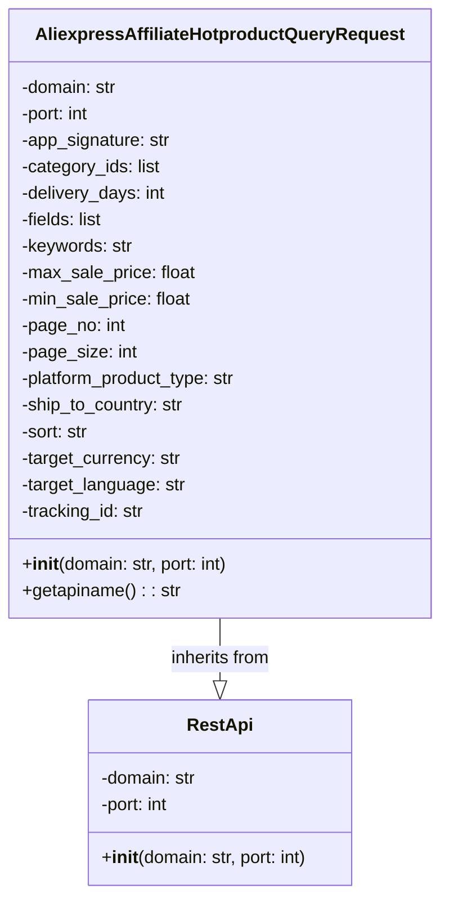

## ИНСТРУКЦИЯ:

Анализируй предоставленный код подробно и объясни его функциональность. Ответ должен включать три раздела:  

1. **<алгоритм>**: Опиши рабочий процесс в виде пошаговой блок-схемы, включая примеры для каждого логического блока, и проиллюстрируй поток данных между функциями, классами или методами.  
2. **<mermaid>**: Напиши код для диаграммы в формате `mermaid`, проанализируй и объясни все зависимости, 
    которые импортируются при создании диаграммы. 
    **ВАЖНО!** Убедитесь, что все имена переменных, используемые в диаграмме `mermaid`, 
    имеют осмысленные и описательные имена. Имена переменных вроде `A`, `B`, `C`, и т.д., не допускаются!  
    
    **Дополнительно**: Если в коде есть импорт `import header`, добавьте блок `mermaid` flowchart, объясняющий `header.py`:\
    ```mermaid\
    flowchart TD\
        Start --> Header[<code>header.py</code><br> Determine Project Root]\
    \
        Header --> import[Import Global Settings: <br><code>from src import gs</code>] \
    ```

3. **<объяснение>**: Предоставьте подробные объяснения:  
   - **Импорты**: Их назначение и взаимосвязь с другими пакетами `src.`.  
   - **Классы**: Их роль, атрибуты, методы и взаимодействие с другими компонентами проекта.  
   - **Функции**: Их аргументы, возвращаемые значения, назначение и примеры.  
   - **Переменные**: Их типы и использование.  
   - Выделите потенциальные ошибки или области для улучшения.  

Дополнительно, постройте цепочку взаимосвязей с другими частями проекта (если применимо).  

Это обеспечивает всесторонний и структурированный анализ кода.
## Формат ответа: `.md` (markdown)
**КОНЕЦ ИНСТРУКЦИИ**
```markdown
## <алгоритм>

1.  **Инициализация объекта `AliexpressAffiliateHotproductQueryRequest`**:
    *   Создается экземпляр класса `AliexpressAffiliateHotproductQueryRequest`.
    *   При инициализации вызывается конструктор родительского класса `RestApi` с параметрами `domain` (по умолчанию "api-sg.aliexpress.com") и `port` (по умолчанию 80).
    *   Инициализируются атрибуты экземпляра: `app_signature`, `category_ids`, `delivery_days`, `fields`, `keywords`, `max_sale_price`, `min_sale_price`, `page_no`, `page_size`, `platform_product_type`, `ship_to_country`, `sort`, `target_currency`, `target_language`, `tracking_id` устанавливаются в `None`.

    *Пример:*
    ```python
    request = AliexpressAffiliateHotproductQueryRequest()
    print(request.domain) # Output: api-sg.aliexpress.com
    print(request.port) # Output: 80
    print(request.tracking_id) # Output: None
    ```
2.  **Вызов метода `getapiname`**:
    *   Вызывается метод `getapiname` для получения имени API запроса.
    *   Метод возвращает строку 'aliexpress.affiliate.hotproduct.query'.

    *Пример:*
    ```python
    api_name = request.getapiname()
    print(api_name)  # Output: aliexpress.affiliate.hotproduct.query
    ```
3.  **Использование объекта для отправки запроса**:
    *   Экземпляр `AliexpressAffiliateHotproductQueryRequest` используется для формирования и отправки HTTP запроса к API AliExpress.
    *   Атрибуты экземпляра устанавливаются в соответсвии с желаемыми параметрами запроса.

    *Пример:*
    ```python
    request.tracking_id = "test_tracking_id"
    request.category_ids = [100,200]
    # Далее предполагается, что данный запрос отправляется через метод request() RestApi
    # (которого нет в данном коде, но подразумевается его существование)
    # response = request.request()
    ```

## <mermaid>



**Анализ зависимостей:**

*   **`AliexpressAffiliateHotproductQueryRequest`** наследует от **`RestApi`**: Это означает, что класс `AliexpressAffiliateHotproductQueryRequest` расширяет функциональность базового класса `RestApi`, получая доступ к его атрибутам и методам. Это типичный пример использования наследования в объектно-ориентированном программировании, где специализированный класс `AliexpressAffiliateHotproductQueryRequest` создается на основе более общего класса `RestApi`.
*   **Атрибуты класса `AliexpressAffiliateHotproductQueryRequest`**:
    *   `domain` (str): Доменное имя API.
    *   `port` (int): Порт для подключения к API.
    *   `app_signature` (str): Подпись приложения для аутентификации.
    *   `category_ids` (list): Список идентификаторов категорий товаров.
    *   `delivery_days` (int): Количество дней доставки.
    *   `fields` (list): Список полей, которые нужно получить в ответе.
    *   `keywords` (str): Ключевые слова для поиска товаров.
    *   `max_sale_price` (float): Максимальная цена товара.
    *   `min_sale_price` (float): Минимальная цена товара.
    *   `page_no` (int): Номер страницы.
    *   `page_size` (int): Размер страницы.
    *   `platform_product_type` (str): Тип платформы продукта.
    *   `ship_to_country` (str): Страна доставки.
    *   `sort` (str): Критерий сортировки.
    *   `target_currency` (str): Целевая валюта.
    *   `target_language` (str): Целевой язык.
    *   `tracking_id` (str): Идентификатор отслеживания.
*  **Методы класса `AliexpressAffiliateHotproductQueryRequest`**:
    *   `__init__(domain, port)`: Конструктор класса, который инициализирует атрибуты экземпляра, вызывая конструктор родительского класса `RestApi` и задавая начальные значения другим параметрам.
    *   `getapiname()`: Метод, возвращающий имя API, к которому обращается данный запрос.
*   **Атрибуты класса `RestApi`**:
    *   `domain` (str): Доменное имя API.
    *   `port` (int): Порт для подключения к API.
* **Методы класса `RestApi`**:
    *   `__init__(domain, port)`: Конструктор класса, инициализирует домен и порт.

## <объяснение>

**Импорты:**

*   `from ..base import RestApi`: Импортирует класс `RestApi` из модуля `base`, находящегося на один уровень выше в иерархии пакетов (`src.suppliers.aliexpress.api.base`). Класс `RestApi` вероятно является базовым классом для всех API запросов к AliExpress и содержит общую логику для отправки REST запросов, например определение домена, порта и возможно обработку HTTP запроса.

**Классы:**

*   `AliexpressAffiliateHotproductQueryRequest(RestApi)`:
    *   **Роль**: Представляет запрос на получение списка горячих товаров от AliExpress Affiliate API.
    *   **Атрибуты**:
        *   `domain` (str): Доменное имя API (по умолчанию "api-sg.aliexpress.com").
        *   `port` (int): Порт для подключения к API (по умолчанию 80).
        *   `app_signature` (str): Подпись приложения, необходимая для аутентификации (по умолчанию `None`).
        *   `category_ids` (list): Список идентификаторов категорий для фильтрации товаров (по умолчанию `None`).
        *   `delivery_days` (int): Количество дней для доставки (по умолчанию `None`).
        *   `fields` (list): Список полей, которые нужно получить в ответе (по умолчанию `None`).
        *   `keywords` (str): Ключевые слова для поиска (по умолчанию `None`).
        *   `max_sale_price` (float): Максимальная цена товара (по умолчанию `None`).
        *   `min_sale_price` (float): Минимальная цена товара (по умолчанию `None`).
        *   `page_no` (int): Номер страницы (по умолчанию `None`).
        *   `page_size` (int): Размер страницы (по умолчанию `None`).
        *   `platform_product_type` (str): Тип платформы продукта (по умолчанию `None`).
        *   `ship_to_country` (str): Страна доставки (по умолчанию `None`).
        *   `sort` (str): Критерий сортировки (по умолчанию `None`).
        *   `target_currency` (str): Целевая валюта (по умолчанию `None`).
        *   `target_language` (str): Целевой язык (по умолчанию `None`).
        *   `tracking_id` (str): Идентификатор отслеживания (по умолчанию `None`).
    *   **Методы**:
        *   `__init__(self, domain="api-sg.aliexpress.com", port=80)`: Конструктор класса. Он принимает домен и порт в качестве аргументов (со значениями по умолчанию) и инициализирует все атрибуты экземпляра, включая вызов конструктора родительского класса `RestApi`.
        *   `getapiname(self)`: Возвращает строку с именем API запроса (`aliexpress.affiliate.hotproduct.query`).
    *   **Взаимодействие**: Наследует от класса `RestApi`, что позволяет использовать общую логику для отправки API запросов. Экземпляры этого класса будут использоваться для формирования конкретных HTTP запросов к AliExpress Affiliate API, передавая параметры в атрибутах экземпляра.

**Функции:**

*   `__init__(self, domain="api-sg.aliexpress.com", port=80)`: Конструктор класса. Он инициализирует экземпляр класса, устанавливая начальные значения атрибутов, а также вызывает конструктор родительского класса `RestApi`.
*   `getapiname(self)`: Метод, возвращающий имя API (`aliexpress.affiliate.hotproduct.query`), к которому предназначен запрос.

**Переменные:**

*   Атрибуты класса `AliexpressAffiliateHotproductQueryRequest` такие как `domain`, `port`, `app_signature`, `category_ids`, `delivery_days` и т.д., хранят параметры запроса. Эти переменные используются для формирования HTTP запроса, который отправляется на API AliExpress.

**Потенциальные ошибки и области для улучшения:**

*   **Отсутствие обработки ошибок**: В коде не предусмотрена обработка ошибок, которые могут возникнуть при отправке HTTP запроса, а также отсутствуют валидации входных параметров.
*   **Нет реализации отправки запроса**: Код описывает только структуру запроса, но не содержит логики для фактической отправки запроса и обработки ответа.
*   **Отсутствие документации**: Нет документации по использованию класса и его атрибутов, что затрудняет его использование.
*   **Некоторые атрибуты могут быть не обязательными**: Атрибуты типа `delivery_days`, `max_sale_price`, `min_sale_price` могут быть не всегда обязательными и возможно должны иметь значение по умолчанию `None` или иметь проверку, если они переданы.
*   **Типизация**: Отсутствуют аннотации типов.
*   **Использование магических строк**: Использование жестко прописанных строк таких как: `aliexpress.affiliate.hotproduct.query`, `api-sg.aliexpress.com` может быть заменено на константы.

**Цепочка взаимосвязей:**

1.  Модуль `AliexpressAffiliateHotproductQueryRequest.py` импортирует `RestApi` из `src.suppliers.aliexpress.api.base`, что указывает на общую архитектуру API-клиента, где все запросы наследуют от базового класса.
2.  Экземпляры класса `AliexpressAffiliateHotproductQueryRequest` будут использоваться совместно с другими модулями для отправки запросов, получения и обработки данных от AliExpress Affiliate API.
3.  Логика обработки ответа от API, скорее всего, будет находиться в других модулях проекта.
4.   Данный класс участвует в построении системы для работы с API AliExpress.

Таким образом, данный код является частью более крупного проекта, который взаимодействует с AliExpress Affiliate API, предоставляя структуру для отправки запросов на получение списка горячих товаров.
```