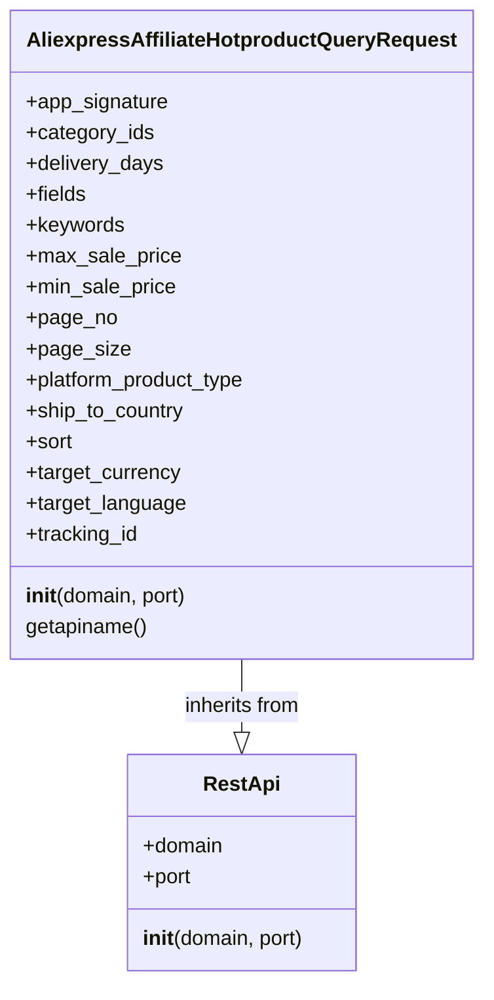

## Алгоритм

1.  **Инициализация класса `AliexpressAffiliateHotproductQueryRequest`:**
    *   При создании экземпляра класса, вызывается конструктор `__init__`.
    *   Конструктор принимает `domain` (по умолчанию "api-sg.aliexpress.com") и `port` (по умолчанию 80) как аргументы.
    *   Вызывается конструктор базового класса `RestApi` (`RestApi.__init__(self, domain, port)`), передавая ему `domain` и `port`.
    *   Инициализируются атрибуты экземпляра класса:
        *   `app_signature`
        *   `category_ids`
        *   `delivery_days`
        *   `fields`
        *   `keywords`
        *   `max_sale_price`
        *   `min_sale_price`
        *   `page_no`
        *   `page_size`
        *   `platform_product_type`
        *   `ship_to_country`
        *   `sort`
        *   `target_currency`
        *   `target_language`
        *   `tracking_id`
    *   Всем этим атрибутам присваивается значение `None`.

2.  **Метод `getapiname`:**
    *   При вызове метода `getapiname`, он возвращает строку `'aliexpress.affiliate.hotproduct.query'`.

## Mermaid

**Объяснение:**

*   `RestApi`: Этот класс представляет базовый класс для работы с REST API. Он содержит общие атрибуты, такие как `domain` и `port`, а также метод `__init__` для их инициализации.
*   `AliexpressAffiliateHotproductQueryRequest`: Этот класс наследуется от `RestApi` и представляет собой запрос для получения списка горячих товаров с Aliexpress.
    *   Он содержит атрибуты, такие как `app_signature`, `category_ids`, `delivery_days` и т.д., которые представляют параметры запроса.
    *   Метод `__init__` вызывает конструктор родительского класса `RestApi` и инициализирует атрибуты запроса.
    *   Метод `getapiname` возвращает имя API метода, который должен быть вызван.
*   `AliexpressAffiliateHotproductQueryRequest --|> RestApi`: Эта стрелка показывает, что класс `AliexpressAffiliateHotproductQueryRequest` наследует от класса `RestApi`.

## Объяснение

**Импорты:**

*   `from ..base import RestApi`: Этот импорт означает, что класс `RestApi` импортируется из модуля `base`, который находится на один уровень выше в иерархии пакетов (`..`). Этот базовый класс, вероятно, содержит общую логику для работы с REST API, такую как отправка запросов, обработка ответов, и т.д. Класс `AliexpressAffiliateHotproductQueryRequest` будет использовать его функционал.

**Классы:**

*   `AliexpressAffiliateHotproductQueryRequest(RestApi)`:
    *   **Роль:** Этот класс представляет собой запрос для получения списка горячих товаров из API Aliexpress. Он инкапсулирует все необходимые параметры запроса.
    *   **Атрибуты:**
        *   `app_signature` (str, optional): Сигнатура приложения.
        *   `category_ids` (str, optional): Идентификаторы категорий товаров.
        *   `delivery_days` (int, optional): Количество дней доставки.
        *   `fields` (str, optional): Поля, которые нужно включить в ответ (например, "productId", "productTitle").
        *   `keywords` (str, optional): Ключевые слова для поиска.
        *   `max_sale_price` (float, optional): Максимальная цена продажи.
        *   `min_sale_price` (float, optional): Минимальная цена продажи.
        *   `page_no` (int, optional): Номер страницы.
        *   `page_size` (int, optional): Размер страницы.
        *   `platform_product_type` (str, optional): Тип продукта на платформе.
        *   `ship_to_country` (str, optional): Страна доставки.
        *   `sort` (str, optional): Поле сортировки (например, "price").
        *   `target_currency` (str, optional): Целевая валюта.
        *   `target_language` (str, optional): Целевой язык.
        *   `tracking_id` (str, optional): Идентификатор отслеживания.
    *   **Методы:**
        *   `__init__(self, domain="api-sg.aliexpress.com", port=80)`: Конструктор класса, инициализирует атрибуты экземпляра класса и вызывает конструктор базового класса `RestApi`.
        *   `getapiname(self)`: Возвращает имя API метода `'aliexpress.affiliate.hotproduct.query'`, которое используется для идентификации нужного endpoint в API Aliexpress.

**Функции:**

*   `__init__(self, domain="api-sg.aliexpress.com", port=80)`: Конструктор класса, принимает домен и порт API и инициализирует все атрибуты запроса как `None`.
*   `getapiname(self)`: Возвращает имя API метода для запроса горячих товаров. Этот метод необходим для формирования правильного запроса к API Aliexpress.

**Переменные:**

*   Атрибуты класса, такие как `app_signature`, `category_ids`, `delivery_days` и т.д.  используются для хранения параметров запроса. Все эти атрибуты имеют значение `None` по умолчанию.

**Потенциальные ошибки и области для улучшения:**

*   **Отсутствие валидации:** Нет никакой валидации входных параметров (типы данных, допустимые значения и т.д.). Это может привести к ошибкам при выполнении запроса.
*   **Жестко заданный домен и порт:** Домен и порт API жестко заданы в конструкторе. Можно улучшить, сделав их настраиваемыми через параметры инициализации или конфигурационные файлы.
*   **Обработка ошибок:** Отсутствует обработка ошибок, которые могут возникнуть при запросе к API.
*   **Отсутствие документации**: Нет документации по использованию класса и его атрибутов.
*   **Отсутствие проверок обязательных полей**: Нет проверок, какие поля являются обязательными для запроса.

**Цепочка взаимосвязей:**

1.  `AliexpressAffiliateHotproductQueryRequest` наследуется от `RestApi`, что предполагает использование общих механизмов для работы с API.
2.  `RestApi` может использовать другие модули проекта, например, для отправки HTTP запросов и обработки ответов.
3.  Данные, полученные от API, могут использоваться в других частях проекта, например, для отображения товаров на сайте.

Этот класс является частью системы для взаимодействия с Aliexpress API и предназначен для запроса списка "горячих" товаров. Он предоставляет структурированный способ формирования запроса к API, но требует доработки для обеспечения корректной работы и обработки ошибок.