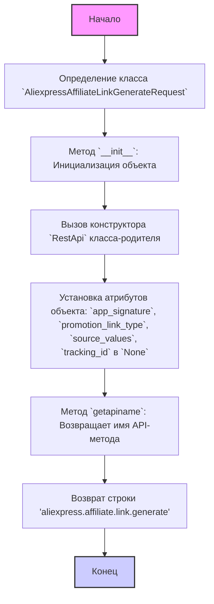
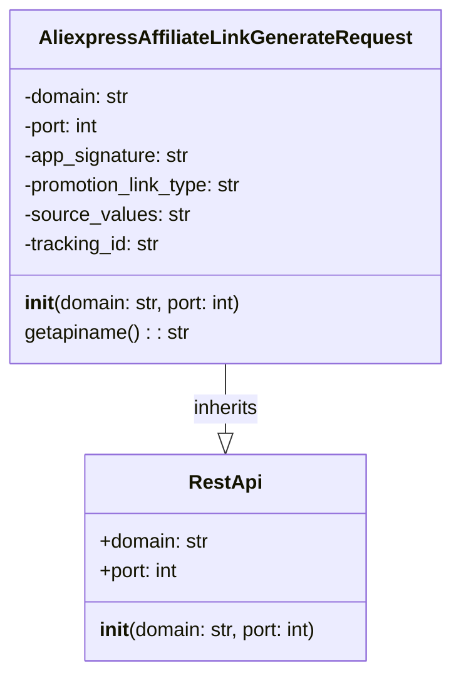

## АНАЛИЗ КОДА: `AliexpressAffiliateLinkGenerateRequest.py`

### 1. <алгоритм>

**Блок-схема:**



**Примеры:**

*   **Инициализация:** При создании экземпляра `AliexpressAffiliateLinkGenerateRequest`, вызывается метод `__init__`, который инициализирует атрибуты, необходимые для запроса к API. Например:
    ```python
    request = AliexpressAffiliateLinkGenerateRequest(domain="api-us.aliexpress.com", port=443)
    ```
    Здесь создается объект `request` с указанным доменом и портом. По умолчанию домен "api-sg.aliexpress.com", порт=80.
*   **Получение имени API:** Метод `getapiname` всегда возвращает строку `'aliexpress.affiliate.link.generate'`, что указывает на тип API запроса, который должен быть сделан.

### 2. <mermaid>



**Объяснение `mermaid`:**

*   **`class AliexpressAffiliateLinkGenerateRequest`**: Описывает класс `AliexpressAffiliateLinkGenerateRequest`, который предназначен для генерации партнерских ссылок через API AliExpress. Включает атрибуты `domain`, `port`, `app_signature`, `promotion_link_type`, `source_values`, `tracking_id` и методы `__init__` (конструктор) и `getapiname`.
*   **`class RestApi`**: Описывает базовый класс `RestApi` от которого наследуется `AliexpressAffiliateLinkGenerateRequest`. Включает атрибуты `domain`, `port`, и метод `__init__`.
*  **`AliexpressAffiliateLinkGenerateRequest --|> RestApi : inherits`**: Указывает на то, что класс `AliexpressAffiliateLinkGenerateRequest` наследует от класса `RestApi`. Это означает, что он получает все атрибуты и методы родительского класса.

### 3. <объяснение>

#### Импорты:

*   `from ..base import RestApi`: Импортирует класс `RestApi` из модуля `base`, расположенного на уровень выше в структуре пакетов (`..`). `RestApi`, вероятно, предоставляет базовую функциональность для взаимодействия с REST API, включая установку домена и порта для запросов. Этот импорт обеспечивает основу для создания API запросов, специфичных для AliExpress.

#### Классы:

*   **`AliexpressAffiliateLinkGenerateRequest`**:
    *   **Роль:** Представляет собой класс, ответственный за создание и отправку запроса на генерацию партнерских ссылок через API AliExpress.
    *   **Атрибуты:**
        *   `domain` (str): Доменное имя API AliExpress (по умолчанию "api-sg.aliexpress.com").
        *   `port` (int): Порт API (по умолчанию 80).
        *   `app_signature` (str): Подпись приложения, необходимая для авторизации запроса.
        *   `promotion_link_type` (str): Тип партнерской ссылки (например, "推广链接").
        *   `source_values` (str): Значения источника ссылки.
        *   `tracking_id` (str): Идентификатор отслеживания.
        Все атрибуты, кроме `domain` и `port`, инициализируются как `None`, поскольку конкретные значения задаются позже в процессе подготовки запроса.
    *   **Методы:**
        *   `__init__(self, domain="api-sg.aliexpress.com", port=80)`: Конструктор класса, вызывается при создании экземпляра класса. Инициализирует атрибуты объекта, вызывая конструктор родительского класса `RestApi`.
        *   `getapiname(self)`: Метод, возвращающий строку `'aliexpress.affiliate.link.generate'`, которая является именем метода API для генерации партнерских ссылок.
    *   **Взаимодействие:** Наследуется от класса `RestApi`, получая от него базовую функциональность для взаимодействия с API.

#### Функции:

*   `__init__` (Конструктор):
    *   **Аргументы:**
        *   `domain` (str, optional): Домен API (по умолчанию "api-sg.aliexpress.com").
        *   `port` (int, optional): Порт API (по умолчанию 80).
    *   **Возвращаемое значение:** None.
    *   **Назначение:** Инициализирует атрибуты объекта, вызывая конструктор родительского класса `RestApi` и устанавливая значения атрибутов экземпляра.
    *   **Пример:**
        ```python
        request = AliexpressAffiliateLinkGenerateRequest(domain="api-us.aliexpress.com", port=443)
        ```
        Этот код создаст новый объект `AliexpressAffiliateLinkGenerateRequest` с указанным доменом и портом.
*   `getapiname`:
    *   **Аргументы:** `self`.
    *   **Возвращаемое значение:** Строка `'aliexpress.affiliate.link.generate'`.
    *   **Назначение:** Возвращает имя API-метода, которое используется для идентификации типа запроса.
    *   **Пример:**
        ```python
        request = AliexpressAffiliateLinkGenerateRequest()
        api_name = request.getapiname()
        print(api_name) # Выведет: aliexpress.affiliate.link.generate
        ```

#### Переменные:

*   `domain` (str): Домен API AliExpress.
*   `port` (int): Порт API AliExpress.
*   `app_signature` (str): Подпись приложения.
*   `promotion_link_type` (str): Тип партнерской ссылки.
*   `source_values` (str): Значения источника ссылки.
*   `tracking_id` (str): Идентификатор отслеживания.

Все переменные, кроме `domain` и `port`, изначально устанавливаются в `None`.

#### Потенциальные ошибки и области для улучшения:

1.  **Отсутствие валидации:** Код не содержит валидации входных данных. Например, `domain` и `port` не проверяются на корректность.
2.  **Зависимость от констант:** Имя API `'aliexpress.affiliate.link.generate'` является константой и жестко задано в коде. Было бы более гибким хранить подобные константы в отдельном месте.
3.  **Нет обработки ошибок:** Код не обрабатывает потенциальные ошибки, например, при обращении к API.
4.  **Отсутствие документации:** Коду не хватает документации, например, docstring для класса и методов, что затрудняет понимание и использование класса.
5.  **Нет примеров использования:** В коде отсутствуют примеры использования, что затрудняет его понимание и интеграцию.

#### Взаимосвязь с другими частями проекта:

*   Класс `AliexpressAffiliateLinkGenerateRequest` зависит от класса `RestApi`, который, вероятно, содержит основную логику для взаимодействия с API, включая создание запросов и обработку ответов.
*   Этот класс будет использоваться в более высоких слоях приложения, где потребуется сгенерировать партнерские ссылки.