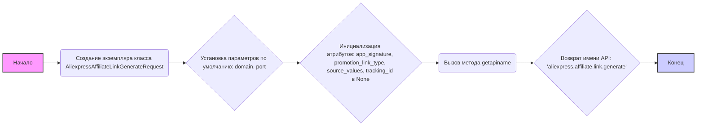
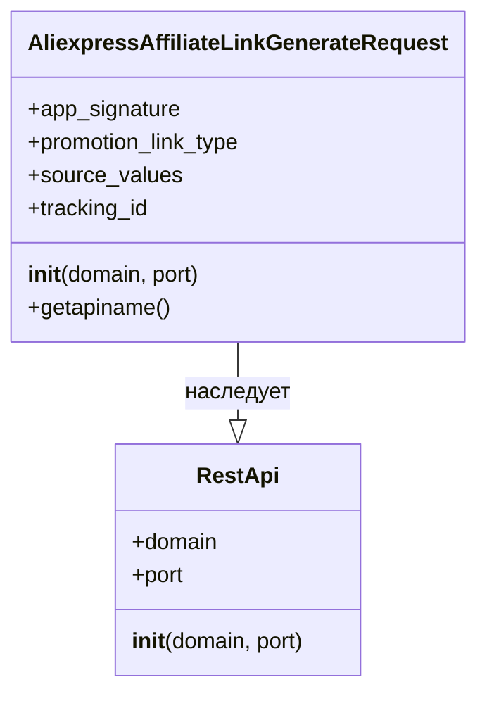

## Анализ кода `AliexpressAffiliateLinkGenerateRequest.py`

### 1. <алгоритм>

**Блок-схема:**



**Примеры:**

1. **Создание экземпляра класса:**
   ```python
   request = AliexpressAffiliateLinkGenerateRequest() 
   ```
   - Создается объект класса `AliexpressAffiliateLinkGenerateRequest`.
2. **Инициализация параметров:**
   - `domain` по умолчанию устанавливается в `api-sg.aliexpress.com`.
   - `port` по умолчанию устанавливается в `80`.
   - Атрибуты `app_signature`, `promotion_link_type`, `source_values`, `tracking_id` инициализируются значением `None`.
3. **Вызов `getapiname()`:**
   ```python
   api_name = request.getapiname()  # api_name будет равно 'aliexpress.affiliate.link.generate'
   ```
   - Метод возвращает строку, представляющую имя API.

### 2. <mermaid>



**Анализ зависимостей:**

- `AliexpressAffiliateLinkGenerateRequest` наследуется от класса `RestApi`, что указывает на то, что он является специализированным типом запроса к REST API.
- `RestApi` скорее всего представляет собой базовый класс для работы с REST API, предоставляющий общую функциональность, такую как установку домена и порта.
- `AliexpressAffiliateLinkGenerateRequest` добавляет специфические атрибуты, характерные для запроса генерации партнерской ссылки AliExpress, такие как `app_signature`, `promotion_link_type`, `source_values`, `tracking_id`.
- Метод `getapiname` возвращает имя API, которое будет использоваться для формирования запроса.

### 3. <объяснение>

**Импорты:**

- `from ..base import RestApi`: Импортирует класс `RestApi` из модуля `base`, расположенного на уровень выше в структуре директорий (в пределах пакета `src.suppliers.aliexpress.api`). Этот импорт устанавливает зависимость от базового класса для работы с REST API, предоставляя общую структуру для отправки запросов.

**Классы:**

- **`AliexpressAffiliateLinkGenerateRequest(RestApi)`**:
  - **Роль**: Представляет собой класс запроса для генерации партнерской ссылки AliExpress. Он наследует функциональность от базового класса `RestApi`.
  - **Атрибуты**:
    - `app_signature`: Идентификатор приложения для подписи запроса, тип `str` или `None`.
    - `promotion_link_type`: Тип партнерской ссылки, тип `str` или `None`.
    - `source_values`: Значения источников, тип `str` или `None`.
    - `tracking_id`: Идентификатор отслеживания, тип `str` или `None`.
  - **Методы**:
    - `__init__(self, domain="api-sg.aliexpress.com", port=80)`: Конструктор класса. Принимает необязательные аргументы `domain` (домен API) и `port` (порт API), устанавливая значения по умолчанию. Вызывает конструктор родительского класса `RestApi.__init__(self, domain, port)` для инициализации домена и порта. Инициализирует атрибуты экземпляра значениями `None`.
    - `getapiname(self)`: Возвращает строку `'aliexpress.affiliate.link.generate'`, представляющую имя API метода.

**Функции:**

- `__init__(self, domain="api-sg.aliexpress.com", port=80)`:
  - **Аргументы**:
    - `domain` (str, необязательный, по умолчанию: "api-sg.aliexpress.com"): Домен API.
    - `port` (int, необязательный, по умолчанию: 80): Порт API.
  - **Возвращаемое значение**: None
  - **Назначение**: Инициализирует экземпляр класса, устанавливая домен, порт и другие атрибуты в `None`.
- `getapiname(self)`:
  - **Аргументы**: `self` (экземпляр класса).
  - **Возвращаемое значение**: Строка ('aliexpress.affiliate.link.generate').
  - **Назначение**: Возвращает имя API для запроса.

**Переменные:**

- `domain`: Строковая переменная, представляющая домен API.
- `port`: Целочисленная переменная, представляющая порт API.
- `app_signature`: Строковая переменная, представляющая идентификатор приложения для подписи запроса, может быть None.
- `promotion_link_type`: Строковая переменная, представляющая тип партнерской ссылки, может быть None.
- `source_values`: Строковая переменная, представляющая значения источников, может быть None.
- `tracking_id`: Строковая переменная, представляющая идентификатор отслеживания, может быть None.

**Потенциальные ошибки и области для улучшения:**

1.  **Отсутствие валидации:** Код не содержит валидации для входных параметров `domain` и `port`.
2.  **Жестко закодированное имя API:** Имя API `aliexpress.affiliate.link.generate` жестко закодировано в методе `getapiname`. Возможно, имеет смысл сделать его константой или атрибутом класса.
3.  **Отсутствие документации**: Отсутствует документация к атрибутам `app_signature`, `promotion_link_type`, `source_values`, `tracking_id`.
4.  **Не хватает функциональности**: Класс `AliexpressAffiliateLinkGenerateRequest` только определяет параметры запроса и имя метода API, но не содержит логики отправки запроса.

**Взаимосвязи с другими частями проекта:**

- Этот класс является частью пакета `src.suppliers.aliexpress.api`, что указывает на то, что он предназначен для взаимодействия с API AliExpress.
- Класс `RestApi` является базовым классом, который, вероятно, используется и другими классами в проекте для отправки запросов к различным REST API.
- Этот класс взаимодействует с модулями, которые будут использовать этот класс для построения, отправки и обработки ответов API AliExpress.

**Цепочка взаимосвязей:**

1.  Пользовательский код (в другом модуле) создает экземпляр `AliexpressAffiliateLinkGenerateRequest`.
2.  Пользовательский код устанавливает значения атрибутов запроса (`app_signature`, `promotion_link_type` и т.д.)
3.  Пользовательский код вызывает метод `getapiname()` для получения имени API.
4.  Пользовательский код использует имя API и атрибуты запроса для отправки запроса через `RestApi` (этот процесс не представлен в коде).
5.  `RestApi` (или его подкласс) отправляет запрос к API AliExpress и возвращает результат.
6.  Пользовательский код обрабатывает ответ API.