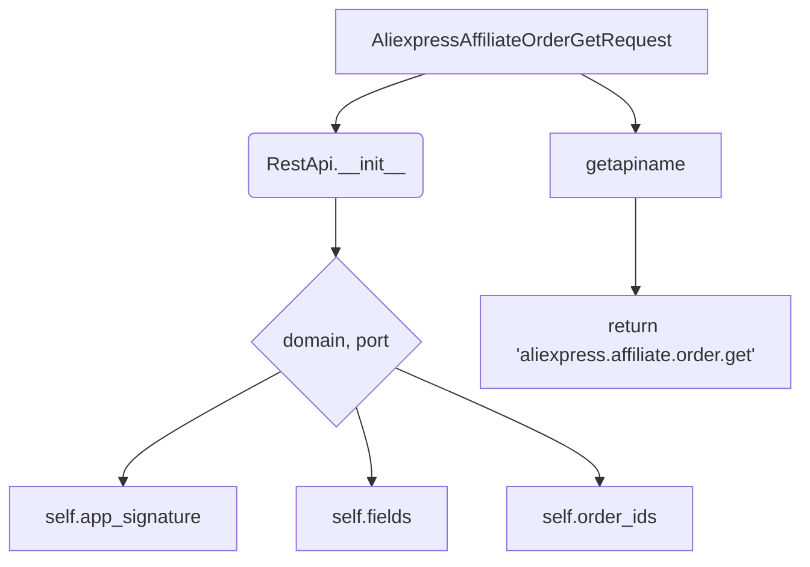

```MD
# <input code>

```python
## \file hypotez/src/suppliers/aliexpress/api/_examples/rest/AliexpressAffiliateOrderGetRequest.py
# -*- coding: utf-8 -*-\
#! venv/Scripts/python.exe # <- venv win
## ~~~~~~~~~~~~~\
""" module: src.suppliers.aliexpress.api._examples.rest """
'''
Created by auto_sdk on 2021.03.05
'''
from ..base import RestApi
class AliexpressAffiliateOrderGetRequest(RestApi):
	def __init__(self, domain="api-sg.aliexpress.com", port=80):
		RestApi.__init__(self,domain, port)
		self.app_signature = None
		self.fields = None
		self.order_ids = None

	def getapiname(self):
		return 'aliexpress.affiliate.order.get'
```

# <algorithm>

Этот код определяет класс `AliexpressAffiliateOrderGetRequest`, который наследуется от класса `RestApi`.  Алгоритм работы класса можно представить как:

1. **Инициализация (`__init__`):**
   - При создании объекта класса, вызывается конструктор родительского класса `RestApi` с переданными `domain` и `port`.
   - Объекту присваиваются значения `self.app_signature`, `self.fields`, `self.order_ids`, которые, по всей видимости, будут заполняться позже, представляя параметры запроса.

2. **Получение имени API (`getapiname`):**
   - Возвращает строку 'aliexpress.affiliate.order.get', которая, вероятно, используется для идентификации API-метода при отправке запроса.

**Пример использования (не показан в коде, но необходимый для работы):**

```python
# Пример использования класса
api_request = AliexpressAffiliateOrderGetRequest() # Инициализация
api_request.app_signature = "some_signature" # Присвоение значений
api_request.fields = ["field1", "field2"]
api_request.order_ids = [123, 456]

# Далее следует вызов метода для отправки запроса, который вероятно унаследован от RestApi, но не показан в данном фрагменте кода
# ...
```


# <mermaid>



**Объяснение диаграммы:**

- `AliexpressAffiliateOrderGetRequest` — класс, определяемый в файле.
- `RestApi.__init__` — конструктор родительского класса, вызываемый при инициализации.
- `domain`, `port` - аргументы, передаваемые в конструктор `RestApi` для настройки соединения.
- `self.app_signature`, `self.fields`, `self.order_ids` — атрибуты класса, используемые для хранения параметров запроса.
- `getapiname` — метод для получения имени API-метода.
- Стрелки показывают последовательность вызовов и передачи данных.


# <explanation>

- **Импорты**: `from ..base import RestApi` импортирует класс `RestApi` из пакета `src.suppliers.aliexpress.api.base`. `..` означает, что поиск модуля происходит на один уровень выше текущей директории.  Это указывает на иерархическую организацию кода.  Этот импорт необходим для того, чтобы класс `AliexpressAffiliateOrderGetRequest` смог использовать функциональность класса `RestApi`.

- **Классы**:
    - `AliexpressAffiliateOrderGetRequest`:  Представляет запрос к API AliExpress для получения информации об  аффилированных заказах.  Он расширяет базовый класс `RestApi`, вероятно, для обработки общих для всех запросов функций (например, создание HTTP-запросов).

- **Функции**:
    - `__init__`: Конструктор класса.  Инициализирует атрибуты, необходимые для отправки запроса. Принимает `domain` и `port` (по умолчанию). Важно, что здесь вызывается конструктор родительского класса `RestApi`.
    - `getapiname`: Возвращает строковое имя API-метода.  Это критично для отправки запроса, так как имя метода используется сервером для идентификации операции.

- **Переменные**:
    - `domain`: Строка, содержащая доменное имя API.
    - `port`: Целое число, определяющее порт API.
    - `app_signature`: Вероятно, подпись приложения, необходимая для аутентификации.
    - `fields`: Список полей, которые требуется получить.
    - `order_ids`: Список идентификаторов заказов.

- **Возможные ошибки и улучшения**:
    - Отсутствует реализация методов, необходимых для отправки HTTP-запросов.  Класс `RestApi`, из которого наследуется `AliexpressAffiliateOrderGetRequest`, предполагает наличие методов для отправки запросов к API (GET, POST, PUT, DELETE). Необходимо реализовать эти методы в `RestApi` или непосредственно в этом классе.
    - Нет обработки ошибок.  Необходимо добавить обработку исключений (например, исключения, связанные с неудачным соединением с API или невалидными данными).
    - Не хватает описания атрибутов `app_signature`, `fields` и `order_ids` в коде. Необходимо указать типы этих атрибутов и возможные значения.
    - В коде есть комментарий `# <- venv win`. По всей видимости, это указывает на то, что файл предназначен для использования с виртуальной средой Python.

**Цепочка взаимосвязей:**

`AliexpressAffiliateOrderGetRequest` использует `RestApi` для обработки сетевых запросов, а следовательно `RestApi`, возможно, взаимодействует с другими модулями для создания, отправки и обработки запросов к внешним API.  В рамках проекта должно быть определено, каким образом будут получаться `app_signature`, `fields` и `order_ids` (например, получение этих данных из конфигурации или других частей приложения).