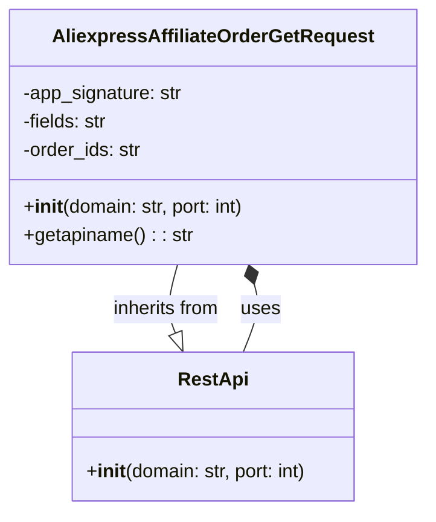

## Анализ кода `AliexpressAffiliateOrderGetRequest.py`

### 1. <алгоритм>

**Блок-схема:**

1.  **Инициализация экземпляра класса `AliexpressAffiliateOrderGetRequest`:**
    *   При создании объекта класса вызывается метод `__init__`.
    *   Устанавливается домен `domain` (по умолчанию "api-sg.aliexpress.com") и порт `port` (по умолчанию 80).
    *   Вызывается конструктор базового класса `RestApi` с переданными `domain` и `port`.
    *   Инициализируются атрибуты экземпляра: `app_signature`, `fields` и `order_ids` значением `None`.
    *   _Пример_: `request = AliexpressAffiliateOrderGetRequest(domain="api.aliexpress.ru", port=443)`
2.  **Вызов метода `getapiname`:**
    *   Метод вызывается для получения имени API.
    *   Возвращает строку `'aliexpress.affiliate.order.get'`.
    *   _Пример_: `api_name = request.getapiname()`
3. **Завершение:**
    * Завершение работы метода или программы

**Поток данных:**

1.  Создание объекта `AliexpressAffiliateOrderGetRequest` -> Передача `domain` и `port` в конструктор `RestApi` -> Инициализация атрибутов `app_signature`, `fields`, `order_ids`
2.  Вызов `getapiname()` -> Возврат строки `'aliexpress.affiliate.order.get'`

### 2. <mermaid>



**Анализ зависимостей:**

*   **`AliexpressAffiliateOrderGetRequest`** является классом, представляющим запрос для получения информации о заказе через API Aliexpress.
*   **`RestApi`** является базовым классом для API-запросов, предоставляющим общую функциональность (например, установку домена и порта).
*   **Наследование:** Класс `AliexpressAffiliateOrderGetRequest` наследует от класса `RestApi` через отношение `--|>`. Это означает, что `AliexpressAffiliateOrderGetRequest` получает все атрибуты и методы от `RestApi`, а так же может их переопределять.
*   **Использование:** `AliexpressAffiliateOrderGetRequest` использует `RestApi` при создании экземпляра. Связь обозначена как `*--`, что означает композицию. 

### 3. <объяснение>

**Импорты:**

*   `from ..base import RestApi`: Импортирует класс `RestApi` из модуля `base`, расположенного в родительской директории текущего модуля. Это указывает на то, что класс `AliexpressAffiliateOrderGetRequest` расширяет функциональность класса `RestApi`, используя его как основу для взаимодействия с API.

**Классы:**

*   **`AliexpressAffiliateOrderGetRequest`:**
    *   **Роль:** Представляет конкретный запрос к API AliExpress для получения информации о заказе.
    *   **Атрибуты:**
        *   `app_signature`: Используется для подписи запроса (по умолчанию `None`).
        *   `fields`: Определяет список полей, которые нужно получить в ответе (по умолчанию `None`).
        *   `order_ids`: Список идентификаторов заказов, для которых нужно получить информацию (по умолчанию `None`).
    *   **Методы:**
        *   `__init__(self, domain="api-sg.aliexpress.com", port=80)`: Конструктор класса. Инициализирует объект, устанавливая домен, порт и атрибуты `app_signature`, `fields`, `order_ids` в `None`, а так же вызывает конструктор `RestApi`.
        *   `getapiname(self)`: Возвращает имя API метода, которое используется в запросе к API AliExpress - `'aliexpress.affiliate.order.get'`.
    *   **Взаимодействие:** Наследует функциональность от `RestApi`, и использует его для создания запросов.
*   **`RestApi`** (из `../base.py`):
    *   **Роль:** Базовый класс для всех API запросов.
    *   **Атрибуты:**
        *   `domain`: Домен API.
        *   `port`: Порт API.
    *   **Методы:**
       *   `__init__(self, domain, port)`: Конструктор класса. Инициализирует домен и порт.
    *   **Взаимодействие:** Предоставляет базовую функциональность для работы с API.

**Функции:**

*   `__init__(self, domain="api-sg.aliexpress.com", port=80)`:
    *   **Аргументы:**
        *   `domain`: Строка, представляющая домен API (по умолчанию "api-sg.aliexpress.com").
        *   `port`: Целое число, представляющее порт API (по умолчанию 80).
    *   **Возвращаемое значение:** Отсутствует (конструктор).
    *   **Назначение:** Инициализирует атрибуты экземпляра класса и вызывает конструктор `RestApi` для установки домена и порта.
    *   **Пример:**
        ```python
        request = AliexpressAffiliateOrderGetRequest(domain="api.example.com", port=443)
        ```
*   `getapiname(self)`:
    *   **Аргументы:** `self` - ссылка на текущий экземпляр класса.
    *   **Возвращаемое значение:** Строка `'aliexpress.affiliate.order.get'` - имя API метода.
    *   **Назначение:** Возвращает имя API-метода для запроса, который будет использоваться для запроса к API Aliexpress.
    *   **Пример:**
        ```python
        request = AliexpressAffiliateOrderGetRequest()
        api_name = request.getapiname()
        print(api_name)  # Выведет: aliexpress.affiliate.order.get
        ```

**Переменные:**

*   `app_signature`:  Строка или None, используется для подписи запроса.
*   `fields`: Строка или None, определяет поля, которые должны быть возвращены в ответе.
*   `order_ids`: Строка или None, содержащая список идентификаторов заказов.
*   `domain`:  Строка, представляющая домен API.
*    `port`: Целое число, представляющее порт API.
*   `self`: Ссылка на текущий экземпляр класса.

**Потенциальные ошибки и области для улучшения:**

*   **Отсутствует валидация данных**: Нет проверки типов данных, которые передаются при создании объекта, а также не проверяются значения для атрибутов `app_signature`, `fields` и `order_ids`.
*   **Жестко заданный домен и порт по умолчанию**: Домен и порт заданы по умолчанию, что может быть не всегда удобно.
*   **Отсутствует реализация логики запроса**: Код только инициализирует объект запроса, но не содержит логику отправки HTTP-запроса, обработки ответа, или обработки ошибок.
*   **Нет описания типа данных атрибутов**:  Атрибуты класса `app_signature`, `fields` и `order_ids` описаны как строки, но в документации API Aliexpress может быть указан другой тип данных, например, список.

**Взаимосвязь с другими частями проекта:**

*   Этот класс является частью модуля `suppliers.aliexpress.api`, что указывает на его принадлежность к работе с API AliExpress.
*   Использует класс `RestApi` из модуля `base`, что говорит о том, что это не единственный класс, использующий `RestApi`, и вероятно, есть еще другие классы запросов к API других поставщиков или методов.
*   Для полноценной работы, класс должен быть дополнен методами для отправки запроса, обработки ответа, а также, возможно, методами для сборки параметров запроса из атрибутов.

**Заключение:**

Класс `AliexpressAffiliateOrderGetRequest` представляет собой заготовку для формирования запросов к API AliExpress. Он наследует от класса `RestApi` и обеспечивает базовую настройку для взаимодействия с API. Для полноценной работы, данный класс нужно дополнить функциональностью отправки запросов и обработки ответов, а также валидацией входных данных.