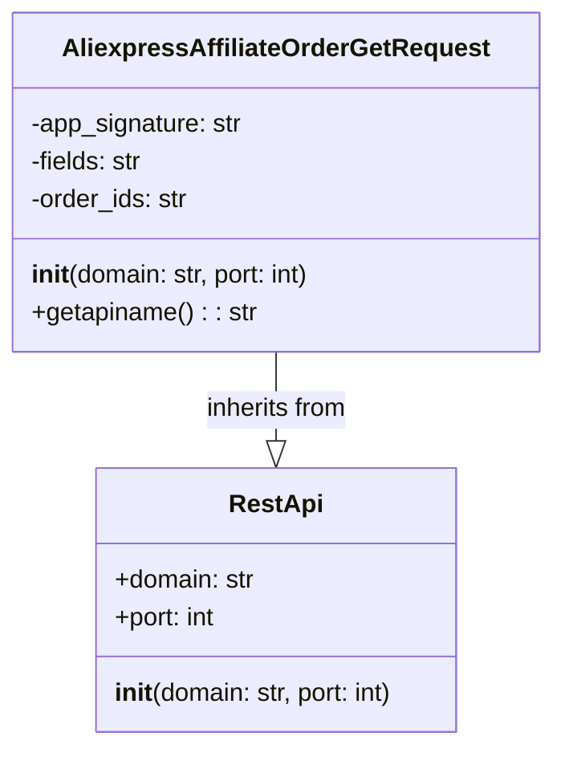

## АНАЛИЗ КОДА: `hypotez/src/suppliers/aliexpress/api/_examples/rest/AliexpressAffiliateOrderGetRequest.py`

### 1. <алгоритм>

1.  **Инициализация класса `AliexpressAffiliateOrderGetRequest`**:
    *   При создании экземпляра класса, конструктор `__init__` принимает параметры `domain` (по умолчанию "api-sg.aliexpress.com") и `port` (по умолчанию 80).
    *   Вызывает конструктор базового класса `RestApi` с переданными `domain` и `port`.
    *   Инициализирует атрибуты экземпляра: `app_signature`, `fields` и `order_ids` значением `None`.

    *Пример:*
    ```python
    request = AliexpressAffiliateOrderGetRequest()
    # domain будет "api-sg.aliexpress.com", port будет 80
    request = AliexpressAffiliateOrderGetRequest(domain="example.com", port=443)
    # domain будет "example.com", port будет 443
    ```

2.  **Метод `getapiname`**:
    *   Этот метод не принимает аргументов.
    *   Возвращает строку `'aliexpress.affiliate.order.get'`, которая представляет имя API-метода.

    *Пример:*
    ```python
    request = AliexpressAffiliateOrderGetRequest()
    api_name = request.getapiname()
    # api_name будет 'aliexpress.affiliate.order.get'
    ```
### 2. <mermaid>


**Объяснение зависимостей в mermaid:**

*   `class RestApi`: Этот класс представляет собой базовый класс для работы с REST API. Он имеет атрибуты `domain` и `port`, а также конструктор для их инициализации.
*   `class AliexpressAffiliateOrderGetRequest`: Этот класс наследует от `RestApi`. Он добавляет атрибуты `app_signature`, `fields`, и `order_ids`, которые специфичны для запроса на получение заказа через API AliExpress. Также он определяет метод `getapiname`, который возвращает имя API.
*  `AliexpressAffiliateOrderGetRequest --|> RestApi`: Эта стрелка с полым наконечником обозначает наследование. `AliexpressAffiliateOrderGetRequest` является подклассом `RestApi`.

### 3. <объяснение>

**Импорты:**

*   `from ..base import RestApi`: Импортирует класс `RestApi` из модуля `base`, находящегося на уровень выше в иерархии пакетов (`src.suppliers.aliexpress.api.base`). Этот класс, вероятно, предоставляет базовую функциональность для взаимодействия с REST API, включая установку домена и порта. Импорт `RestApi` обеспечивает повторное использование кода и унифицированный интерфейс для всех API запросов.

**Классы:**

*   **`AliexpressAffiliateOrderGetRequest`**:
    *   **Роль**: Этот класс представляет запрос для получения информации о заказах через API AliExpress. Он специализируется на обработке конкретного API-метода (`aliexpress.affiliate.order.get`).
    *   **Атрибуты**:
        *   `app_signature`: (тип `str`) Хранит подпись приложения, необходимую для аутентификации. Изначально инициализирован как `None`, что указывает на необходимость установки значения.
        *   `fields`: (тип `str`) Содержит список полей, которые нужно получить в ответе. Изначально `None`.
        *   `order_ids`: (тип `str`) Список идентификаторов заказов, информацию о которых нужно получить. Изначально `None`.
    *   **Методы**:
        *   `__init__(self, domain="api-sg.aliexpress.com", port=80)`: Конструктор класса. Принимает параметры `domain` и `port` для установки базового адреса API. Вызывает конструктор базового класса `RestApi` и инициализирует атрибуты класса `app_signature`, `fields` и `order_ids` как `None`.
        *   `getapiname(self)`: Возвращает строку `'aliexpress.affiliate.order.get'`, указывающую на имя API-метода, который обрабатывает данный класс.

**Функции:**

*   `__init__`: Конструктор класса, который используется для инициализации экземпляра класса, настраивая домен, порт и основные параметры запроса.
*   `getapiname`: Метод, который возвращает имя API, ассоциированного с этим классом запроса.

**Переменные:**

*   `domain`: Строка, представляющая домен API AliExpress (по умолчанию `api-sg.aliexpress.com`).
*   `port`: Целое число, представляющее порт для подключения к API (по умолчанию 80).
*   `app_signature`: Строка, представляющая подпись приложения, необходимую для аутентификации (изначально `None`).
*   `fields`: Строка, представляющая список полей, которые нужно получить в ответе (изначально `None`).
*   `order_ids`: Строка, представляющая список идентификаторов заказов, информацию о которых нужно получить (изначально `None`).

**Потенциальные ошибки и области для улучшения:**

*   Отсутствует валидация входных данных для конструктора (например, проверка типа `domain` и `port`).
*   Не реализована функциональность для установки фактических значений `app_signature`, `fields`, и `order_ids`, хотя они объявлены как атрибуты класса.
*   Класс лишь подготавливает запрос, но не отправляет его. Необходима реализация метода для отправки запроса и обработки ответа.
*   Не реализована обработка ошибок при отправке запроса и получении ответа.

**Взаимосвязи с другими частями проекта:**

*   Зависит от `RestApi` в модуле `base`, что означает наличие базовой инфраструктуры для работы с REST API.
*   Предполагается использование данного класса в контексте более крупной системы работы с API AliExpress, где будут вызывать методы для отправки запроса и обработки ответа, возможно, в других модулях.

Этот анализ подробно описывает структуру и назначение класса `AliexpressAffiliateOrderGetRequest`, его взаимосвязи и области, требующие доработки.