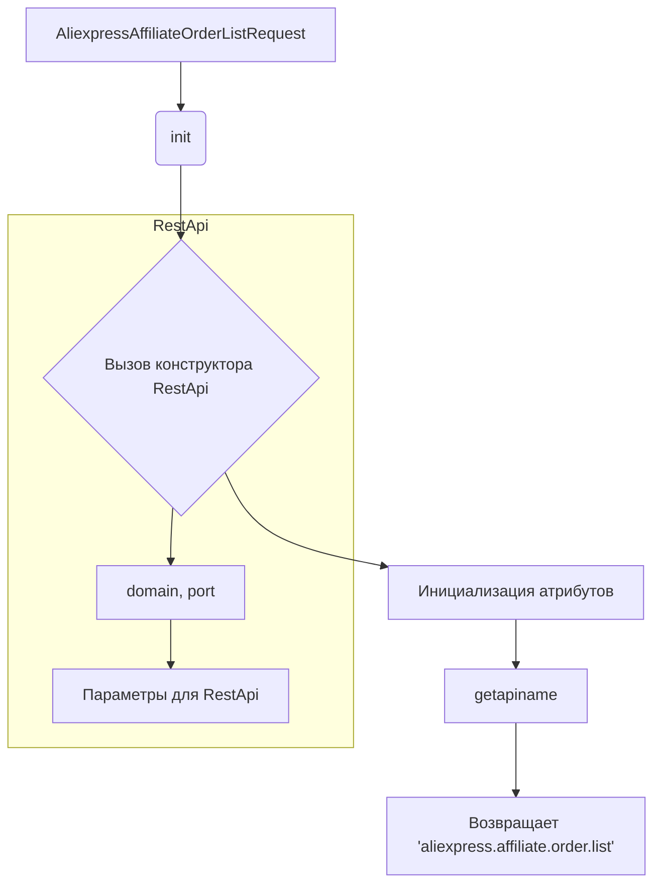

# <input code>

```python
## \file hypotez/src/suppliers/aliexpress/api/_examples/rest/AliexpressAffiliateOrderListRequest.py
# -*- coding: utf-8 -*-\
#! venv/Scripts/python.exe # <- venv win
## ~~~~~~~~~~~~~\
""" module: src.suppliers.aliexpress.api._examples.rest """

'''
Created by auto_sdk on 2021.06.02
'''
from ..base import RestApi
class AliexpressAffiliateOrderListRequest(RestApi):
	def __init__(self, domain="api-sg.aliexpress.com", port=80):
		RestApi.__init__(self,domain, port)
		self.app_signature = None
		self.end_time = None
		self.fields = None
		self.locale_site = None
		self.page_no = None
		self.page_size = None
		self.start_time = None
		self.status = None

	def getapiname(self):
		return 'aliexpress.affiliate.order.list'
```

# <algorithm>

**Блок-схема алгоритма:**

1. **`AliexpressAffiliateOrderListRequest`:**
    * Инициализация объекта:
        * Вызов конструктора базового класса `RestApi` с `domain` и `port`.
        * Инициализация атрибутов:
            * `app_signature`, `end_time`, `fields`, `locale_site`, `page_no`, `page_size`, `start_time`, `status` устанавливаются в `None`.
    * **`getapiname`:**
        * Возвращает строку "aliexpress.affiliate.order.list".

**Пример использования:**

```python
request = AliexpressAffiliateOrderListRequest(domain="api-us.aliexpress.com", port=8080)
api_name = request.getapiname()
print(api_name)  # Выведет 'aliexpress.affiliate.order.list'
```


# <mermaid>



# <explanation>

**Импорты:**

* `from ..base import RestApi`: Импортирует класс `RestApi` из модуля `base`, который находится в папке на один уровень выше (`../base`). Это предполагает иерархическую структуру проекта, где `suppliers/aliexpress/api` содержит собственные модули, но наследуется от базового класса.

**Классы:**

* `AliexpressAffiliateOrderListRequest`:
    * Это дочерний класс `RestApi`. Он предназначен для работы с API AliExpress для получения списка заказов аффилированного партнёра.
    * **Атрибуты**: `app_signature`, `end_time`, `fields`, `locale_site`, `page_no`, `page_size`, `start_time`, `status`:  хранят параметры запроса к API. Эти параметры необходимо заполнить перед использованием класса.
    * **Метод `__init__`**: Инициализирует объект, настраивая его параметры, включая вызов конструктора родительского класса `RestApi`.
    * **Метод `getapiname`**: Возвращает имя API-метода ('aliexpress.affiliate.order.list'), который будет использован для запроса.


**Функции:**

* **`__init__`**:  Инициализирует объект класса. Принимает `domain` и `port` (по умолчанию "api-sg.aliexpress.com" и 80).
* **`getapiname`**: Возвращает строку  'aliexpress.affiliate.order.list', содержащую имя API-метода.


**Переменные:**

* `domain`, `port` -  строка и целое число, используемые для настройки соединения с API.
* Все атрибуты класса (e.g., `app_signature`) - хранят данные, относящиеся к запросу.


**Возможные ошибки и улучшения:**

* **Нет валидации данных:**  Класс не содержит валидации входных параметров. Например, `page_no` и `page_size` должны быть числами. Необходимо добавить проверку типов и ограничений.
* **Отсутствие обработки ошибок:**  Класс не обрабатывает возможные ошибки при взаимодействии с API (например, некорректный ответ, сетевые проблемы). Добавление обработки исключений (try...except) улучшит устойчивость.
* **Отсутствие документации:**  Необходимо добавить более подробную документацию к методам и атрибутам.
* **Зависимости:** Класс `RestApi` в `..base` предположительно содержит методы для формирования запросов и работы с API.  Необходимо уточнить его функционал и интерфейс.


**Цепочка взаимосвязей:**

`AliexpressAffiliateOrderListRequest` использует `RestApi` для выполнения запросов к API AliExpress.  `RestApi`, скорее всего, использует `requests` или другой модуль для HTTP-запросов.  Пропущенные звенья этой цепочки зависят от реализации `RestApi`.