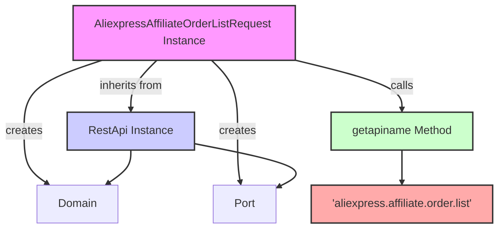

## Анализ кода `AliexpressAffiliateOrderListRequest.py`

### <алгоритм>
1. **Инициализация класса `AliexpressAffiliateOrderListRequest`**:
   - Создается экземпляр класса `AliexpressAffiliateOrderListRequest`.
   - Вызывается конструктор базового класса `RestApi` с параметрами `domain` (по умолчанию "api-sg.aliexpress.com") и `port` (по умолчанию 80).
   - Инициализируются атрибуты экземпляра: `app_signature`, `end_time`, `fields`, `locale_site`, `page_no`, `page_size`, `start_time`, `status` со значением `None`.
   *Пример:*
   ```python
   request = AliexpressAffiliateOrderListRequest(domain="example.com", port=443)
   # request.domain = "example.com"
   # request.port = 443
   # request.app_signature = None, ...
   ```
2. **Вызов метода `getapiname()`**:
   - Метод `getapiname()` вызывается у экземпляра класса `AliexpressAffiliateOrderListRequest`.
   - Метод возвращает строковое значение `'aliexpress.affiliate.order.list'`. Это имя API-метода, который будет вызываться.
   *Пример:*
   ```python
   api_name = request.getapiname()
   # api_name = 'aliexpress.affiliate.order.list'
   ```
3. **Использование экземпляра для построения запроса:**
   - Созданный экземпляр класса `AliexpressAffiliateOrderListRequest` используется для формирования HTTP-запроса к AliExpress API, устанавливая параметры (атрибуты класса) такие как `app_signature`, `end_time`, `fields`, `locale_site`, `page_no`, `page_size`, `start_time`, `status`.
   - Метод `getapiname` используется для определения конечной точки API.

### <mermaid>

**Объяснение зависимостей в `mermaid`:**

-   `AliexpressAffiliateOrderListRequest Instance` (A) - представляет экземпляр класса, который наследует от `RestApi`.
-   `RestApi Instance` (B) -  представляет экземпляр базового класса `RestApi`, от которого наследуется класс `AliexpressAffiliateOrderListRequest`.
-   `getapiname Method` (C) - метод, вызываемый у экземпляра `AliexpressAffiliateOrderListRequest`, возвращает имя API метода.
-    `'aliexpress.affiliate.order.list'` (D) -  строка, возвращаемая методом `getapiname` и представляющая имя API метода.
-    `Domain` (E) -  представляет атрибут `domain` при инициализации классов.
-    `Port` (F) -  представляет атрибут `port` при инициализации классов.

**Зависимости:**

1.  `AliexpressAffiliateOrderListRequest` наследуется от `RestApi`, поэтому есть зависимость `A -- inherits from --> B`.
2.  `AliexpressAffiliateOrderListRequest` создает атрибуты `domain`, `port`
3.  `AliexpressAffiliateOrderListRequest` вызывает метод `getapiname()`, поэтому есть зависимость `A -- calls --> C`.
4.  Метод `getapiname()` возвращает строку `'aliexpress.affiliate.order.list'`, поэтому есть зависимость `C --> D`.
5.  `RestApi`  содержит атрибуты `domain`, `port`, поэтому есть зависимость `B --> E`,  `B --> F`.

### <объяснение>

**Импорты:**

-   `from ..base import RestApi`: Импортируется класс `RestApi` из модуля `base`, расположенного на уровень выше в структуре пакетов (в данном случае, `src.suppliers.aliexpress.api`). `RestApi` служит базовым классом для всех API запросов. Таким образом, код демонстрирует использование наследования и повторное использование кода. `RestApi` предположительно предоставляет общую логику для формирования HTTP-запросов и работы с API.

**Классы:**

-   `AliexpressAffiliateOrderListRequest`:
    -   **Роль:** Этот класс предназначен для представления запроса на получение списка заказов через AliExpress Affiliate API.
    -   **Атрибуты:**
        -   `app_signature`: подпись приложения, необходимая для авторизации в API.
        -   `end_time`: время окончания периода для фильтрации заказов.
        -   `fields`: список полей, которые нужно включить в ответ.
        -   `locale_site`: язык и локализация для результатов.
        -   `page_no`: номер страницы результатов.
        -   `page_size`: размер страницы результатов.
        -   `start_time`: время начала периода для фильтрации заказов.
        -    `status`: статус заказа для фильтрации.
        Все атрибуты по умолчанию установлены в `None`, и предполагается их установка перед отправкой запроса.
    -   **Методы:**
        -   `__init__(self, domain="api-sg.aliexpress.com", port=80)`: Конструктор класса, который вызывает конструктор родительского класса `RestApi` и инициализирует атрибуты класса.
        -   `getapiname(self)`: Возвращает имя API-метода, который должен быть вызван (в данном случае '`aliexpress.affiliate.order.list'`).
    -   **Взаимодействие:**
        -   Наследуется от `RestApi`, получая его функциональность. Предполагается, что `RestApi` предоставляет механизмы для формирования и отправки HTTP-запросов.
        -   Атрибуты экземпляра (например, `start_time`, `end_time`) используются для формирования параметров запроса к API AliExpress.

**Функции:**

-   `__init__(self, domain="api-sg.aliexpress.com", port=80)`:
    -   **Аргументы:**
        -   `self`: Ссылка на экземпляр класса.
        -    `domain` (по умолчанию "api-sg.aliexpress.com"): Доменное имя API.
        -   `port` (по умолчанию 80): Порт для HTTP соединения.
    -   **Возвращаемое значение:** `None` (конструктор не возвращает значений).
    -   **Назначение:** Инициализирует экземпляр класса `AliexpressAffiliateOrderListRequest` и его атрибуты.
-   `getapiname(self)`:
    -   **Аргументы:**
        -   `self`: Ссылка на экземпляр класса.
    -   **Возвращаемое значение:** Строка `'aliexpress.affiliate.order.list'` (имя API метода).
    -   **Назначение:** Возвращает имя API-метода, которое будет вызываться.

**Переменные:**

-   `self.app_signature`, `self.end_time`, `self.fields`, `self.locale_site`, `self.page_no`, `self.page_size`, `self.start_time`, `self.status`: Атрибуты экземпляра класса `AliexpressAffiliateOrderListRequest`, которые хранят параметры запроса к API AliExpress. Тип переменных - любой, так как они инициализируются в `None`.

**Потенциальные ошибки и области для улучшения:**

-   **Отсутствие валидации:**  Нет проверок на типы и диапазоны значений атрибутов. Например, `page_no` и `page_size` должны быть положительными целыми числами.
-   **Отсутствие документации по атрибутам:** В коде нет документации о том, какие значения допустимы для каждого атрибута.
-   **Жестко заданный домен и порт:**  Хотя есть возможность передать их в конструктор, значения по умолчанию могут быть не всегда подходящими.
-   **Обработка ошибок:** Отсутствует обработка ошибок при выполнении запроса, что является критически важным при работе с внешними API.
-   **Непонятный `app_signature`**: Непонятно где и как получается подпись приложения.
-   **Отсутствие явных требований к значениям:** нет явного указания какие значения могут принимать атрибуты `status` и `fields`.

**Цепочка взаимосвязей с другими частями проекта:**

1.  `AliexpressAffiliateOrderListRequest` наследуется от `RestApi`, который, вероятно, является частью более общей библиотеки для работы с API AliExpress.
2.  Класс предназначен для использования совместно с другими модулями, которые могут устанавливать значения атрибутов и выполнять сам запрос.
3.  В проекте `hypotez` этот класс будет использоваться в модуле, который отвечает за получение данных о заказах через AliExpress.

В целом, код представляет собой базовый класс для формирования запроса к AliExpress Affiliate API. Он требует доработки для обеспечения надежной и правильной работы.