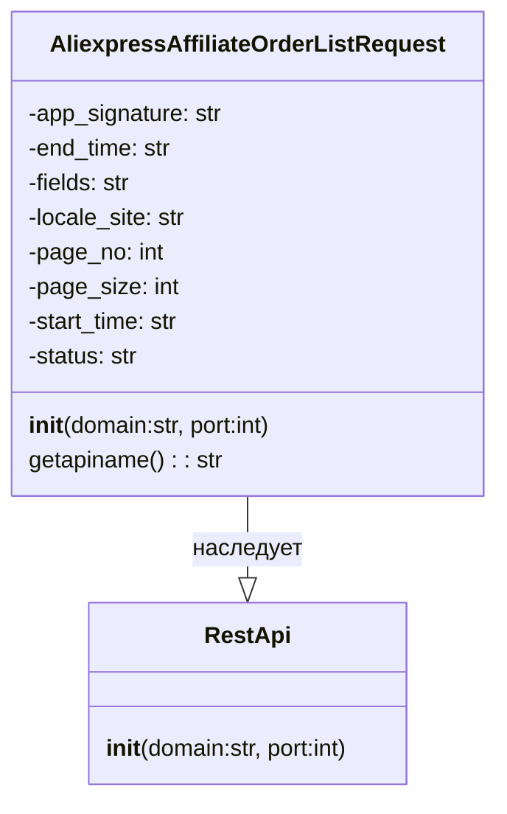

## АНАЛИЗ КОДА

### <алгоритм>

1.  **Инициализация объекта `AliexpressAffiliateOrderListRequest`**:
    *   Создается объект класса `AliexpressAffiliateOrderListRequest`.
    *   При инициализации вызывается конструктор родительского класса `RestApi` с параметрами `domain` (по умолчанию "api-sg.aliexpress.com") и `port` (по умолчанию 80).
    *   Устанавливаются начальные значения атрибутов объекта: `app_signature` (None), `end_time` (None), `fields` (None), `locale_site` (None), `page_no` (None), `page_size` (None), `start_time` (None), `status` (None).

    ```mermaid
    flowchart TD
        Start[Начало] --> InitClass[Создание объекта AliexpressAffiliateOrderListRequest];
        InitClass --> InitRestApi[Вызов конструктора RestApi с domain и port];
        InitRestApi --> SetAttributes[Установка начальных значений атрибутов объекта];
        SetAttributes --> End[Конец инициализации];
    ```

2.  **Вызов метода `getapiname`**:
    *   Метод вызывается у объекта `AliexpressAffiliateOrderListRequest`.
    *   Метод возвращает строку `'aliexpress.affiliate.order.list'`.

    ```mermaid
    flowchart TD
        StartGetApiName[Начало getapiname()] --> ReturnApiName[Возврат 'aliexpress.affiliate.order.list'];
        ReturnApiName --> EndGetApiName[Конец getapiname()];
    ```

### <mermaid>



**Объяснение зависимостей `mermaid`:**

*   **`AliexpressAffiliateOrderListRequest`**: Этот класс представляет собой запрос к API Aliexpress для получения списка заказов аффилиатов. Он имеет ряд атрибутов для параметров запроса, такие как `app_signature`, `end_time`, `fields`, `locale_site`, `page_no`, `page_size`, `start_time`, и `status`.  Также имеет метод `getapiname`, который возвращает название API метода.
*   **`RestApi`**: Это базовый класс для REST API запросов. `AliexpressAffiliateOrderListRequest` наследуется от этого класса, что означает, что он получает функциональность от `RestApi`, например, методы для отправки запросов и обработки ответов.
*   **Наследование `AliexpressAffiliateOrderListRequest --|> RestApi`**:  Показывает, что класс `AliexpressAffiliateOrderListRequest` наследует (является подклассом) класса `RestApi`.
*    В диаграмме показана зависимость (наследование) между классами. `AliexpressAffiliateOrderListRequest` является подклассом `RestApi`, что позволяет повторно использовать его методы и атрибуты.

### <объяснение>

**Импорты:**

*   `from ..base import RestApi`: Импортирует класс `RestApi` из модуля `base`, расположенного на уровень выше в иерархии каталогов (`src/suppliers/aliexpress/api/base`). `RestApi`, вероятно, содержит базовую логику для работы с REST API, такую как отправка HTTP-запросов и обработка ответов. Класс `AliexpressAffiliateOrderListRequest` наследует этот базовый функционал, что позволяет повторно использовать код.

**Классы:**

*   `AliexpressAffiliateOrderListRequest`:
    *   **Роль:** Представляет собой конкретный запрос к API Aliexpress для получения списка заказов аффилиатов.
    *   **Атрибуты:**
        *   `app_signature`: Подпись приложения (тип: `str` или `None`).
        *   `end_time`: Время окончания периода для фильтрации заказов (тип: `str` или `None`).
        *   `fields`: Поля, которые необходимо включить в ответ (тип: `str` или `None`).
        *   `locale_site`: Язык сайта (тип: `str` или `None`).
        *   `page_no`: Номер страницы (тип: `int` или `None`).
        *   `page_size`: Размер страницы (тип: `int` или `None`).
        *   `start_time`: Время начала периода для фильтрации заказов (тип: `str` или `None`).
        *   `status`: Статус заказа (тип: `str` или `None`).
    *   **Методы:**
        *   `__init__(self, domain="api-sg.aliexpress.com", port=80)`: Конструктор класса, инициализирует атрибуты класса и вызывает конструктор родительского класса `RestApi`.
        *   `getapiname(self)`: Возвращает название API метода (`'aliexpress.affiliate.order.list'`).
    *   **Взаимодействие:**  Этот класс наследует функциональность от `RestApi`, который, вероятно, отвечает за отправку запросов к API.
*   `RestApi`:
    *   **Роль:** Базовый класс для REST API запросов.
    *   **Методы:**
        *   `__init__(self, domain, port)`: Конструктор, инициализирует базовые атрибуты, такие как домен и порт для API запросов.

**Функции:**

*   `__init__`: Инициализирует объект класса `AliexpressAffiliateOrderListRequest`. Устанавливает значения атрибутов, некоторые из которых являются параметрами для запроса к API.
*   `getapiname`: Метод, который возвращает название API-метода, который будет использоваться для запроса.

**Переменные:**

*   Атрибуты класса `AliexpressAffiliateOrderListRequest` представляют собой параметры, необходимые для запроса к API, и их значения могут быть установлены при создании объекта класса, или до вызова методов API.

**Потенциальные ошибки и области для улучшения:**

*   **Валидация входных данных:** Код не проверяет типы и корректность входных данных. Например, можно добавить проверку типов для `page_no` и `page_size` (должны быть целыми числами) и форматов для  `start_time` и `end_time`.
*   **Обработка ошибок:** Код не содержит обработку ошибок, возникающих при отправке запроса к API или при получении ответа. Желательно добавить обработку ошибок, например, использование `try-except` блоков.
*   **Документирование:**  Код мог бы быть лучше документирован. Например, можно добавить docstrings для методов, чтобы объяснить их назначение и параметры.

**Цепочка взаимосвязей с другими частями проекта:**

*   `AliexpressAffiliateOrderListRequest`  использует базовый класс `RestApi`, который, вероятно, расположен в модуле `src.suppliers.aliexpress.api.base`.  `RestApi` в свою очередь зависит от базовых библиотек для HTTP запросов, которые, вероятно, также есть в проекте, но здесь они не описаны.
*   Этот класс, вероятно, будет использоваться в других частях проекта для получения списка заказов через API Aliexpress.

**В итоге:**

Этот код представляет собой класс для формирования запроса к Aliexpress API для получения списка заказов. Он наследует базовый класс `RestApi`, который предоставляет базовые средства для работы с REST API. Код нуждается в доработке в части обработки ошибок, валидации входных данных, и документировании.