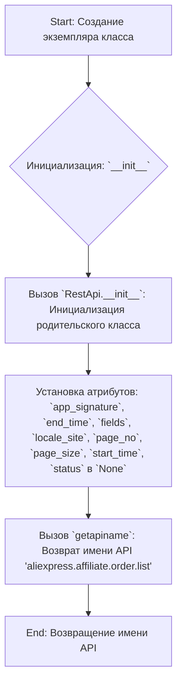
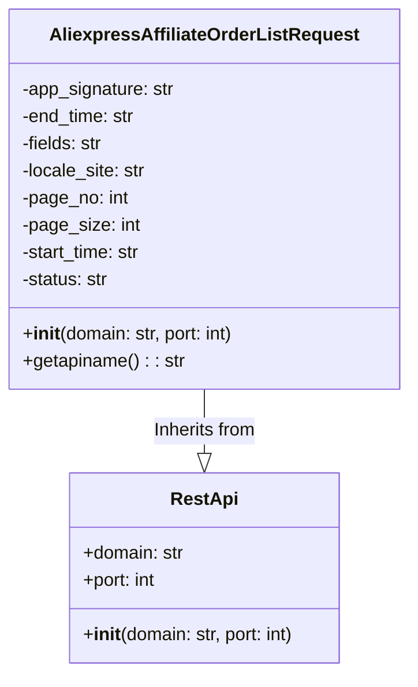

## Анализ кода `AliexpressAffiliateOrderListRequest.py`

### 1. <алгоритм>

**Блок-схема работы класса `AliexpressAffiliateOrderListRequest`:**



**Примеры:**

1.  **Создание экземпляра класса:**
    ```python
    request = AliexpressAffiliateOrderListRequest()
    ```
    *   Инициализирует объект запроса к API для получения списка заказов.

2.  **Инициализация (`__init__`):**
    *   Присваивает значения по умолчанию (обычно `None`) атрибутам запроса, таким как `app_signature`, `end_time`, `fields` и т.д.
    *   Вызывает конструктор родительского класса `RestApi`, передавая домен и порт API.
3. **Получение имени API (`getapiname`):**
    ```python
    api_name = request.getapiname()
    print(api_name)  # Output: aliexpress.affiliate.order.list
    ```
    *   Возвращает строку, представляющую имя API-метода для получения списка заказов.

### 2. <mermaid>



**Объяснение диаграммы:**

*   `AliexpressAffiliateOrderListRequest`: Класс, представляющий запрос к API для получения списка заказов Aliexpress.
    *   Атрибуты: `app_signature`, `end_time`, `fields`, `locale_site`, `page_no`, `page_size`, `start_time`, `status` хранят параметры запроса.
    *   Методы:
        *   `__init__`: Конструктор класса, инициализирует атрибуты и вызывает конструктор `RestApi`.
        *   `getapiname`: Возвращает имя API метода.
*   `RestApi`: Базовый класс для всех API запросов.
    *   Атрибуты: `domain`, `port` - домен и порт API.
    *   Методы: `__init__`: Конструктор класса, инициализирует атрибуты.
*   `AliexpressAffiliateOrderListRequest --|> RestApi`: Отношение наследования. Класс `AliexpressAffiliateOrderListRequest` наследует от `RestApi`.

### 3. <объяснение>

**Импорты:**

*   `from ..base import RestApi`: Импортирует базовый класс `RestApi` из модуля `base`, который находится на уровень выше в пакете (т.е. `src/suppliers/aliexpress/api/base.py`). Этот класс, вероятно, предоставляет общую функциональность для взаимодействия с REST API, такую как формирование запросов, отправка и обработка ответов.  `RestApi` является базовым классом для всех API запросов, поэтому от него наследуется класс `AliexpressAffiliateOrderListRequest`

**Классы:**

*   `AliexpressAffiliateOrderListRequest`:
    *   **Роль:** Представляет запрос для получения списка партнерских заказов с Aliexpress API.
    *   **Атрибуты:**
        *   `app_signature` (str): Подпись приложения.
        *   `end_time` (str): Время окончания диапазона поиска заказов.
        *   `fields` (str): Поля, которые должны быть включены в ответ.
        *   `locale_site` (str): Локальный сайт.
        *   `page_no` (int): Номер страницы результатов.
        *   `page_size` (int): Количество результатов на странице.
        *   `start_time` (str): Время начала диапазона поиска заказов.
        *   `status` (str): Статус заказов.
    *   **Методы:**
        *   `__init__(self, domain="api-sg.aliexpress.com", port=80)`: Конструктор класса. Принимает домен и порт API в качестве аргументов. Инициализирует атрибуты класса и вызывает конструктор базового класса `RestApi`.
        *   `getapiname(self)`: Возвращает имя API метода (`aliexpress.affiliate.order.list`).
    *   **Взаимодействие:** Наследует от класса `RestApi`, что позволяет использовать общую логику для работы с API.  Атрибуты данного класса будут использованы для создания запроса к API Aliexpress.

**Функции:**

*   `__init__`:
    *   **Аргументы:** `domain` (str, по умолчанию `"api-sg.aliexpress.com"`), `port` (int, по умолчанию 80).
    *   **Возвращаемое значение:** Нет (конструктор).
    *   **Назначение:** Инициализирует атрибуты класса `AliexpressAffiliateOrderListRequest`, включая вызов конструктора `RestApi` для базовой инициализации домена и порта. Устанавливает все атрибуты запроса в `None`.
*   `getapiname`:
    *   **Аргументы:** `self` (ссылка на экземпляр класса).
    *   **Возвращаемое значение:**  Строка (str) - имя API метода.
    *   **Назначение:** Возвращает имя API метода, которое используется для запроса списка заказов (`'aliexpress.affiliate.order.list'`).

**Переменные:**

*   `self.app_signature`, `self.end_time`, `self.fields`, `self.locale_site`, `self.page_no`, `self.page_size`, `self.start_time`, `self.status` - атрибуты экземпляра класса `AliexpressAffiliateOrderListRequest`.  Эти переменные будут использоваться для передачи параметров запроса к API. Изначально установлены в `None` и должны быть заполнены перед отправкой запроса.

**Потенциальные ошибки или области для улучшения:**

*   **Отсутствие валидации:**  Нет проверки типов и допустимых значений атрибутов перед отправкой запроса. Было бы полезно добавить проверку типов и границ значений для предотвращения ошибок API.
*   **Неявное использование `None`:** Использование `None` в качестве значения по умолчанию для многих атрибутов может привести к ошибкам, если не задать их явно перед отправкой запроса.
*   **Отсутствие документации:**  Нет docstring'ов для методов и класса, что делает код менее понятным.
*   **Отсутствие примеров использования:** Было бы полезно добавить примеры использования класса для лучшего понимания его работы.
*   **Не обработка исключений:** Нет обработки исключений при работе с сетью. Необходимо добавить блоки `try-except`.

**Цепочка взаимосвязей с другими частями проекта:**

*   Этот класс зависит от `RestApi` из `../base`, который, вероятно, является базовым классом для всех API запросов в проекте.
*   Этот класс будет использоваться для создания запросов к API Aliexpress, а полученные данные будут обрабатываться другими модулями проекта.
*  Этот класс является частью модуля `src.suppliers.aliexpress.api._examples.rest`, что подразумевает, что это пример работы с API aliexpress и его можно использовать для создания других методов для запросов.