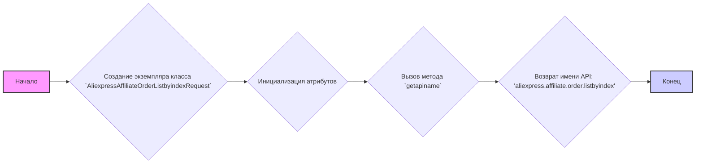
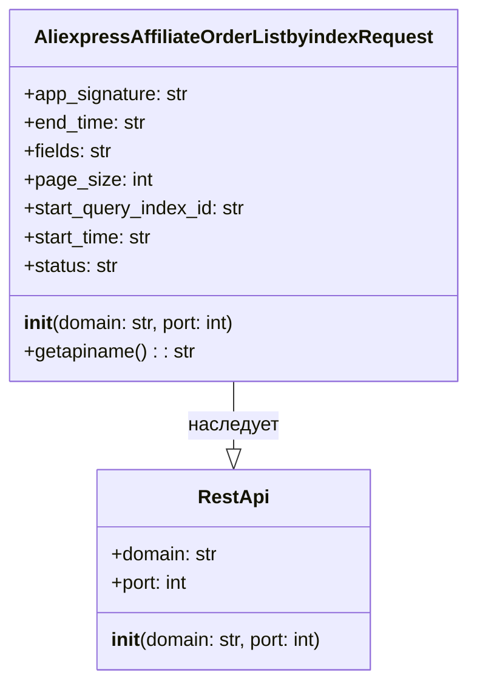

## АНАЛИЗ КОДА: `AliexpressAffiliateOrderListbyindexRequest.py`

### 1. <алгоритм>

**Блок-схема:**



**Примеры:**

1.  **Создание экземпляра:**
    ```python
    request = AliexpressAffiliateOrderListbyindexRequest()
    ```
    В результате создается объект, у которого атрибуты `app_signature`, `end_time`, `fields`, `page_size`, `start_query_index_id`, `start_time` и `status` инициализированы значением `None`. Атрибуты `domain` и `port` будут "api-sg.aliexpress.com" и 80 соответственно, если не переопределены в конструкторе.

2.  **Вызов метода `getapiname`:**
    ```python
    api_name = request.getapiname()
    print(api_name) # Вывод: aliexpress.affiliate.order.listbyindex
    ```
    Метод возвращает строку с именем API, которое используется для формирования запроса к AliExpress.

### 2. <mermaid>



**Объяснение:**

-   **`RestApi`**: Базовый класс для API запросов, определен в `from ..base import RestApi`. Он содержит общие атрибуты для всех API запросов: `domain` (адрес API сервера) и `port` (порт сервера). Конструктор `__init__` инициализирует эти параметры.
-   **`AliexpressAffiliateOrderListbyindexRequest`**: Класс, представляющий конкретный API запрос для получения списка заказов AliExpress. Он наследует от `RestApi`, получая его атрибуты и конструктор. Дополнительные атрибуты этого класса:
    -   `app_signature`: Подпись приложения.
    -   `end_time`: Конечная дата для фильтрации заказов.
    -   `fields`: Поля, которые нужно вернуть в ответе.
    -   `page_size`: Размер страницы (количество заказов на странице).
    -   `start_query_index_id`: Индекс для пагинации.
    -   `start_time`: Начальная дата для фильтрации заказов.
    -   `status`: Статус заказа.
    -   Метод `getapiname()`: Возвращает имя API метода.

**Импорты и Зависимости**:
Импорт `from ..base import RestApi` указывает на то, что класс `AliexpressAffiliateOrderListbyindexRequest` наследует функциональность базового класса `RestApi`, находящегося в файле `base.py` в родительском каталоге. Это типичная структура для организации классов API запросов, где общая логика выносится в базовый класс, а специфичные реализации добавляются в дочерние классы.

### 3. <объяснение>

**Импорты:**

-   `from ..base import RestApi`: Импортирует класс `RestApi` из модуля `base`, находящегося в родительском каталоге. Этот класс является базовым для всех REST API запросов в этом проекте.  `RestApi` предоставляет базовые атрибуты (например, `domain` и `port`) и методы для работы с REST API.  Это способствует повторному использованию кода и облегчает поддержку и расширение API-клиента.

**Классы:**

-   **`AliexpressAffiliateOrderListbyindexRequest`**: Этот класс представляет собой запрос для получения списка заказов AliExpress с пагинацией по индексу.
    -   **Роль**: Инкапсулирует всю необходимую информацию для выполнения данного API запроса. Он устанавливает параметры запроса (например, временные рамки, размер страницы, статус заказов).
    -   **Атрибуты**:
        -   `domain` (str): Доменное имя API сервера (по умолчанию `api-sg.aliexpress.com`).
        -   `port` (int): Порт API сервера (по умолчанию `80`).
        -   `app_signature` (str): Подпись приложения для авторизации.
        -   `end_time` (str): Конечная временная граница для фильтрации заказов.
        -   `fields` (str): Список полей, которые нужно получить в ответе.
        -   `page_size` (int): Количество заказов на одной странице.
        -   `start_query_index_id` (str): Индекс начала для запроса с пагинацией.
        -   `start_time` (str): Начальная временная граница для фильтрации заказов.
        -   `status` (str): Статус заказов, которые нужно получить.
    -   **Методы**:
        -   `__init__(self, domain="api-sg.aliexpress.com", port=80)`: Конструктор класса. Инициализирует базовые атрибуты `domain` и `port` класса `RestApi` и устанавливает остальные атрибуты в `None`.
        -   `getapiname(self)`: Метод, который возвращает имя API метода, используемого для данного запроса (`aliexpress.affiliate.order.listbyindex`).
    -   **Взаимодействие**: Наследуется от `RestApi`, что позволяет использовать общие атрибуты и функциональность для API запросов. В дальнейшем, экземпляры этого класса будут использоваться для формирования и отправки запросов на API AliExpress.

**Функции:**

-   `__init__(self, domain="api-sg.aliexpress.com", port=80)`: Конструктор класса. Принимает `domain` и `port` в качестве аргументов, инициализирует атрибуты объекта и вызывает конструктор родительского класса `RestApi`.
    -   **Аргументы**:
        -   `domain` (str, по умолчанию `"api-sg.aliexpress.com"`): Доменное имя API.
        -   `port` (int, по умолчанию `80`): Порт API.
    -   **Возвращаемое значение**: Нет.
-   `getapiname(self)`: Метод, который возвращает имя API метода.
    -   **Аргументы**: `self`.
    -   **Возвращаемое значение**: `str` - имя API (`aliexpress.affiliate.order.listbyindex`).

**Переменные:**

-   Все атрибуты класса (`app_signature`, `end_time`, `fields`, `page_size`, `start_query_index_id`, `start_time`, `status`) инициализируются значением `None` в конструкторе, пока не будут установлены конкретные значения перед отправкой запроса.
    -   **Типы**: `str`, `int`, в зависимости от атрибута.
    -   **Использование**: Хранят параметры запроса.

**Потенциальные ошибки и области для улучшения:**

-   **Отсутствие валидации параметров**: Не хватает валидации входных параметров в конструкторе и перед отправкой запроса, что может привести к ошибкам времени выполнения. Например, `page_size` должен быть положительным числом, а `start_time` и `end_time` должны быть в корректном формате даты.
-   **Отсутствие обработки ошибок**: Не реализована обработка ошибок при выполнении запроса.
-   **Отсутствие документации**: Отсутствует документация по использованию класса.
-   **Отсутствие констант для полей**: Можно добавить константы для имен полей, чтобы избежать опечаток.

**Взаимосвязи с другими частями проекта:**

-   Данный класс использует базовый класс `RestApi` из модуля `base`, предполагая, что там есть общая логика для работы с API (например, формирование запросов, отправка их на сервер, обработка ответов).
-   Этот класс, вероятно, используется в других частях проекта, где требуется получить список заказов AliExpress. Скорее всего, экземпляры этого класса создаются для отправки запросов, и результаты этих запросов обрабатываются в других модулях проекта.
-   Вся цепочка запросов будет выглядеть так: создание экземпляра `AliexpressAffiliateOrderListbyindexRequest`, установка параметров запроса (например, `start_time`, `end_time`, и т.д.), вызов методов класса `RestApi` (которые могут быть переопределены) для отправки запроса и обработки ответа, который затем передается обратно.