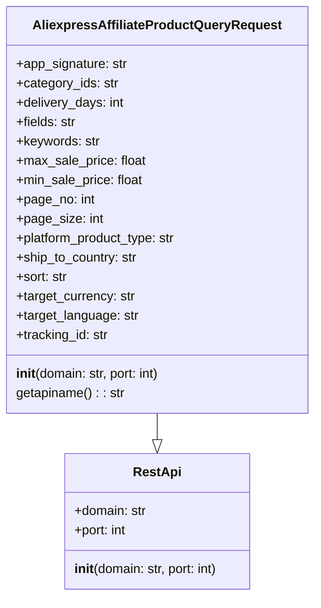

## Анализ кода `AliexpressAffiliateProductQueryRequest.py`

### <алгоритм>
1.  **Инициализация объекта `AliexpressAffiliateProductQueryRequest`**:
    *   Создается экземпляр класса `AliexpressAffiliateProductQueryRequest`.
    *   Вызывается конструктор `__init__`, который принимает домен и порт как аргументы (по умолчанию `"api-sg.aliexpress.com"` и `80`).
    *   Вызывается конструктор родительского класса `RestApi` с переданными доменом и портом.
    *   Инициализируются атрибуты экземпляра, такие как `app_signature`, `category_ids`, `delivery_days`, `fields`, `keywords`, `max_sale_price`, `min_sale_price`, `page_no`, `page_size`, `platform_product_type`, `ship_to_country`, `sort`, `target_currency`, `target_language` и `tracking_id` в `None`.
    *   *Пример:* `request = AliexpressAffiliateProductQueryRequest()` создаст объект с атрибутами, готовыми к настройке для запроса.
2.  **Получение имени API**:
    *   Вызывается метод `getapiname()`.
    *   Метод возвращает строку `'aliexpress.affiliate.product.query'`, которая является именем API для запроса.
    *   *Пример:* `api_name = request.getapiname()` вернет `'aliexpress.affiliate.product.query'`.

### <mermaid>

**Описание `mermaid` диаграммы:**
*   Диаграмма классов отображает отношения между `RestApi` и `AliexpressAffiliateProductQueryRequest`.
*   `RestApi` - это базовый класс с атрибутами `domain` и `port`, а также конструктором `__init__`.
*   `AliexpressAffiliateProductQueryRequest` наследуется от `RestApi` (обозначено `-->|`). Он включает дополнительные атрибуты, специфичные для запроса продуктов, а также метод `getapiname`.
*   Все атрибуты имеют соответствующие типы данных, например `str` (строка), `int` (целое число), `float` (число с плавающей точкой).
*   Отношение наследования показывает, что `AliexpressAffiliateProductQueryRequest` использует функциональность `RestApi` и расширяет её.

### <объяснение>

**Импорты:**
*   `from ..base import RestApi`: Импортирует класс `RestApi` из модуля `base`, расположенного на уровень выше в структуре пакетов (`src/suppliers/aliexpress/api`). Класс `RestApi`, вероятно, обеспечивает общую основу для взаимодействия с REST API, такую как обработка домена и порта. Данный импорт создает зависимость текущего модуля от `RestApi`, что позволяет `AliexpressAffiliateProductQueryRequest` использовать функциональность базового класса.

**Классы:**
*   `AliexpressAffiliateProductQueryRequest(RestApi)`:
    *   **Роль**: Этот класс предназначен для формирования запросов к API Aliexpress для получения списка товаров. Он наследует функциональность базового класса `RestApi` и добавляет атрибуты, специфичные для запроса продуктов.
    *   **Атрибуты**:
        *   `app_signature`: строка, подпись приложения.
        *   `category_ids`: строка, идентификаторы категорий товаров.
        *   `delivery_days`: целое число, количество дней доставки.
        *   `fields`: строка, поля для возврата в ответе API.
        *   `keywords`: строка, ключевые слова для поиска.
        *   `max_sale_price`: число с плавающей точкой, максимальная цена товара.
        *   `min_sale_price`: число с плавающей точкой, минимальная цена товара.
        *   `page_no`: целое число, номер страницы.
        *   `page_size`: целое число, размер страницы.
        *   `platform_product_type`: строка, тип продукта платформы.
        *   `ship_to_country`: строка, страна доставки.
        *   `sort`: строка, критерий сортировки.
        *   `target_currency`: строка, целевая валюта.
        *   `target_language`: строка, целевой язык.
        *   `tracking_id`: строка, идентификатор отслеживания.
        *   Все атрибуты изначально установлены в `None` и могут быть заполнены перед выполнением запроса.
    *   **Методы**:
        *   `__init__(self, domain="api-sg.aliexpress.com", port=80)`: Конструктор класса, вызывающий конструктор базового класса `RestApi` и инициализирующий атрибуты экземпляра.
        *   `getapiname(self)`: Возвращает имя API для запроса `'aliexpress.affiliate.product.query'`.
    *   **Взаимодействие**: Класс взаимодействует с `RestApi` через наследование, получая функциональность для управления доменным именем и портом. Он также предоставляет интерфейс для настройки параметров запроса продуктов.

**Функции:**
*   `__init__(self, domain="api-sg.aliexpress.com", port=80)`:
    *   **Аргументы**:
        *   `domain` (строка, по умолчанию `"api-sg.aliexpress.com"`): Доменное имя API.
        *   `port` (целое число, по умолчанию `80`): Порт API.
    *   **Возвращаемое значение**: Нет (конструктор).
    *   **Назначение**: Инициализирует объект, устанавливая домен и порт, вызывая конструктор родительского класса `RestApi` и инициализируя атрибуты запроса `None`.
    *   **Пример**: `request = AliexpressAffiliateProductQueryRequest(domain="api.aliexpress.ru", port=443)` создаст объект с пользовательским доменом и портом.
*   `getapiname(self)`:
    *   **Аргументы**: `self` (ссылка на экземпляр класса).
    *   **Возвращаемое значение**: Строка `'aliexpress.affiliate.product.query'`.
    *   **Назначение**: Возвращает имя API метода.
    *   **Пример**: `api_name = request.getapiname()` вернет `'aliexpress.affiliate.product.query'`.

**Переменные:**
*   Атрибуты класса (`app_signature`, `category_ids`, и т.д.) являются переменными экземпляра.
    *   **Типы**: Строки (str), целые числа (int), числа с плавающей точкой (float) или `None`.
    *   **Использование**: Хранят параметры для запроса к API. Могут быть установлены в различные значения перед выполнением запроса.

**Потенциальные ошибки и области для улучшения:**
*   Отсутствие валидации данных: Не выполняется проверка типов и значений входных данных. Например, `page_no` и `page_size` должны быть положительными числами.
*   Нет явного метода отправки запроса: В этом классе только формируется запрос, но нет логики его отправки. Отправка запроса вероятно происходит в родительском классе `RestApi` или другом месте.
*   Недостаток документации по возможным значениям параметров: Нет информации о возможных значениях параметров, таких как `sort`, `platform_product_type`.
*   Отсутствие обработки ошибок: Отсутствует обработка возможных ошибок при отправке запроса и получении ответа.
*   Возможна избыточность атрибутов: Некоторые атрибуты могут быть взаимосвязаны или не использоваться в определенных ситуациях, что может привести к ненужным переменным.
*   Использование `None` как значения по умолчанию. Было бы лучше использовать пустые строки или нули в зависимости от типа переменной.

**Цепочка взаимосвязей:**
*   `AliexpressAffiliateProductQueryRequest` наследует от `RestApi`, предполагая, что `RestApi` реализует основную логику отправки запросов.
*   После создания экземпляра `AliexpressAffiliateProductQueryRequest`,  его атрибуты устанавливаются для конкретного запроса, и затем вызывается `getapiname()` для получения имени API.
*   Далее, вероятно, в коде, где используется этот класс, будет вызов метода отправки запроса из `RestApi` с параметрами, настроенными в `AliexpressAffiliateProductQueryRequest`.

Этот анализ обеспечивает полное понимание функциональности кода, его взаимодействия с другими частями проекта, а также выявляет области, которые можно улучшить.