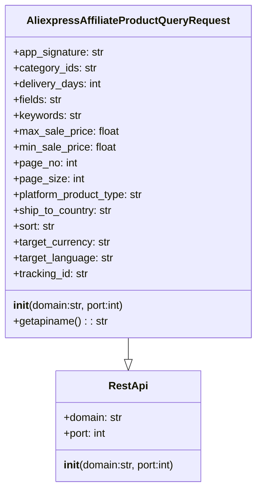
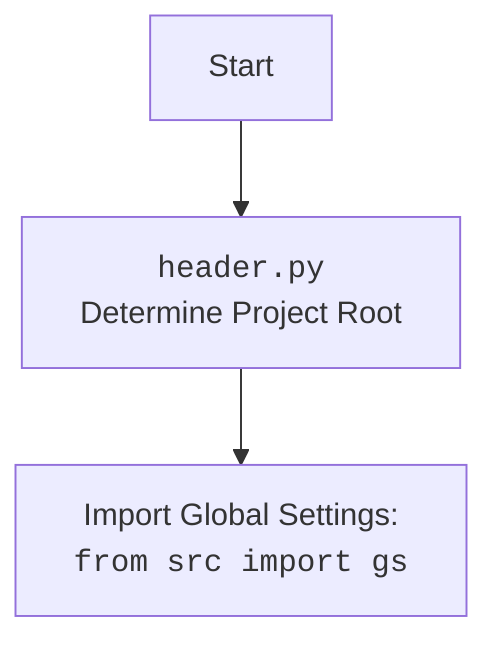

## Анализ кода `AliexpressAffiliateProductQueryRequest.py`

### 1. <алгоритм>

**Общая схема работы:**
1.  **Инициализация:** Создается экземпляр класса `AliexpressAffiliateProductQueryRequest`, который наследуется от `RestApi`.
    *   Пример: `request = AliexpressAffiliateProductQueryRequest(domain="api-sg.aliexpress.com", port=80)`
2.  **Установка параметров запроса:** Атрибутам экземпляра класса присваиваются значения, необходимые для формирования запроса к API Aliexpress.
    *   Примеры:
        *   `request.keywords = "headphones"`
        *   `request.min_sale_price = 10`
        *   `request.max_sale_price = 50`
        *   `request.page_no = 1`
        *   `request.page_size = 20`
3.  **Получение имени API:** Вызывается метод `getapiname()`, который возвращает имя API-метода для запроса.
    *   Пример: `api_name = request.getapiname()  # api_name будет равен 'aliexpress.affiliate.product.query'`

**Блок-схема:**

```mermaid
graph TD
    A[Начало: Создание экземпляра AliexpressAffiliateProductQueryRequest] --> B{Установка параметров запроса};
    B --> C{Вызов getapiname()};
    C --> D[Возврат имени API];
    D --> E[Конец];
    
    subgraph "Пример установки параметров"
    B --> B1(keywords="headphones");
    B --> B2(min_sale_price=10);
    B --> B3(max_sale_price=50);
    B --> B4(page_no=1);
    B --> B5(page_size=20);
    end
     
     style A fill:#f9f,stroke:#333,stroke-width:2px
     style B fill:#ccf,stroke:#333,stroke-width:2px
     style C fill:#ccf,stroke:#333,stroke-width:2px
     style D fill:#f9f,stroke:#333,stroke-width:2px
    
```

### 2. <mermaid>



**Объяснение диаграммы `mermaid`:**

*   `RestApi`: Это базовый класс, от которого наследуется `AliexpressAffiliateProductQueryRequest`. Он содержит атрибуты `domain` (домен API) и `port` (порт API). У класса есть метод `__init__`, который принимает домен и порт в качестве аргументов для инициализации.
*   `AliexpressAffiliateProductQueryRequest`: Это класс, представляющий запрос к API Aliexpress для получения списка продуктов. Он наследует свойства от `RestApi` и добавляет специфичные для этого запроса атрибуты, такие как `app_signature`, `category_ids`, `keywords`, и т.д. Также есть метод `getapiname()`, который возвращает имя API-метода.
*   `--|>`:  Стрелка с пустым треугольником показывает отношение наследования. `AliexpressAffiliateProductQueryRequest` наследует от `RestApi`.

**Импорт `header.py`:**

В данном коде нет явного импорта `header.py`. Если бы был импорт `from src import header`, то  соответствующий mermaid блок выглядел бы так:



### 3. <объяснение>

**Импорты:**

*   `from ..base import RestApi`: Импортирует класс `RestApi` из модуля `base`, который находится в родительской директории текущего модуля. Класс `RestApi` предоставляет базовую функциональность для взаимодействия с API, такую как установку домена и порта.

**Классы:**

*   `AliexpressAffiliateProductQueryRequest(RestApi)`:
    *   **Роль:** Этот класс представляет запрос для получения списка продуктов через API Aliexpress. Он отвечает за хранение параметров запроса и генерацию имени API-метода.
    *   **Атрибуты:**
        *   `domain`: Доменное имя API-сервера Aliexpress (по умолчанию "api-sg.aliexpress.com").
        *   `port`: Порт API-сервера (по умолчанию 80).
        *   `app_signature`: Подпись приложения, необходимая для аутентификации.
        *   `category_ids`: Идентификаторы категорий товаров.
        *   `delivery_days`: Максимальное количество дней доставки.
        *   `fields`: Список полей, которые нужно включить в ответ.
        *   `keywords`: Ключевые слова для поиска товаров.
        *   `max_sale_price`: Максимальная цена товара.
        *   `min_sale_price`: Минимальная цена товара.
        *   `page_no`: Номер страницы результатов.
        *   `page_size`: Количество результатов на странице.
        *   `platform_product_type`: Тип товара (например, "general").
        *   `ship_to_country`: Страна доставки.
        *   `sort`: Параметр сортировки результатов.
        *   `target_currency`: Валюта цены.
        *   `target_language`: Язык описания товара.
        *   `tracking_id`: Идентификатор отслеживания партнера.
    *   **Методы:**
        *   `__init__(self, domain="api-sg.aliexpress.com", port=80)`: Конструктор класса, инициализирует атрибуты класса. Принимает домен и порт в качестве аргументов. Вызывает конструктор родительского класса `RestApi.__init__(self, domain, port)`.
        *   `getapiname(self)`: Возвращает имя API-метода, которое равно `'aliexpress.affiliate.product.query'`.
    *   **Взаимодействие:**
        *   Наследуется от `RestApi`, получая базовую функциональность для взаимодействия с API.
        *   Используется для создания объекта запроса, который может быть передан функции для отправки запроса к API.

**Функции:**

*   `__init__(self, domain="api-sg.aliexpress.com", port=80)`: Конструктор класса `AliexpressAffiliateProductQueryRequest`, инициализирует атрибуты экземпляра класса, устанавливая дефолтные значения для домена и порта, и вызывает конструктор базового класса `RestApi`.
*   `getapiname(self)`: Возвращает имя API метода `aliexpress.affiliate.product.query` в виде строки.

**Переменные:**

*   Переменные экземпляра класса `AliexpressAffiliateProductQueryRequest` - это параметры запроса к API, которые устанавливаются при создании и использовании объекта. Они хранят значения, необходимые для формирования и отправки запроса к API.
    *   Примеры: `domain`, `port`, `app_signature`, `category_ids`, и т.д., как описано в разделе "Классы" -> "Атрибуты".

**Потенциальные ошибки и области для улучшения:**

*   **Отсутствие валидации параметров:** Не проверяется корректность передаваемых параметров. Например, `page_no` и `page_size` должны быть положительными числами.
*   **Отсутствие документации:** Нет явного описания значений параметров и их допустимых форматов.
*   **Обработка ошибок:** Код не содержит обработки ошибок, например, при некорректном ответе от API.

**Взаимосвязь с другими частями проекта:**

*   Класс `AliexpressAffiliateProductQueryRequest` вероятно используется в связке с другими модулями, которые выполняют отправку запросов к API Aliexpress и обрабатывают полученные данные.
*   Он зависит от класса `RestApi`, который обеспечивает базовую функциональность для взаимодействия с API.
*   Этот класс является частью слоя API для работы с Aliexpress, и взаимодействует с другими слоями проекта, например с бизнес-логикой, представлением данных.