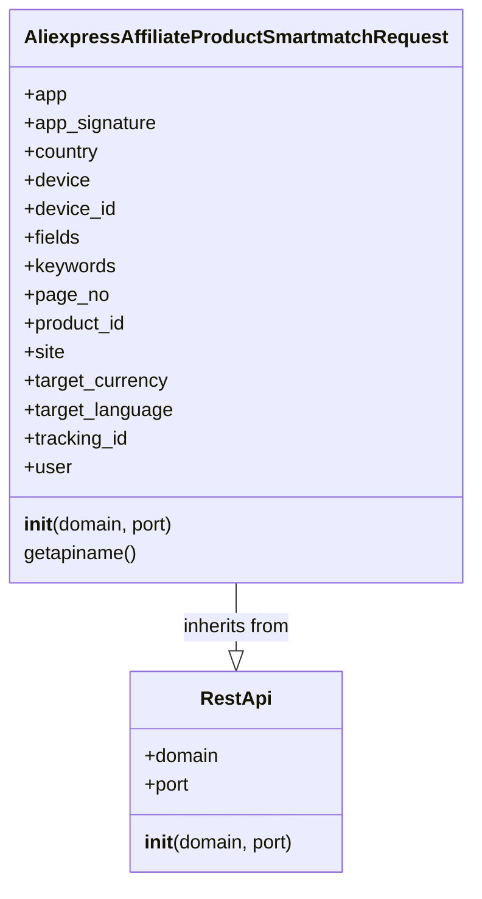

## Анализ кода `AliexpressAffiliateProductSmartmatchRequest.py`

### <алгоритм>
1. **Инициализация объекта `AliexpressAffiliateProductSmartmatchRequest`**:
   - Создается объект класса `AliexpressAffiliateProductSmartmatchRequest`.
   - Вызывается конструктор родительского класса `RestApi` (`RestApi.__init__(self, domain, port)`), который инициализирует домен и порт для API запросов. Например, `domain` может быть "api-sg.aliexpress.com", а `port` - 80.
   - Инициализируются атрибуты объекта значениями по умолчанию `None`: `app`, `app_signature`, `country`, `device`, `device_id`, `fields`, `keywords`, `page_no`, `product_id`, `site`, `target_currency`, `target_language`, `tracking_id`, `user`. Эти атрибуты будут использоваться для формирования запроса к API.

2. **Получение имени API (`getapiname`)**:
   - Вызывается метод `getapiname()` объекта `AliexpressAffiliateProductSmartmatchRequest`.
   - Этот метод возвращает строку `'aliexpress.affiliate.product.smartmatch'`, которая представляет имя API метода для запроса.

### <mermaid>

### <объяснение>

#### Импорты
-   `from ..base import RestApi`:
    -   Импортирует класс `RestApi` из модуля `base`, расположенного на уровень выше в структуре директорий (`src.suppliers.aliexpress.api.base`).
    -   Класс `RestApi` вероятно содержит общую логику для работы с REST API, такую как отправка запросов и обработка ответов.
    -   Это является частью общей структуры для работы с различными API поставщиков, обеспечивая переиспользование кода.

#### Классы
-   `AliexpressAffiliateProductSmartmatchRequest(RestApi)`:
    -   Этот класс представляет собой запрос к API AliExpress для получения списка товаров с использованием "умного" сопоставления (smart match).
    -   Он наследует от класса `RestApi`, что позволяет использовать общую логику для работы с API.
    -   **Атрибуты:**
        -   `app`, `app_signature`: Идентификатор приложения и его подпись, необходимые для аутентификации.
        -   `country`: Страна пользователя.
        -   `device`, `device_id`: Информация об устройстве пользователя.
        -   `fields`: Список полей, которые нужно включить в ответ.
        -   `keywords`: Ключевые слова для поиска товаров.
        -   `page_no`: Номер страницы результатов.
        -   `product_id`: ID конкретного товара (возможно для получения похожих).
        -   `site`: Сайт AliExpress, с которого делается запрос.
        -   `target_currency`, `target_language`: Целевая валюта и язык для отображения результатов.
        -   `tracking_id`: ID отслеживания.
        -   `user`: ID пользователя.
    -   **Методы:**
        -   `__init__(self, domain="api-sg.aliexpress.com", port=80)`: Конструктор класса, который инициализирует атрибуты и вызывает конструктор родительского класса `RestApi` для установки домена и порта.
        -   `getapiname(self)`: Метод, который возвращает имя API метода (`'aliexpress.affiliate.product.smartmatch'`).

#### Функции
-   `__init__(self, domain="api-sg.aliexpress.com", port=80)`:
    -   Конструктор класса `AliexpressAffiliateProductSmartmatchRequest`.
    -   Аргументы:
        -   `domain` (строка, по умолчанию "api-sg.aliexpress.com"): Доменное имя API сервера AliExpress.
        -   `port` (целое число, по умолчанию 80): Порт API сервера.
    -   Инициализирует атрибуты экземпляра класса, которые используются для формирования API-запроса.
- `getapiname(self)`:
    -   Метод, возвращающий имя API-метода.
    -   Аргументы: `self` - ссылка на экземпляр класса.
    -   Возвращаемое значение: строка `'aliexpress.affiliate.product.smartmatch'`.

#### Переменные
-   Все атрибуты класса (`app`, `app_signature`, `country`, `device`, `device_id`, `fields`, `keywords`, `page_no`, `product_id`, `site`, `target_currency`, `target_language`, `tracking_id`, `user`) являются переменными экземпляра класса.
-   Они используются для хранения параметров запроса к API.
-  `domain` и `port` используются для базовой настройки подключения к API.

#### Потенциальные ошибки и улучшения
-   **Отсутствие валидации параметров**:  В коде отсутствует валидация типов данных и значений для атрибутов класса, что может привести к ошибкам во время выполнения, если передаются некорректные данные.
-   **Отсутствие документации**: Код хорошо структурирован, но не содержит docstrings для функций и методов, что затрудняет понимание его назначения и использования.
-   **Жестко заданный домен и порт**: Хотя в конструкторе есть аргументы `domain` и `port`, значения по умолчанию могут быть жестко заданы. Возможно, стоит сделать эти параметры более гибкими через внешнюю конфигурацию.
-  **Не реализована логика отправки запроса**: Код только определяет структуру запроса, но не реализует фактическую отправку HTTP запроса к API, которая должна быть в базовом классе `RestApi`.

#### Взаимосвязь с другими частями проекта
-   Этот класс предназначен для работы в рамках системы, которая взаимодействует с API AliExpress.
-   Он является частью модуля `src.suppliers.aliexpress.api._examples.rest`, который вероятно содержит примеры использования API.
-   Он использует класс `RestApi` из `src.suppliers.aliexpress.api.base`, что указывает на общую архитектуру для работы с API разных поставщиков.