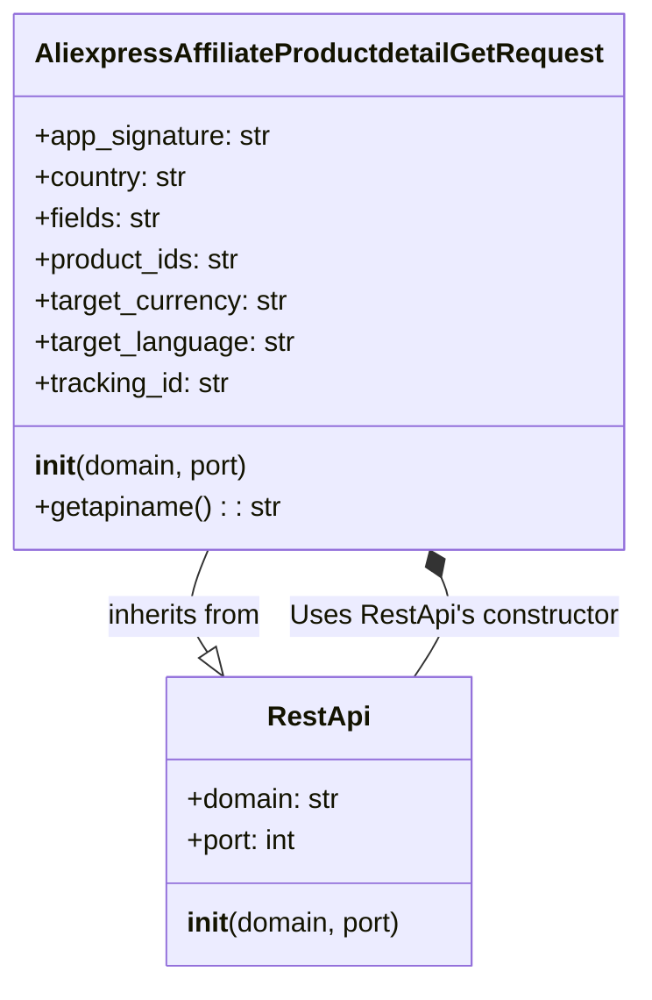

## <алгоритм>

1. **Инициализация класса `AliexpressAffiliateProductdetailGetRequest`:**
   - Создается экземпляр класса `AliexpressAffiliateProductdetailGetRequest`, при этом вызывается конструктор `__init__`.
   - В конструкторе:
     - Вызывается конструктор родительского класса `RestApi` с параметрами `domain="api-sg.aliexpress.com"` и `port=80` (по умолчанию).
       - Например, `request = AliexpressAffiliateProductdetailGetRequest()` создаст объект с доменом "api-sg.aliexpress.com" и портом 80.
     - Инициализируются атрибуты экземпляра `self.app_signature`, `self.country`, `self.fields`, `self.product_ids`, `self.target_currency`, `self.target_language`, `self.tracking_id` значением `None`.
       - Например, `request.app_signature` будет `None` до тех пор, пока ему не будет присвоено конкретное значение.
2. **Вызов метода `getapiname`:**
   - Вызывается метод `getapiname` у экземпляра класса `AliexpressAffiliateProductdetailGetRequest`.
   - Метод `getapiname` возвращает строку `'aliexpress.affiliate.productdetail.get'`.
     - Например, `api_name = request.getapiname()` присвоит переменной `api_name` значение `'aliexpress.affiliate.productdetail.get'`.

## <mermaid>

**Объяснение зависимостей:**

- `AliexpressAffiliateProductdetailGetRequest` наследует от `RestApi`, что обозначается стрелкой с полым треугольником (`--|>`). Это означает, что `AliexpressAffiliateProductdetailGetRequest` является подклассом `RestApi` и имеет доступ ко всем его публичным методам и атрибутам.
-  `AliexpressAffiliateProductdetailGetRequest`  использует конструктор `__init__` из `RestApi`, что обозначено ассоциацией `*--`. Это означает, что `AliexpressAffiliateProductdetailGetRequest` вызывает  конструктор `__init__` базового класса для своей инициализации.

## <объяснение>

**Импорты:**

- `from ..base import RestApi`:
    - Импортирует класс `RestApi` из модуля `base`, расположенного на уровень выше в иерархии пакетов (`..`).
    - Это означает, что класс `AliexpressAffiliateProductdetailGetRequest` будет использовать функциональность класса `RestApi` для взаимодействия с API.
    - Предполагается, что `RestApi` содержит общую логику для отправки REST-запросов, а `AliexpressAffiliateProductdetailGetRequest` будет его конкретным применением для получения деталей продукта.

**Классы:**

- `AliexpressAffiliateProductdetailGetRequest(RestApi)`:
    - Это класс, представляющий запрос к API AliExpress для получения информации о деталях продукта.
    - Он наследует от класса `RestApi`, что позволяет ему переиспользовать общую логику для работы с REST API.
    - **Атрибуты**:
      - `app_signature` (str, по умолчанию `None`): Подпись приложения.
      - `country` (str, по умолчанию `None`): Страна, для которой запрашивается информация.
      - `fields` (str, по умолчанию `None`): Список полей, которые нужно включить в ответ.
      - `product_ids` (str, по умолчанию `None`): Идентификаторы продуктов, для которых запрашивается информация.
      - `target_currency` (str, по умолчанию `None`): Валюта, в которой нужно получить цены.
      - `target_language` (str, по умолчанию `None`): Язык, на котором нужно получить информацию.
      - `tracking_id` (str, по умолчанию `None`): Идентификатор отслеживания.
    - **Методы**:
      - `__init__(self, domain="api-sg.aliexpress.com", port=80)`:
        - Конструктор класса. Принимает домен и порт API в качестве параметров, по умолчанию "api-sg.aliexpress.com" и 80.
        - Инициализирует атрибуты класса и вызывает конструктор родительского класса `RestApi`.
      - `getapiname(self)`:
        - Возвращает имя API метода: `'aliexpress.affiliate.productdetail.get'`.
        - Этот метод используется для формирования правильного URL запроса.
    - **Взаимодействие**:
      - Класс использует `RestApi` для отправки запросов.
      - Параметры экземпляра класса (например, `product_ids`, `fields`) будут использованы для формирования параметров запроса.

**Функции:**

- `__init__(self, domain="api-sg.aliexpress.com", port=80)`:
  - **Аргументы:**
      - `self`: Ссылка на текущий экземпляр класса.
      - `domain` (str): Доменное имя API, по умолчанию `"api-sg.aliexpress.com"`.
      - `port` (int): Порт API, по умолчанию `80`.
  - **Возвращаемое значение:** `None`. Функция является конструктором и не возвращает значение.
  - **Назначение:** Инициализирует объект класса `AliexpressAffiliateProductdetailGetRequest`. Вызывает конструктор базового класса `RestApi` и устанавливает начальные значения атрибутов запроса.
- `getapiname(self)`:
  - **Аргументы:**
     - `self`: Ссылка на текущий экземпляр класса.
  - **Возвращаемое значение:** `str`. Возвращает строку `'aliexpress.affiliate.productdetail.get'`.
  - **Назначение:** Возвращает имя API метода, который будет использоваться при отправке запроса.

**Переменные:**

- Атрибуты класса (`app_signature`, `country`, `fields`, `product_ids`, `target_currency`, `target_language`, `tracking_id`) все имеют тип `str` и по умолчанию инициализируются значением `None`.
  - Они представляют параметры, которые могут быть заданы для запроса к API.

**Потенциальные ошибки и области для улучшения:**

- **Отсутствие валидации параметров**: Код не проверяет корректность переданных параметров (например, формат `product_ids`).
- **Отсутствие обработки ошибок**: Код не обрабатывает ошибки, которые могут возникнуть при выполнении запроса.
- **Жестко заданные значения домена и порта**: Можно сделать их конфигурируемыми, а не задавать по умолчанию.
- **Нет документации**: Было бы полезно добавить комментарии к коду и docstrings для функций и классов.

**Цепочка взаимосвязей:**

1. Класс `AliexpressAffiliateProductdetailGetRequest` наследует от `RestApi`, который, предположительно, предоставляет базовые функции для отправки REST-запросов.
2. При создании объекта `AliexpressAffiliateProductdetailGetRequest`, вызывается конструктор `RestApi`.
3. Метод `getapiname` возвращает имя API метода.
4. Объект `AliexpressAffiliateProductdetailGetRequest` используется для настройки параметров запроса к API AliExpress, а затем отправляет запрос с использованием методов, унаследованных от `RestApi` (хотя в этом примере нет кода отправки запроса, он подразумевается на основе использования `RestApi`).
5. Другие части проекта, например, модули для обработки ответов от API, будут использовать объекты `AliexpressAffiliateProductdetailGetRequest` для получения данных о продуктах.