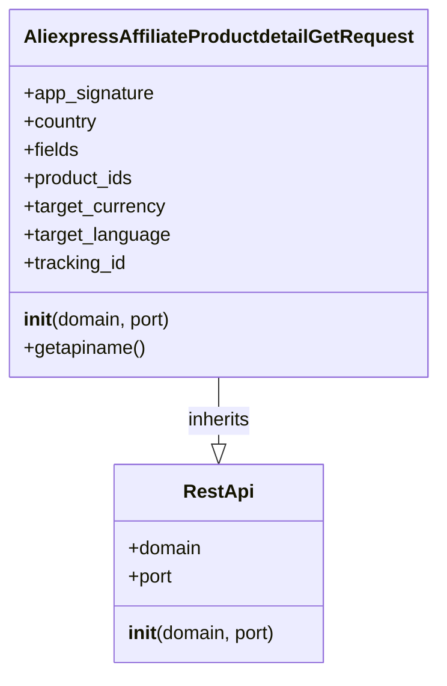

## Анализ кода `AliexpressAffiliateProductdetailGetRequest.py`

### <алгоритм>

1.  **Инициализация объекта `AliexpressAffiliateProductdetailGetRequest`**:
    *   Создается экземпляр класса `AliexpressAffiliateProductdetailGetRequest`.
    *   Вызывается конструктор `__init__`.
    *   Конструктор принимает необязательные аргументы `domain` (по умолчанию "api-sg.aliexpress.com") и `port` (по умолчанию 80).
    *   Вызывается конструктор родительского класса `RestApi` с переданными `domain` и `port`.
        *   Пример: `request = AliexpressAffiliateProductdetailGetRequest(domain="api.aliexpress.com", port=443)`
    *   Инициализируются атрибуты экземпляра:
        *   `app_signature` (строка, по умолчанию `None`). Представляет собой подпись приложения.
        *   `country` (строка, по умолчанию `None`). Код страны для фильтрации товаров.
        *   `fields` (строка, по умолчанию `None`).  Список полей, которые необходимо получить в ответе API.
        *   `product_ids` (строка, по умолчанию `None`). Список ID товаров, которые нужно получить.
        *   `target_currency` (строка, по умолчанию `None`).  Целевая валюта для отображения цен.
        *   `target_language` (строка, по умолчанию `None`).  Целевой язык для отображения информации.
        *  `tracking_id` (строка, по умолчанию `None`). ID для отслеживания.
2.  **Вызов метода `getapiname`**:
    *   Вызывается метод `getapiname` у экземпляра `AliexpressAffiliateProductdetailGetRequest`.
    *   Метод возвращает строку `'aliexpress.affiliate.productdetail.get'`.
        *   Пример: `api_name = request.getapiname()`, `api_name` будет равно `'aliexpress.affiliate.productdetail.get'`

### <mermaid>

**Объяснение:**

*   **`RestApi`**:  Представляет базовый класс для взаимодействия с REST API. Содержит атрибуты `domain` (доменное имя API) и `port` (порт API), а также метод `__init__` для их инициализации.
*   **`AliexpressAffiliateProductdetailGetRequest`**:  Представляет класс, который формирует запрос для получения подробной информации о товарах AliExpress. Он наследует от `RestApi`, что позволяет ему использовать общую логику работы с API. Содержит атрибуты для настройки запроса и метод `getapiname()` который возвращает имя вызываемого API.
*   **`AliexpressAffiliateProductdetailGetRequest --|> RestApi : inherits`**: Означает, что класс `AliexpressAffiliateProductdetailGetRequest` наследует класс `RestApi`, т.е. приобретает все свойства и методы `RestApi`.

### <объяснение>

**Импорты:**

*   `from ..base import RestApi`: Импортирует класс `RestApi` из модуля `base`, находящегося на уровень выше в иерархии пакетов (относительно текущего модуля). `RestApi`, вероятно, содержит базовую реализацию для взаимодействия с REST API, такую как формирование URL, отправка запросов и т.д. `src.suppliers.aliexpress.api.base.RestApi` является базовым классом для всех запросов к API Aliexpress.

**Классы:**

*   **`AliexpressAffiliateProductdetailGetRequest`**:
    *   **Роль:** Этот класс представляет запрос для получения подробной информации о товарах AliExpress через API. Он инкапсулирует параметры запроса и предоставляет метод для получения имени API.
    *   **Атрибуты:**
        *   `app_signature`:  Подпись приложения, необходимая для авторизации.
        *   `country`: Код страны для фильтрации товаров (например, "US" для США).
        *   `fields`: Список полей, которые нужно получить в ответе API (например, "title,images,price").
        *   `product_ids`: Список идентификаторов товаров, информацию о которых нужно получить (например, "12345,67890").
        *   `target_currency`: Целевая валюта, в которой будут отображены цены (например, "USD").
        *   `target_language`: Целевой язык для отображения информации (например, "en" для английского).
        *   `tracking_id`: ID для отслеживания.
    *   **Методы:**
        *   `__init__(self, domain="api-sg.aliexpress.com", port=80)`: Конструктор класса, который инициализирует атрибуты экземпляра, вызывая конструктор родительского класса `RestApi`. Устанавливает значения по умолчанию для `domain` и `port`.
        *   `getapiname(self)`:  Возвращает строку, представляющую имя API метода, которое будет использоваться в запросе (в данном случае 'aliexpress.affiliate.productdetail.get').

**Функции:**

*   `__init__(self, domain="api-sg.aliexpress.com", port=80)`: Конструктор класса.
    *   **Аргументы:**
        *   `domain`: Строка, доменное имя API сервера (по умолчанию "api-sg.aliexpress.com").
        *   `port`: Целое число, порт API сервера (по умолчанию 80).
    *   **Возвращает:** `None` (метод-конструктор).
    *   **Назначение:** Инициализирует объект класса, устанавливает значения атрибутов, включая вызов конструктора родительского класса `RestApi`.
*   `getapiname(self)`:
    *   **Аргументы:** `self` - ссылка на экземпляр класса.
    *   **Возвращает:** Строку `'aliexpress.affiliate.productdetail.get'`.
    *   **Назначение:** Возвращает имя API метода, который будет использоваться для отправки запроса.

**Переменные:**

*   `domain`: Строка, представляющая доменное имя API сервера (используется в конструкторе).
*   `port`: Целое число, представляющее порт API сервера (используется в конструкторе).
*   `app_signature`, `country`, `fields`, `product_ids`, `target_currency`, `target_language`, `tracking_id`: Строки, представляющие параметры запроса. Изначально установлены в `None`, но могут быть присвоены значения при использовании экземпляра класса.

**Потенциальные ошибки и области для улучшения:**

*   В коде не предусмотрена валидация входных параметров, что может привести к ошибкам при выполнении запросов.
*   Не указаны типы данных для атрибутов класса, что затрудняет чтение и понимание кода. Можно добавить type hints.
*   Нет обработки исключений, которые могут возникнуть при работе с API.
*   Метод `getapiname` возвращает жестко заданную строку. Для более гибкой архитектуры можно было бы рассмотреть возможность хранить имя API в отдельной переменной или константе.

**Взаимосвязи с другими частями проекта:**

*   Этот класс является частью пакета `src.suppliers.aliexpress.api`, который, вероятно, отвечает за взаимодействие с API AliExpress.
*   Он наследует `RestApi` из `src.suppliers.aliexpress.api.base`, что предполагает, что в проекте есть общая архитектура для работы с REST API.
*   Экземпляры этого класса, вероятно, используются в других частях проекта для формирования запросов к API AliExpress и получения информации о товарах.  Возможно, используется в связке с другими запросами, вроде `AliexpressAffiliateCategoryGetRequest`.