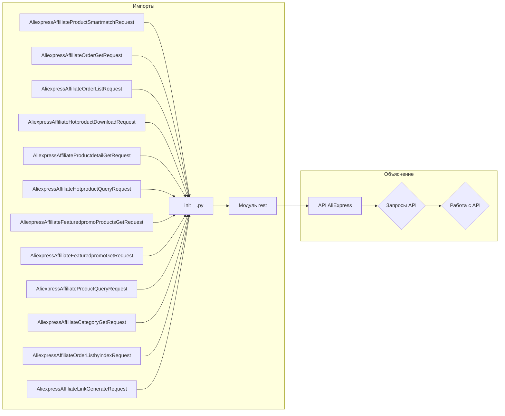

# <input code>

```python
## \file hypotez/src/suppliers/aliexpress/api/_examples/rest/__init__.py
# -*- coding: utf-8 -*-
#! venv/Scripts/python.exe # <- venv win
## ~~~~~~~~~~~~~\
""" module: src.suppliers.aliexpress.api._examples.rest """
from .AliexpressAffiliateProductSmartmatchRequest import AliexpressAffiliateProductSmartmatchRequest
from .AliexpressAffiliateOrderGetRequest import AliexpressAffiliateOrderGetRequest
from .AliexpressAffiliateOrderListRequest import AliexpressAffiliateOrderListRequest
from .AliexpressAffiliateHotproductDownloadRequest import AliexpressAffiliateHotproductDownloadRequest
from .AliexpressAffiliateProductdetailGetRequest import AliexpressAffiliateProductdetailGetRequest
from .AliexpressAffiliateHotproductQueryRequest import AliexpressAffiliateHotproductQueryRequest
from .AliexpressAffiliateFeaturedpromoProductsGetRequest import AliexpressAffiliateFeaturedpromoProductsGetRequest
from .AliexpressAffiliateFeaturedpromoGetRequest import AliexpressAffiliateFeaturedpromoGetRequest
from .AliexpressAffiliateProductQueryRequest import AliexpressAffiliateProductQueryRequest
from .AliexpressAffiliateCategoryGetRequest import AliexpressAffiliateCategoryGetRequest
from .AliexpressAffiliateOrderListbyindexRequest import AliexpressAffiliateOrderListbyindexRequest
from .AliexpressAffiliateLinkGenerateRequest import AliexpressAffiliateLinkGenerateRequest
```

# <algorithm>

Этот файл представляет собой модуль `__init__.py` для пакета `rest` внутри модуля `api` поставщика AliExpress.  Он импортирует различные классы, вероятно, представляющие запросы к API AliExpress.  Пошаговой блок-схемы в данном случае нет, так как файл просто импортирует другие модули. Данные не перемещаются, так как это только импорт.

# <mermaid>



# <explanation>

**Импорты**: Файл `__init__.py` служит точкой входа для пакета `rest`.  В нём происходит импорт классов, определяющих различные запросы к API AliExpress. Все классы имеют префикс `AliexpressAffiliate`, указывающий на их связь с аффилиатными программами AliExpress.  Импорты из `.` указывают на то, что импортируемые модули находятся в текущей директории (`hypotez/src/suppliers/aliexpress/api/_examples/rest`).

**Классы**: Файл импортирует несколько классов, каждый, вероятно, описывающий отдельный тип запроса к API AliExpress, например, получение информации о продукте, списки заказов и так далее.  Эти классы, определённые в других файлах (`*.py`),  содержат логику для создания, обработки и отправки запросов.

**Функции**: В самом файле нет определений функций.  Все функции, вероятно, определены в классах, импортируемых из других файлов, и отвечают за логику взаимодействия с API.

**Переменные**: В данном файле нет явно объявленных переменных.  Любые переменные присутствуют внутри методов или атрибутов импортированных классов.

**Возможные ошибки или области для улучшений**:

* **Документация**: Не хватает документации о функциональности каждого импортированного класса. Необходимо описывать, какие запросы они представляют, какие аргументы принимают и какие данные возвращают.
* **Обработка ошибок**:  Необходимо продумать механизмы обработки ошибок, возвращаемых API AliExpress.
* **Тестирование**: Необходимо провести тесты для каждого класса, чтобы убедиться в корректности работы запросов.
* **Логирование**: Введение логирования может помочь отследить выполнение запросов и выявить проблемы.
* **Тип venv**:  Строка `#! venv/Scripts/python.exe # <- venv win` указывает на использование виртуального окружения (`venv`).  Это хорошая практика, но стоит рассмотреть, как эта переменная используется в окружении.

**Взаимосвязи с другими частями проекта**: Этот модуль является частью API-слоя для AliExpress, взаимодействующего с бизнес-логикой проекта и, возможно,  базами данных, чтобы хранить результаты запросов и использовать их в дальнейшем.