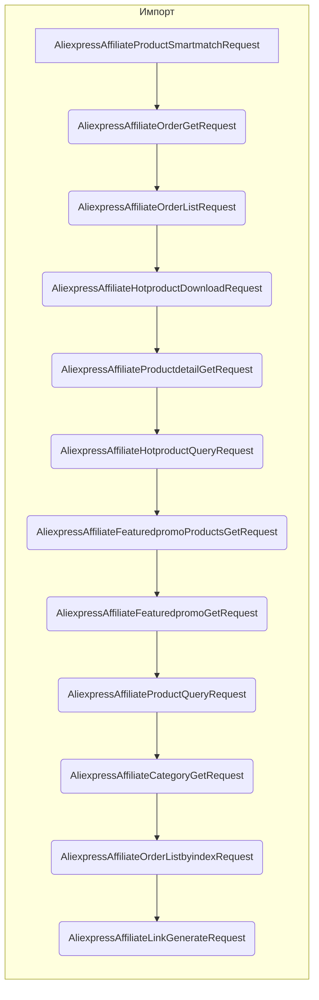

# <input code>

```python
## \file hypotez/src/suppliers/aliexpress/api/_examples/rest/__init__.py
# -*- coding: utf-8 -*-
#! venv/Scripts/python.exe # <- venv win
## ~~~~~~~~~~~~~
""" module: src.suppliers.aliexpress.api._examples.rest """
from .AliexpressAffiliateProductSmartmatchRequest import AliexpressAffiliateProductSmartmatchRequest
from .AliexpressAffiliateOrderGetRequest import AliexpressAffiliateOrderGetRequest
from .AliexpressAffiliateOrderListRequest import AliexpressAffiliateOrderListRequest
from .AliexpressAffiliateHotproductDownloadRequest import AliexpressAffiliateHotproductDownloadRequest
from .AliexpressAffiliateProductdetailGetRequest import AliexpressAffiliateProductdetailGetRequest
from .AliexpressAffiliateHotproductQueryRequest import AliexpressAffiliateHotproductQueryRequest
from .AliexpressAffiliateFeaturedpromoProductsGetRequest import AliexpressAffiliateFeaturedpromoProductsGetRequest
from .AliexpressAffiliateFeaturedpromoGetRequest import AliexpressAffiliateFeaturedpromoGetRequest
from .AliexpressAffiliateProductQueryRequest import AliexpressAffiliateProductQueryRequest
from .AliexpressAffiliateCategoryGetRequest import AliexpressAffiliateCategoryGetRequest
from .AliexpressAffiliateOrderListbyindexRequest import AliexpressAffiliateOrderListbyindexRequest
from .AliexpressAffiliateLinkGenerateRequest import AliexpressAffiliateLinkGenerateRequest
```

# <algorithm>

Этот код представляет собой модуль `__init__.py` для пакета `rest` внутри `aliexpress` API.  Он импортирует различные классы, предположительно, запросы для взаимодействия с API AliExpress.  Поскольку это `__init__.py`, он обеспечивает автоматическую доступность импортированных классов в подпапках.  Блок-схема здесь не применима, так как это не функция, а импорты.


# <mermaid>




# <explanation>

**Импорты:**

Код импортирует различные классы из подпапок текущего модуля (`src/suppliers/aliexpress/api/_examples/rest`).  Это типичный способ организации Python-проектов, чтобы группировать связанные классы и функции в отдельных файлах.

* `from .AliexpressAffiliate...` - означает импорт из файлов в той же директории.  Например, `AliexpressAffiliateProductSmartmatchRequest` вероятно представляет собой класс для выполнения определенного типа запроса к API AliExpress.

**Классы (предполагаемые):**

Код не содержит реализации классов, а лишь их импорты.  Предполагается, что в файлах, из которых производятся импорты, определены классы, представляющие собой различные запросы к API AliExpress.  Эти классы, вероятно, содержат:

* **Атрибуты:** параметры запроса (например, идентификатор продукта, данные пользователя).
* **Методы:** методы для создания запроса, передачи его на сервер и обработки ответа.

**Функции (нет):**

В этом коде нет определений функций.  Все импорты относятся к классам.

**Переменные (нет):**

В этом коде нет явных переменных.

**Возможные ошибки или улучшения:**

* **Документация:** У каждого из импортированных классов должна быть подробная документация (в формате docstrings), описывающая их назначение, параметры и возвращаемые значения.
* **Обработка ошибок:**  Необходимо предусмотреть обработку возможных ошибок (исключения) при взаимодействии с API AliExpress, например, проблемы с сетевым соединением или неверные входные данные.
* **Тестирование:** Важно написать тесты для проверки правильности работы каждого из запросов.


**Взаимосвязь с другими частями проекта:**

Этот модуль является частью проекта, ориентированного на работу с API AliExpress.  Вероятно, существует код для инициализации `AliexpressAffiliate...Request` объектов, подготовки данных для запросов, обработки ответов API, а также для использования полученных данных в других частях проекта.   Например,  `hypotez/src` предполагает, что это часть некоторой системы обработки данных, которая использует AliExpress в качестве поставщика данных.