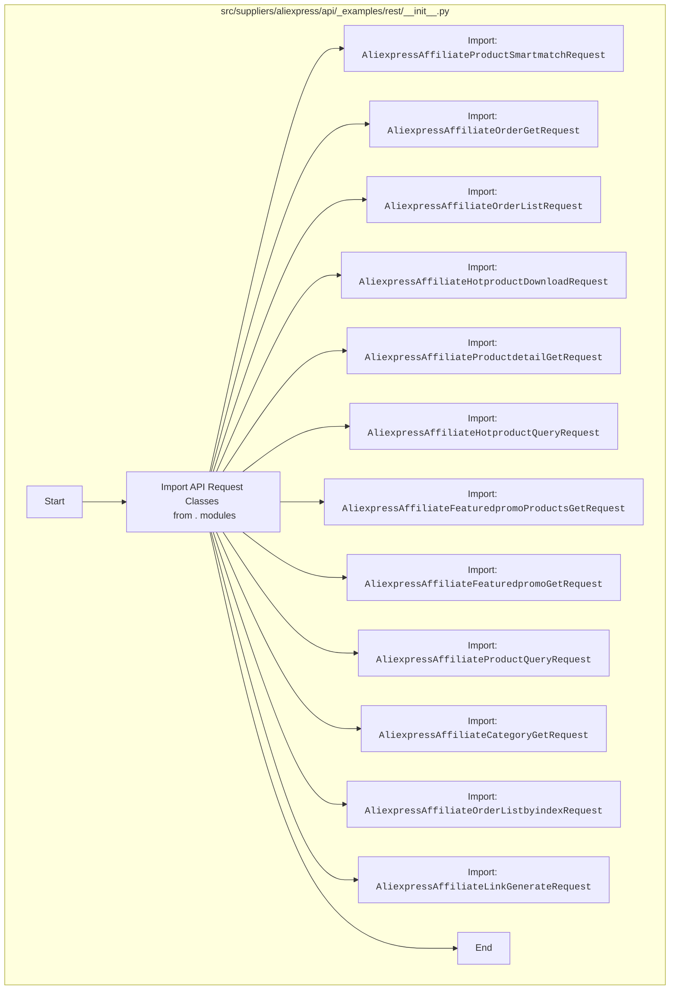

## АНАЛИЗ КОДА: `hypotez/src/suppliers/aliexpress/api/_examples/rest/__init__.py`

### <алгоритм>

1. **Импорт модулей**: Из текущей директории (`.`) импортируются различные классы запросов API AliExpress.
2.  **Создание экземпляров классов**: После импорта, эти классы можно использовать для создания экземпляров запросов к API AliExpress. 
   Например:
   ```python
   from hypotez.src.suppliers.aliexpress.api._examples.rest import AliexpressAffiliateProductQueryRequest
   
   product_query = AliexpressAffiliateProductQueryRequest()
   # Настройка параметров запроса и выполнение
   ```
3. **Вызов методов**: У каждого из созданных объектов можно вызывать методы для настройки параметров и выполнения запросов к API AliExpress. Например, метод для отправки запроса (`.send_request()`, который предположительно есть в каждом классе).
4. **Обработка результатов**: После выполнения запроса API, полученный ответ обрабатывается.
   ```python
    response = product_query.send_request()
    #  Обработка данных в ответе 
    if response and response.status_code == 200:
        data = response.json()
        # Дальнейшая обработка данных
    else:
      print ("Произошла ошибка")
   ```
5.  **Повторение**: Можно повторять запросы к API, изменяя параметры для получения различных данных.

### <mermaid>



### <объяснение>

**Импорты:**

-   `from .AliexpressAffiliateProductSmartmatchRequest import AliexpressAffiliateProductSmartmatchRequest`: Импортирует класс `AliexpressAffiliateProductSmartmatchRequest` из модуля `AliexpressAffiliateProductSmartmatchRequest.py`, расположенного в той же директории. Этот класс, вероятно, используется для создания запросов для получения смарт-подбора товаров.
-   `from .AliexpressAffiliateOrderGetRequest import AliexpressAffiliateOrderGetRequest`: Импортирует класс `AliexpressAffiliateOrderGetRequest` для запроса информации о заказе.
-   `from .AliexpressAffiliateOrderListRequest import AliexpressAffiliateOrderListRequest`: Импортирует класс `AliexpressAffiliateOrderListRequest` для запроса списка заказов.
-   `from .AliexpressAffiliateHotproductDownloadRequest import AliexpressAffiliateHotproductDownloadRequest`: Импортирует класс `AliexpressAffiliateHotproductDownloadRequest` для загрузки информации о популярных товарах.
-   `from .AliexpressAffiliateProductdetailGetRequest import AliexpressAffiliateProductdetailGetRequest`: Импортирует класс `AliexpressAffiliateProductdetailGetRequest` для получения детальной информации о товаре.
-   `from .AliexpressAffiliateHotproductQueryRequest import AliexpressAffiliateHotproductQueryRequest`: Импортирует класс `AliexpressAffiliateHotproductQueryRequest` для запроса популярных товаров.
-    `from .AliexpressAffiliateFeaturedpromoProductsGetRequest import AliexpressAffiliateFeaturedpromoProductsGetRequest`: Импортирует класс для запроса информации о товарах участвующих в акциях
-    `from .AliexpressAffiliateFeaturedpromoGetRequest import AliexpressAffiliateFeaturedpromoGetRequest`: Импортирует класс для запроса информации о рекламных акциях
-   `from .AliexpressAffiliateProductQueryRequest import AliexpressAffiliateProductQueryRequest`: Импортирует класс `AliexpressAffiliateProductQueryRequest` для запроса информации о товарах.
-   `from .AliexpressAffiliateCategoryGetRequest import AliexpressAffiliateCategoryGetRequest`: Импортирует класс `AliexpressAffiliateCategoryGetRequest` для получения информации о категориях товаров.
-   `from .AliexpressAffiliateOrderListbyindexRequest import AliexpressAffiliateOrderListbyindexRequest`: Импортирует класс для получения списка заказов по индексу.
-   `from .AliexpressAffiliateLinkGenerateRequest import AliexpressAffiliateLinkGenerateRequest`: Импортирует класс для создания партнерских ссылок.

**Назначение файла:**

Файл `__init__.py` в Python используется для обозначения директории как пакета. В данном случае, он импортирует все классы запросов, которые находятся в этой же директории, делая их доступными при импорте пакета. Это позволяет более удобно использовать эти классы, импортируя их из пакета, а не из каждого файла по отдельности.

**Структура проекта:**

-   Файл находится в директории `hypotez/src/suppliers/aliexpress/api/_examples/rest`, что указывает на то, что он является частью более крупного проекта `hypotez`.
-   Директория `suppliers/aliexpress/api` указывает, что этот код, вероятно, предназначен для работы с API AliExpress.
-   Директория `_examples/rest` указывает, что эти классы предназначены для примеров запросов к REST API AliExpress.
-   Каждый импортированный класс представляет собой отдельный запрос к API AliExpress, который позволяет выполнять определенные действия, такие как получение информации о товарах, заказах или категориях.

**Потенциальные ошибки и области для улучшения:**

-   **Обработка ошибок**: Классы, вероятно, имеют собственные методы для обработки ошибок, которые возникают при запросах к API. В примере использования необходимо реализовать обработку ошибок, чтобы избежать некорректной работы приложения.
-   **Асинхронность**: Код может быть улучшен путем реализации асинхронных запросов, что позволит ускорить выполнение программы.
-   **Документация**: Для более эффективного использования, классы можно снабдить docstring, описывающие назначение каждого метода.
-   **Расширение функциональности**: Возможно расширение функционала с добавлением новых методов и классов для запросов к API AliExpress.
-   **Тестирование**: Для корректной работы приложения необходимы тесты каждого запроса к API, чтобы проверить правильность ответов и обработки ошибок.

**Взаимосвязь с другими частями проекта:**

-   Этот пакет является частью более крупного проекта `hypotez`, что подразумевает его использование другими частями этого проекта.
-   Классы для запросов к API AliExpress могут использоваться для создания сервисов, которые будут извлекать данные из API AliExpress и использовать их в других частях приложения.
-   Возможно, эти классы связаны с другими частями проекта, например, с модулями для работы с базами данных, кэшированием или графическим интерфейсом.

В целом, код представляет собой набор классов, которые предоставляют удобный интерфейс для выполнения запросов к API AliExpress. Дальнейшая разработка будет заключаться в реализации методов в этих классах и использовании их в других частях проекта.