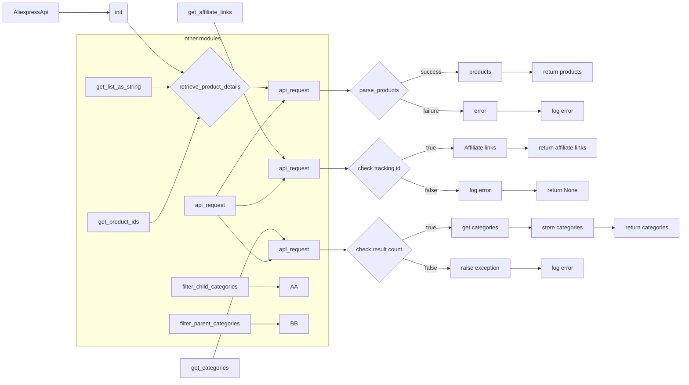

# <input code>

```python
## \file hypotez/src/suppliers/aliexpress/api/api.py
# -*- coding: utf-8 -*-\
#! venv/Scripts/python.exe # <- venv win
## ~~~~~~~~~~~~~\
""" module: src.suppliers.aliexpress.api """
""" AliExpress API wrapper for Python
A simple Python wrapper for the AliExpress Open Platform API. This module allows
to get product information and affiliate links from AliExpress using the official
API in an easier way.
"""
...

...

from typing import List, Union

from src.logger import logger
from src.utils.printer import pprint

from .models import (
                    AffiliateLink as model_AffiliateLink,
                    Category as model_Category,
                    ChildCategory as model_ChildCategory,
                    Currency as model_Currency,
                    HotProductsResponse as model_HotProductsResponse,
                    Language as model_Language,
                    LinkType as model_LinkType,
                    Product as model_Product,
                    ProductType as model_ProductType,
                    SortBy as model_SortBy)

from .errors.exceptions import CategoriesNotFoudException
from .helpers.categories import filter_child_categories, filter_parent_categories
from .skd import setDefaultAppInfo
from .skd import api as aliapi
from .errors import ProductsNotFoudException, InvalidTrackingIdException
from .helpers import api_request, parse_products, get_list_as_string, get_product_ids


class AliexpressApi:
    """Provides methods to get information from AliExpress using your API credentials.

    @param key (str): Your API key.
    @param secret (str): Your API secret.
    @param language (str): Language code. Defaults to EN.
    @param currency (str): Currency code. Defaults to USD.
    @param tracking_id (str): The tracking id for link generator. Defaults to None.
    """

    def __init__(self,
        key: str,
        secret: str,
        language: model_Language,
        currency: model_Currency,
        tracking_id: str = None,
        app_signature: str = None,
        **kwargs):
        self._key = key
        self._secret = secret
        self._tracking_id = tracking_id
        self._language = language
        self._currency = currency
        self._app_signature = app_signature
        self.categories = None
        setDefaultAppInfo(self._key, self._secret)


    # ... (rest of the code)
```

# <algorithm>

**Шаг 1:** Инициализация `AliexpressApi`
* Получает API ключ (`key`), секрет (`secret`), язык (`language`), валюту (`currency`), необязательный трекинг-ID (`tracking_id`), подпись приложения (`app_signature`).
* Хранит эти значения в атрибутах класса.
* Вызывает `setDefaultAppInfo` для настройки API.


**Пример:**

```
api = AliexpressApi(key='your_key', secret='your_secret', language=model_Language.EN, currency=model_Currency.USD, tracking_id='12345')
```

**Шаг 2:** `retrieve_product_details`
* Преобразует входные `product_ids` (строка или список) в строку.
* Создает объект запроса `AliexpressAffiliateProductdetailGetRequest`.
* Устанавливает параметры запроса (product_ids, валюта, язык, страна и т.д.).
* Выполняет запрос с помощью `api_request`.
* Обрабатывает ответ:
    * Если есть продукты, возвращает отформатированный список продуктов `model_Product`.
    * Если продуктов нет, логирует предупреждение и возвращает `None` (или возможно выбросит исключение в будущем).


**Пример:**

```
products = api.retrieve_product_details(product_ids=['123', '456'], fields=['title', 'price'])
```


**Шаг 3:** `get_affiliate_links`
* Проверяет, установлен ли трекинг-ID. Если нет, логирует ошибку и возвращает `None`.
* Преобразует `links` (строка или список) в строку.
* Создает запрос `AliexpressAffiliateLinkGenerateRequest`.
* Устанавливает параметры запроса (типы ссылок, трекинг-ID и т.д.).
* Выполняет запрос с помощью `api_request`.
* Возвращает список `model_AffiliateLink`, если запрос успешен и результат получен.


**Пример:**

```
links = api.get_affiliate_links(links=['link1', 'link2'], link_type=model_LinkType.HOTLINK)
```


# <mermaid>



# <explanation>

**Импорты:**

* `from typing import List, Union`: Стандартный импорт для определения типов данных.
* `from src.logger import logger`: Импортирует объект логгера, вероятно, для записи сообщений об ошибках и отладки в рамках проекта `src`.
* `from src.utils.printer import pprint`: Вероятно, импортирует функцию `pprint` для форматированного вывода данных.
* `from .models import ...`: Импортирует классы моделей, относящиеся к API AliExpress. Модели, такие как `model_AffiliateLink`, `model_Category` и т.д., определяются в пакете `hypotez/src/suppliers/aliexpress/api/models`.
* `from .errors.exceptions import ...`: Импортирует пользовательские исключения, связанные с обработкой ошибок API AliExpress.
* `from .helpers.categories import ...`: Импортирует функции для работы с категориями.
* `from .skd import setDefaultAppInfo, api as aliapi`: Импортирует функцию `setDefaultAppInfo` и объект `aliapi`, вероятно, из модуля `skd`, предоставляющего низкоуровневый доступ к AliExpress API.  `aliapi` скорее всего содержит REST клиент.
* `from .errors import ...`: Импортирует другие пользовательские исключения.
* `from .helpers import ...`: Импортирует вспомогательные функции, такие как `api_request`, `parse_products`, `get_list_as_string`, и `get_product_ids`.


**Классы:**

* `AliexpressApi`:  Класс-обертка для работы с AliExpress API.
    * Атрибуты: `_key`, `_secret`, `_tracking_id`, `_language`, `_currency`, `_app_signature`, `categories`. `_key` и `_secret` — ключи доступа к API AliExpress.
    * Методы: `__init__`, `retrieve_product_details`, `get_affiliate_links`, `get_hotproducts`, `get_categories`, `get_parent_categories`, `get_child_categories`. Каждый метод отвечает за выполнение определённого запроса к AliExpress API.

**Функции:**

* `api_request`: Функция, отправляющая HTTP-запросы к AliExpress API.
* `parse_products`: Парсит JSON-ответ API AliExpress, преобразуя его в список объектов `model_Product`.
* `get_list_as_string`, `get_product_ids`: Функции, вероятно, преобразуют входные данные в строковый формат, подходящий для работы с AliExpress API, либо обрабатывают id продуктов.
* `setDefaultAppInfo`: Настраивает приложение с ключами и секретом.


**Возможные ошибки и улучшения:**

* **Обработка ошибок:** В коде есть блоки `try...except`, но обработка ошибок всё ещё не полная, возможно, стоит добавить обработку более специфических исключений, таких как `ApiRequestException`, `ApiRequestResponseException`. 
* **Проверка входных данных:** В методах стоит добавить проверки входных данных (например, `product_ids`, `links`) на корректность.
* **Кэширование:** В методах `get_categories` есть возможность кэшировать данные, что существенно улучшит производительность при частых запросах к этим данным.
* **Явное использование типов:** Использование `Union[str, list[str]]` для аргументов, принимающих как строки, так и списки, сделает код более читаемым.

**Взаимосвязи с другими частями проекта:**

Код использует логгер из `src.logger` и функции из `src.utils.printer`,  а также модели и исключения из подпапок своего пакета.  Это означает, что модуль `aliexpress/api` зависит от модулей `logger`, `utils` and `models`. `api` также использует `skd` для работы с API.


Этот код демонстрирует хороший уровень абстракции и позволяет удобно работать с AliExpress API.  Добавление проверки входных данных, кэширования и более расширенной обработки ошибок существенно улучшит его надежность и производительность.