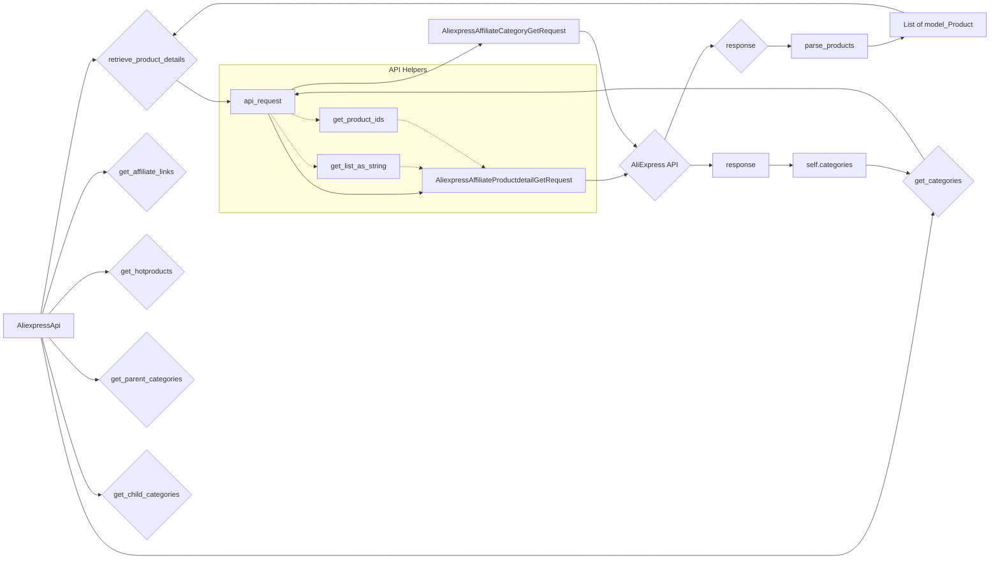

# <input code>

```python
## \file hypotez/src/suppliers/aliexpress/api/api.py
# -*- coding: utf-8 -*-\
#! venv/Scripts/python.exe # <- venv win
## ~~~~~~~~~~~~~
""" module: src.suppliers.aliexpress.api """
""" AliExpress API wrapper for Python
A simple Python wrapper for the AliExpress Open Platform API. This module allows
to get product information and affiliate links from AliExpress using the official
API in an easier way.
"""
...

...

from typing import List, Union

from src.logger import logger
from src.utils import pprint

from .models import (
                    AffiliateLink as model_AffiliateLink,
                    Category as model_Category,
                    ChildCategory as model_ChildCategory,
                    Currency as model_Currency,
                    HotProductsResponse as model_HotProductsResponse,
                    Language as model_Language,
                    LinkType as model_LinkType,
                    Product as model_Product,
                    ProductType as model_ProductType,
                    SortBy as model_SortBy)

from .errors.exceptions import CategoriesNotFoudException
from .helpers.categories import filter_child_categories, filter_parent_categories
from .skd import setDefaultAppInfo
from .skd import api as aliapi
from .errors import ProductsNotFoudException, InvalidTrackingIdException
from .helpers import api_request, parse_products, get_list_as_string, get_product_ids


class AliexpressApi:
    """Provides methods to get information from AliExpress using your API credentials.

    @param key (str): Your API key.
    @param secret (str): Your API secret.
    @param language (str): Language code. Defaults to EN.
    @param currency (str): Currency code. Defaults to USD.
    @param tracking_id (str): The tracking id for link generator. Defaults to None.
    """

    def __init__(self,
        key: str,
        secret: str,
        language: model_Language,
        currency: model_Currency,
        tracking_id: str = None,
        app_signature: str = None,
        **kwargs):
        self._key = key
        self._secret = secret
        self._tracking_id = tracking_id
        self._language = language
        self._currency = currency
        self._app_signature = app_signature
        self.categories = None
        setDefaultAppInfo(self._key, self._secret)


    # ... (other methods)
```

# <algorithm>

The algorithm can be visualized as a set of interconnected functions.  The `AliexpressApi` class orchestrates the interaction with the AliExpress API.  Each method encapsulates a specific API call.

**Example: `retrieve_product_details`**

1. **Input Validation**:  The `product_ids` input is processed (potentially converting a string to a list).
2. **API Request Preparation**: An `AliexpressAffiliateProductdetailGetRequest` object is created.  Values (like `product_ids`, `currency`, `language`) are populated from class attributes and user input.
3. **API Request Execution**:  `api_request` function handles the actual API call.  It returns a response object.
4. **Response Processing**:
    * **Success:** `parse_products` processes the response to extract and format `Product` objects. Returns the list of products.
    * **Failure**:  If the response indicates no products found, a warning is logged, and potentially a default or empty list is returned.  Error handling catches exceptions and logs them.

**Example: `get_categories`**

1. **API Request Preparation**: An `AliexpressAffiliateCategoryGetRequest` object is constructed and populated with `app_signature`.
2. **API Request Execution**:  `api_request` function handles the API call and returns a response.
3. **Response Processing**:  If the response has categories, they are stored in the `self.categories` attribute and returned. If not, a `CategoriesNotFoudException` is raised.

Other methods follow a similar pattern, each handling a distinct aspect of the AliExpress API interaction.


# <mermaid>



# <explanation>

**Imports**:

- `src.logger`, `src.utils`: Likely custom modules within the project (`src`) for logging and utility functions, respectively.
- `src.suppliers.aliexpress.api.models`: Contains data models (classes) for API responses.  This organization signifies the structure of the project.
- `src.suppliers.aliexpress.api.errors.exceptions`: Defines custom exceptions specific to API errors.
- `src.suppliers.aliexpress.api.helpers.categories`: Contains functions for filtering categories.
- `src.suppliers.aliexpress.api.skd`: likely contains the actual AliExpress API SDK interaction (Aliexpress SDK).
- `src.suppliers.aliexpress.api.errors`: Module to hold error classes specific to the AliExpress API.
- `src.suppliers.aliexpress.api.helpers`: Contains helper functions.

**Classes**:

- `AliexpressApi`: A wrapper class that handles interactions with the AliExpress API.
    - `__init__`: Initializes the API client with API keys, language, currency, and optional tracking IDs. `setDefaultAppInfo` from `skd` likely initializes the SDK with these.
    - `retrieve_product_details`, `get_affiliate_links`, `get_hotproducts`, `get_categories`, `get_parent_categories`, `get_child_categories`: These are methods that make specific API calls to AliExpress. They take various parameters (e.g., product IDs, category IDs) and return appropriate data types (lists of products, categories, etc.).  These methods correctly use the `api_request` function to communicate with the AliExpress API.

**Functions**:

- `api_request`: Handles the actual HTTP requests to the AliExpress API. It takes a request object and the corresponding response type.  Critically, it's central to all API interactions, simplifying code.
- `parse_products`, `filter_child_categories`, `filter_parent_categories`, `get_list_as_string`, `get_product_ids`: Helper functions that parse the response, filter categories, and handle input data formats.

**Variables**:

- `self._key`, `self._secret`, `self._tracking_id`, `self._language`, `self._currency`: Instance variables of the `AliexpressApi` class storing API credentials, language, and currency information.
- `self.categories`: An instance variable for caching retrieved categories to improve efficiency.

**Possible Errors/Improvements**:

- **Error Handling**: While the code includes `try...except` blocks for error handling, there's room for more specific exceptions to provide better context to users (e.g., using exceptions from the AliExpress SDK directly).
- **Input Validation**: Further input validation (e.g., checking for valid API keys, IDs) would enhance robustness.
- **Logging**: More descriptive logging could make debugging easier.
- **Caching**: The cache for `self.categories` is a great improvement.  Consider additional caching strategies (e.g., using a dedicated caching library) for other potentially slow operations.
- **Dependency Management**: A clear specification of the requirements and setup process (including version numbers) would improve reproducibility and maintainability.

**Relationship to other parts of the project**:

- The code depends on the `src` package and is tightly coupled with other API interaction components. The relationships are mainly through imports of functions and classes from other parts of the project for logging, data handling, and the AliExpress SDK itself.  These dependencies are important for the project's architecture and operation.