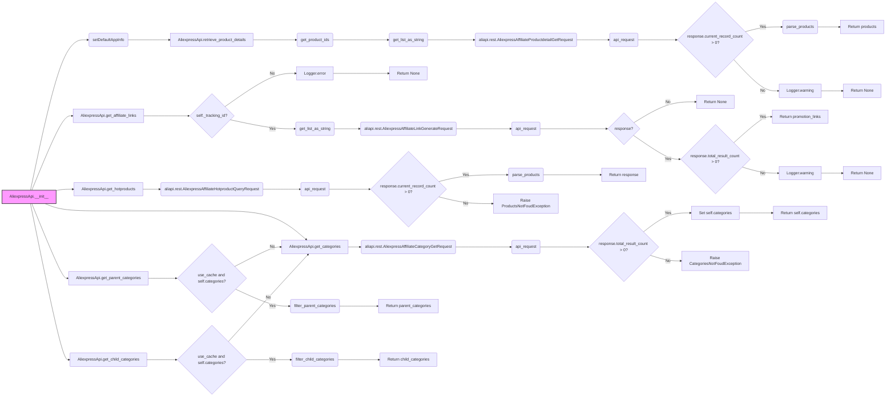

## Анализ кода `hypotez/src/suppliers/aliexpress/api/api.py`

### <алгоритм>

**Блок-схема работы класса `AliexpressApi`:**

1.  **Инициализация (`__init__`)**:
    *   Принимает API-ключ (`key`), секретный ключ (`secret`), язык (`language`), валюту (`currency`), идентификатор отслеживания (`tracking_id`) и подпись приложения (`app_signature`).
    *   Сохраняет переданные значения как атрибуты экземпляра.
    *   Инициализирует `categories` как `None`.
    *   Вызывает `setDefaultAppInfo` для настройки параметров SDK.
    *   *Пример*: `api = AliexpressApi(key='mykey', secret='mysecret', language='EN', currency='USD', tracking_id='12345')`
2.  **Получение деталей продукта (`retrieve_product_details`)**:
    *   Принимает идентификаторы продуктов (`product_ids`), список полей (`fields`) и страну (`country`).
    *   Преобразует `product_ids` в список и затем в строку.
    *   Создает запрос `AliexpressAffiliateProductdetailGetRequest`.
    *   Устанавливает параметры запроса (подпись приложения, поля, идентификаторы продуктов, страна, валюта, язык и идентификатор отслеживания).
    *   Вызывает `api_request` для отправки запроса и получения ответа.
    *   Если есть продукты, вызывает `parse_products` для обработки ответа.
    *   Возвращает список продуктов. Если продуктов нет, возвращает `None`.
    *   Обрабатывает исключения (например, если продукты не найдены).
    *   *Пример*: `products = api.retrieve_product_details(product_ids=['123', '456'], fields=['title', 'price'])`
3.  **Получение партнерских ссылок (`get_affiliate_links`)**:
    *   Принимает список ссылок (`links`) и тип ссылки (`link_type`).
    *   Проверяет, установлен ли идентификатор отслеживания (`tracking_id`). Если нет, возвращает `None`.
    *   Преобразует `links` в строку.
    *   Создает запрос `AliexpressAffiliateLinkGenerateRequest`.
    *   Устанавливает параметры запроса (подпись приложения, исходные значения, тип ссылки, идентификатор отслеживания).
    *   Вызывает `api_request` для отправки запроса и получения ответа.
    *   Если есть ссылки, возвращает их. Если нет, возвращает `None`.
    *   *Пример*: `affiliate_links = api.get_affiliate_links(links=['https://example.com/product1', 'https://example.com/product2'], link_type='HOTLINK')`
4.  **Получение горячих товаров (`get_hotproducts`)**:
    *   Принимает параметры поиска (идентификаторы категорий, дни доставки, поля, ключевые слова, минимальная и максимальная цены, номер страницы, размер страницы, тип продукта, страна доставки, сортировка).
    *   Создает запрос `AliexpressAffiliateHotproductQueryRequest`.
    *   Устанавливает параметры запроса (подпись приложения, идентификаторы категорий, дни доставки, поля, ключевые слова, минимальная и максимальная цены, номер страницы, размер страницы, тип продукта, страна доставки, сортировка, валюта, язык, идентификатор отслеживания).
    *   Вызывает `api_request` для отправки запроса и получения ответа.
    *   Если есть продукты, вызывает `parse_products` для обработки ответа.
    *   Возвращает объект `HotProductsResponse`.
    *   Если продуктов нет, вызывает исключение `ProductsNotFoudException`.
    *   *Пример*: `hot_products = api.get_hotproducts(category_ids=['123'], keywords='test', page_size=10)`
5.  **Получение категорий (`get_categories`)**:
    *   Создает запрос `AliexpressAffiliateCategoryGetRequest`.
    *   Устанавливает подпись приложения.
    *   Вызывает `api_request` для отправки запроса и получения ответа.
    *   Если категории найдены, сохраняет их в атрибут `self.categories` и возвращает.
    *   Если категорий нет, вызывает исключение `CategoriesNotFoudException`.
    *   *Пример*: `categories = api.get_categories()`
6.  **Получение родительских категорий (`get_parent_categories`)**:
    *   Принимает параметр `use_cache` (использовать ли кеш).
    *   Если кеш не используется или категории не загружены, вызывает `get_categories`.
    *   Вызывает `filter_parent_categories` для фильтрации категорий и возвращает результат.
    *   *Пример*: `parent_categories = api.get_parent_categories()`
7.  **Получение дочерних категорий (`get_child_categories`)**:
    *   Принимает `parent_category_id` и `use_cache`.
    *   Если кеш не используется или категории не загружены, вызывает `get_categories`.
    *   Вызывает `filter_child_categories` для фильтрации и возвращает результат.
    *   *Пример*: `child_categories = api.get_child_categories(parent_category_id=123)`

### <mermaid>



**Объяснение `mermaid` диаграммы:**

*   `AliexpressApi.__init__` (A): Начальная точка, инициализация класса `AliexpressApi`.
*   `setDefaultAppInfo` (B): Настройка информации приложения (API key и secret).
*   `AliexpressApi.retrieve_product_details` (C): Метод для получения информации о продуктах.
*   `get_product_ids` (D): Функция для обработки идентификаторов продуктов.
*   `get_list_as_string` (E): Функция для преобразования списка в строку.
*   `aliapi.rest.AliexpressAffiliateProductdetailGetRequest` (F): Объект запроса для получения деталей продуктов.
*   `api_request` (G): Функция отправки API-запроса.
*   `response.current_record_count > 0?` (H): Проверка наличия записей в ответе.
*   `parse_products` (I): Функция для обработки списка продуктов.
*   `Return products` (J): Возврат списка продуктов.
*    `Logger.warning` (K): Логирование предупреждения об отсутствии продуктов.
*   `Return None` (L): Возврат `None` при отсутствии продуктов.
*    `AliexpressApi.get_affiliate_links` (M): Метод для получения партнерских ссылок.
*   `self._tracking_id?` (N): Проверка наличия `tracking_id`.
*   `Logger.error` (O): Логирование ошибки отсутствия `tracking_id`.
*   `Return None` (P): Возврат `None` при отсутствии `tracking_id`.
*  `get_list_as_string` (Q): Преобразование ссылок в строку.
*   `aliapi.rest.AliexpressAffiliateLinkGenerateRequest` (R): Объект запроса для генерации партнерских ссылок.
*  `api_request` (S): Функция отправки API-запроса.
*   `response?` (T): Проверка наличия ответа.
*  `Return None` (U): Возврат `None` при отсутствии ответа.
*   `response.total_result_count > 0?` (V): Проверка наличия ссылок в ответе.
*   `Return promotion_links` (W): Возврат списка партнерских ссылок.
* `Logger.warning` (X): Логирование предупреждения об отсутствии ссылок.
*   `Return None` (Y): Возврат `None` при отсутствии ссылок.
*   `AliexpressApi.get_hotproducts` (Z): Метод для получения горячих товаров.
*  `aliapi.rest.AliexpressAffiliateHotproductQueryRequest` (AA): Объект запроса для поиска горячих продуктов.
*  `api_request` (AB): Функция отправки API-запроса.
*  `response.current_record_count > 0?` (AC): Проверка наличия записей в ответе.
*  `parse_products` (AD): Функция для обработки списка продуктов.
*  `Return response` (AE): Возврат ответа `HotProductsResponse`.
*  `Raise ProductsNotFoudException` (AF): Выброс исключения при отсутствии продуктов.
*  `AliexpressApi.get_categories` (AG): Метод для получения категорий.
*   `aliapi.rest.AliexpressAffiliateCategoryGetRequest` (AH): Объект запроса для получения категорий.
*  `api_request` (AI): Функция отправки API-запроса.
*  `response.total_result_count > 0?` (AJ): Проверка наличия категорий в ответе.
* `Set self.categories` (AK): Сохранение категорий в атрибут.
* `Return self.categories` (AL): Возврат списка категорий.
* `Raise CategoriesNotFoudException` (AM): Выброс исключения при отсутствии категорий.
* `AliexpressApi.get_parent_categories` (AN): Метод для получения родительских категорий.
* `use_cache and self.categories?` (AO): Проверка наличия кешированных категорий.
*  `filter_parent_categories` (AP): Фильтрация родительских категорий.
*  `Return parent_categories` (AQ): Возврат списка родительских категорий.
*   `AliexpressApi.get_child_categories` (AR): Метод для получения дочерних категорий.
*  `use_cache and self.categories?` (AS): Проверка наличия кешированных категорий.
*  `filter_child_categories` (AT): Фильтрация дочерних категорий.
*  `Return child_categories` (AU): Возврат списка дочерних категорий.

**Импорты и зависимости:**

*   `from typing import List, Union`: Импортируются типы данных для аннотаций типов.
*   `from src.logger.logger import logger`: Импортируется объект `logger` для логирования.
*   `from src.utils.printer import pprint`: Импортируется функция `pprint` для удобной печати.
*   `from .models import ...`: Импортируются классы моделей данных (`AffiliateLink`, `Category`, `ChildCategory`, `Currency`, `HotProductsResponse`, `Language`, `LinkType`, `Product`, `ProductType`, `SortBy`) из текущего пакета `.models`.
*    `from .errors.exceptions import CategoriesNotFoudException`: Импортируется исключение `CategoriesNotFoudException` для обработки ошибок категорий.
*   `from .helpers.categories import filter_child_categories, filter_parent_categories`: Импортируются функции для фильтрации категорий.
*   `from .skd import setDefaultAppInfo`: Импортируется функция для настройки SDK.
*   `from .skd import api as aliapi`: Импортируется объект `api` (переименован в `aliapi`) из SDK.
*  `from .errors import ProductsNotFoudException, InvalidTrackingIdException`: Импортируются исключения для обработки ошибок продуктов и некорректных `tracking_id`.
* `from .helpers import api_request, parse_products, get_list_as_string, get_product_ids`: Импортируются вспомогательные функции для выполнения запросов, обработки ответов и преобразования данных.

### <объяснение>

**Импорты:**

*   `typing`: Используется для статической типизации, что делает код более читаемым и предотвращает ошибки.
*   `src.logger.logger`: Модуль `logger` из пакета `src.logger` предоставляет функциональность для логирования событий и ошибок.
*   `src.utils.printer`: Модуль `printer` из пакета `src.utils` предоставляет инструменты для форматированного вывода данных.
*   `from .models import ...`: Импорт моделей данных. Эти модели представляют структуры данных, которые возвращаются API AliExpress (например, продукты, категории). Они нужны для типизации данных и их организации.
*   `from .errors.exceptions import CategoriesNotFoudException`: Импорт исключения, которое поднимается в случае, если категории не найдены.
*   `from .helpers.categories import filter_child_categories, filter_parent_categories`: Импорт функций для фильтрации категорий. Они используются для обработки списка категорий и разделения их на родительские и дочерние.
*   `from .skd import setDefaultAppInfo`: Импорт функции для настройки SDK, которая инициализирует параметры API (ключ и секрет).
*   `from .skd import api as aliapi`: Импорт API-клиента SDK (Aliexpress API SDK), который позволяет взаимодействовать с API AliExpress.
*  `from .errors import ProductsNotFoudException, InvalidTrackingIdException`: Импорт исключений, которые поднимаются в случае, если продукты не найдены или идентификатор отслеживания недействителен.
*   `from .helpers import api_request, parse_products, get_list_as_string, get_product_ids`: Импорт вспомогательных функций, которые упрощают работу с API, обработку данных и формирование запросов.

**Классы:**

*   `AliexpressApi`:
    *   **Роль**: Центральный класс, предоставляющий интерфейс для взаимодействия с AliExpress API. Он инкапсулирует логику аутентификации, запросов и обработки ответов.
    *   **Атрибуты**:
        *   `_key`: API-ключ.
        *   `_secret`: Секретный ключ API.
        *   `_tracking_id`: Идентификатор отслеживания.
        *   `_language`: Язык.
        *   `_currency`: Валюта.
        *   `_app_signature`: Подпись приложения.
        *   `categories`: Список категорий.
    *   **Методы**:
        *   `__init__`: Инициализирует класс, устанавливает API-ключи и базовые параметры.
        *   `retrieve_product_details`: Получает детали продукта по его идентификатору или списку идентификаторов.
        *   `get_affiliate_links`: Преобразует список ссылок в партнерские ссылки.
        *   `get_hotproducts`: Получает список горячих товаров по заданным критериям.
        *   `get_categories`: Получает список всех доступных категорий.
        *   `get_parent_categories`: Получает список родительских категорий.
        *   `get_child_categories`: Получает список дочерних категорий для конкретной родительской категории.
    *   **Взаимодействие**: Этот класс использует `aliapi` для запросов к API, `helpers` для обработки данных и `models` для представления данных. Он является основным интерфейсом для работы с API AliExpress в проекте.

**Функции:**

*   `__init__(self, key: str, secret: str, language: model_Language, currency: model_Currency, tracking_id: str = None, app_signature: str = None, **kwargs)`:
    *   **Аргументы**:
        *   `key`: API-ключ (строка).
        *   `secret`: Секретный ключ API (строка).
        *   `language`: Язык (объект `model_Language`).
        *   `currency`: Валюта (объект `model_Currency`).
        *   `tracking_id`: Идентификатор отслеживания (строка, по умолчанию `None`).
        *    `app_signature`: Подпись приложения (строка, по умолчанию `None`).
        *   `**kwargs`: Дополнительные аргументы.
    *   **Возвращаемое значение**: None.
    *   **Назначение**: Инициализация экземпляра класса `AliexpressApi` с заданными параметрами.
    *   **Пример**:
        ```python
        api = AliexpressApi(key='my_key', secret='my_secret', language=model_Language.EN, currency=model_Currency.USD, tracking_id='tracking123')
        ```
*  `retrieve_product_details(self, product_ids: str | list, fields: str | list = None, country: str = None, **kwargs) -> List[model_Product]`:
    *   **Аргументы**:
        *   `product_ids`: Идентификатор или список идентификаторов продуктов (строка или список строк).
        *   `fields`: Поля для включения в ответ (строка или список строк, по умолчанию `None`).
        *   `country`: Страна, для которой нужно получить цены (строка, по умолчанию `None`).
        *   `**kwargs`: Дополнительные аргументы.
    *   **Возвращаемое значение**: Список продуктов (список объектов `model_Product`).
    *   **Назначение**: Получение информации о продуктах.
    *   **Пример**:
        ```python
        products = api.retrieve_product_details(product_ids=['12345', '67890'], fields=['title', 'price'], country='US')
        ```
*   `get_affiliate_links(self, links: str | list, link_type: model_LinkType = model_LinkType.NORMAL, **kwargs) -> List[model_AffiliateLink]`:
    *   **Аргументы**:
        *   `links`: Ссылка или список ссылок на продукты (строка или список строк).
        *   `link_type`: Тип партнерской ссылки (объект `model_LinkType`, по умолчанию `model_LinkType.NORMAL`).
        *   `**kwargs`: Дополнительные аргументы.
    *   **Возвращаемое значение**: Список партнерских ссылок (список объектов `model_AffiliateLink`).
    *   **Назначение**: Генерация партнерских ссылок для продуктов.
    *   **Пример**:
        ```python
        affiliate_links = api.get_affiliate_links(links=['https://example.com/product1', 'https://example.com/product2'], link_type=model_LinkType.HOTLINK)
        ```
* `get_hotproducts(self, category_ids: str | list = None, delivery_days: int = None, fields: str | list = None, keywords: str = None, max_sale_price: int = None, min_sale_price: int = None, page_no: int = None, page_size: int = None, platform_product_type: model_ProductType = None, ship_to_country: str = None, sort: model_SortBy = None, **kwargs) -> model_HotProductsResponse`:
    *   **Аргументы**:
         *  `category_ids`: Идентификатор или список идентификаторов категорий (строка или список строк, по умолчанию `None`).
        *   `delivery_days`: Количество дней доставки (целое число, по умолчанию `None`).
        *   `fields`: Поля для включения в ответ (строка или список строк, по умолчанию `None`).
        *   `keywords`: Ключевые слова для поиска (строка, по умолчанию `None`).
        *   `max_sale_price`: Максимальная цена продажи (целое число, по умолчанию `None`).
        *   `min_sale_price`: Минимальная цена продажи (целое число, по умолчанию `None`).
        *   `page_no`: Номер страницы (целое число, по умолчанию `None`).
        *  `page_size`: Размер страницы (целое число, по умолчанию `None`).
        * `platform_product_type`: Тип продукта (объект `model_ProductType`, по умолчанию `None`).
        * `ship_to_country`: Страна доставки (строка, по умолчанию `None`).
        * `sort`: Метод сортировки (объект `model_SortBy`, по умолчанию `None`).
        *   `**kwargs`: Дополнительные аргументы.
    *   **Возвращаемое значение**: Объект с горячими товарами (объект `model_HotProductsResponse`).
    *   **Назначение**: Получение списка горячих продуктов.
    *   **Пример**:
        ```python
        hot_products = api.get_hotproducts(category_ids=['123'], keywords='test', page_size=10)
        ```
*   `get_categories(self, **kwargs) -> List[model_Category | model_ChildCategory]`:
    *   **Аргументы**:
        *   `**kwargs`: Дополнительные аргументы.
    *   **Возвращаемое значение**: Список категорий (список объектов `model_Category` или `model_ChildCategory`).
    *   **Назначение**: Получение списка всех доступных категорий.
    *    **Пример**:
        ```python
        categories = api.get_categories()
        ```
*   `get_parent_categories(self, use_cache=True, **kwargs) -> List[model_Category]`:
    *   **Аргументы**:
        *   `use_cache`: Использовать кешированные данные (логическое значение, по умолчанию `True`).
        *   `**kwargs`: Дополнительные аргументы.
    *   **Возвращаемое значение**: Список родительских категорий (список объектов `model_Category`).
    *   **Назначение**: Получение списка родительских категорий.
    *    **Пример**:
        ```python
        parent_categories = api.get_parent_categories()
        ```
*   `get_child_categories(self, parent_category_id: int, use_cache=True, **kwargs) -> List[model_ChildCategory]`:
    *   **Аргументы**:
        *   `parent_category_id`: Идентификатор родительской категории (целое число).
        *   `use_cache`: Использовать кешированные данные (логическое значение, по умолчанию `True`).
        *    `**kwargs`: Дополнительные аргументы.
    *   **Возвращаемое значение**: Список дочерних категорий (список объектов `model_ChildCategory`).
    *   **Назначение**: Получение списка дочерних категорий для заданной родительской категории.
    *   **Пример**:
        ```python
        child_categories = api.get_child_categories(parent_category_id=123)
        ```

**Переменные:**

*   `self._key`, `self._secret`, `self._tracking_id`, `self._language`, `self._currency`, `self._app_signature`: Атрибуты экземпляра класса `AliexpressApi`, хранящие значения, необходимые для взаимодействия с API AliExpress.
*   `self.categories`: Список категорий, полученных из API.
*   `request`: Экземпляр класса запроса из SDK `aliapi.rest`, используется для создания и отправки API-запросов.
*   `response`: Ответ от API, содержит данные, полученные от API AliExpress.

**Потенциальные ошибки и области для улучшения:**

*   **Обработка ошибок**: В некоторых местах обработка ошибок ограничивается выводом в лог и возвратом `None`. Желательно использовать исключения для более надежной обработки ошибок.
*   **Кеширование**: Кеширование категорий работает только в рамках одного экземпляра `AliexpressApi`. Можно реализовать более глобальный механизм кеширования для уменьшения количества запросов к API.
*   **Логирование**: Можно добавить больше информационных сообщений в лог для облегчения отладки.
*  **Валидация ввода**: Не помешает добавить валидацию для входящих параметров (например, проверка корректности `product_ids`, `category_ids` и т.д.)
*   **Асинхронность**: API-запросы могут выполняться долго. Рассмотреть возможность использования асинхронных запросов для повышения производительности.

**Цепочка взаимосвязей:**

1.  **Внешний код (например, `src/main.py`)**: Создает экземпляр `AliexpressApi`, передавая API-ключ, секретный ключ и другие необходимые параметры.
2.  **`AliexpressApi`**: Использует SDK `aliapi` и вспомогательные функции (`api_request`, `parse_products`, `get_list_as_string`, `get_product_ids`) для выполнения API-запросов и обработки ответов.
3.  **`aliapi.rest`**: Предоставляет классы для формирования API-запросов к AliExpress.
4.  **`api_request`**: Отправляет HTTP-запрос к API AliExpress и возвращает ответ.
5.  **`parse_products`**: Обрабатывает JSON-ответ от API, преобразуя его в объекты `model_Product` или другие модели данных.
6.  **`filter_parent_categories`, `filter_child_categories`**: Фильтрует список категорий на родительские и дочерние категории соответственно.
7.  **`model_*`**: Классы моделей данных, используемые для представления структур данных от API.
8.  **`src.logger.logger`**: Используется для записи логов о выполнении операций и ошибках.
9.  **`src.utils.printer`**: Используется для форматированного вывода данных (например, при отладке).