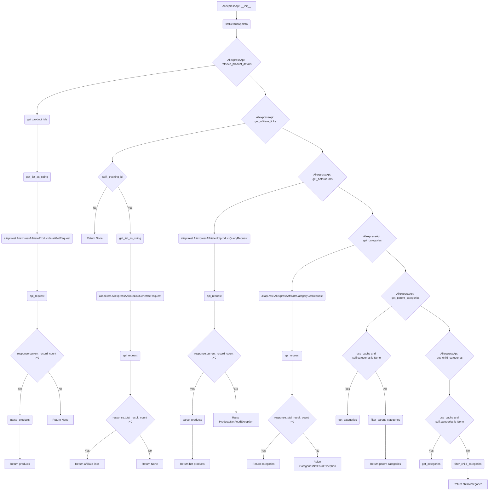
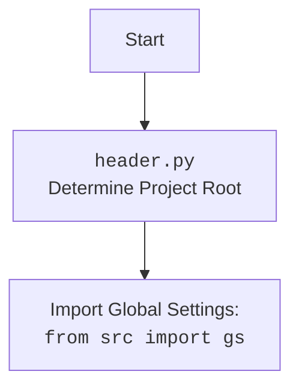

## <алгоритм>

### 1. Инициализация `AliexpressApi`
   - **Пример**: `api = AliexpressApi(key="your_api_key", secret="your_api_secret", language="RU", currency="RUB", tracking_id="your_tracking_id", app_signature="your_app_signature")`
   - Создается экземпляр класса `AliexpressApi` с заданными API-ключами, языком, валютой, ID отслеживания и подписью приложения.
   - Сохраняются значения ключа, секрета, ID отслеживания, языка, валюты и подписи приложения как атрибуты экземпляра.
   - Инициализируется атрибут `categories` как `None`.
   - Вызывается функция `setDefaultAppInfo` из модуля `skd` для установки ключа и секрета приложения.

### 2. Получение деталей продукта `retrieve_product_details`
   - **Пример**: `products = api.retrieve_product_details(product_ids=["12345", "67890"], fields=["title", "price"], country="RU")`
   - Принимает ID продуктов (строка или список), поля для извлечения, и страну.
   - Преобразует ID продуктов в список строк, затем в строку, разделенную запятыми.
   - Создает запрос `AliexpressAffiliateProductdetailGetRequest`.
   - Устанавливает параметры запроса: подпись приложения, поля, ID продуктов, страну, целевую валюту, целевой язык и ID отслеживания.
   - Вызывает функцию `api_request` для выполнения API-запроса и получения ответа.
   - Если есть продукты, вызывает `parse_products` для обработки ответа.
   - Возвращает список объектов `Product`.
   - Если продукты не найдены, возвращает `None` и записывает предупреждение в лог.
   - В случае ошибки, записывает информацию в лог и возвращает `None`.

### 3. Генерация партнерских ссылок `get_affiliate_links`
   - **Пример**: `affiliate_links = api.get_affiliate_links(links=["https://aliexpress.com/item/12345.html", "https://aliexpress.com/item/67890.html"], link_type=model_LinkType.HOTLINK)`
   - Принимает ссылки на товары (строка или список) и тип ссылки.
   - Проверяет наличие ID отслеживания, возвращает `None`, если его нет.
   - Преобразует ссылки в строку, разделенную запятыми.
   - Создает запрос `AliexpressAffiliateLinkGenerateRequest`.
   - Устанавливает параметры запроса: подпись приложения, ссылки, тип ссылки и ID отслеживания.
   - Вызывает функцию `api_request` для выполнения API-запроса.
   - Если ответ получен и есть ссылки, возвращает список объектов `AffiliateLink`.
   - Если нет ссылок, возвращает `None` и записывает предупреждение в лог.

### 4. Получение горячих товаров `get_hotproducts`
   - **Пример**: `hot_products = api.get_hotproducts(category_ids="123,456", keywords="phone", min_sale_price=1000, max_sale_price=5000, page_no=1, page_size=20)`
   - Принимает ID категорий (строка или список), количество дней доставки, поля, ключевые слова, максимальную и минимальную цену, номер страницы, размер страницы, тип товара, страну доставки и метод сортировки.
   - Создает запрос `AliexpressAffiliateHotproductQueryRequest`.
   - Устанавливает параметры запроса, включая подпись приложения, ID категорий, количество дней доставки, поля, ключевые слова, максимальную и минимальную цену, номер страницы, размер страницы, тип товара, страну доставки, метод сортировки, целевую валюту и целевой язык, ID отслеживания.
   - Вызывает функцию `api_request` для выполнения API-запроса.
   - Если есть продукты, вызывает `parse_products` для обработки ответа, сохраняет результаты в `response.products` и возвращает объект `HotProductsResponse`.
   - Если продукты не найдены, вызывает исключение `ProductsNotFoudException`.

### 5. Получение категорий `get_categories`
   - **Пример**: `categories = api.get_categories()`
   - Создает запрос `AliexpressAffiliateCategoryGetRequest`.
   - Устанавливает подпись приложения.
   - Вызывает функцию `api_request` для выполнения API-запроса.
   - Если категории найдены, сохраняет их в атрибут `self.categories` и возвращает список категорий.
   - Если категории не найдены, вызывает исключение `CategoriesNotFoudException`.

### 6. Получение родительских категорий `get_parent_categories`
   - **Пример**: `parent_categories = api.get_parent_categories()`
   - Принимает булев флаг `use_cache` для использования кэшированных категорий.
   - Если `use_cache` равен `False` или `self.categories` равен `None`, вызывает `self.get_categories()` для получения категорий с API.
   - Вызывает `filter_parent_categories` для фильтрации и возвращает список родительских категорий.

### 7. Получение дочерних категорий `get_child_categories`
   - **Пример**: `child_categories = api.get_child_categories(parent_category_id=123)`
   - Принимает ID родительской категории и булев флаг `use_cache`.
   - Если `use_cache` равен `False` или `self.categories` равен `None`, вызывает `self.get_categories()` для получения категорий с API.
   - Вызывает `filter_child_categories` для фильтрации и возвращает список дочерних категорий.

## <mermaid>

## <объяснение>

### Импорты:

-   `from typing import List, Union`: Используется для аннотации типов, определения списков и объединения нескольких типов.
-   `from src.logger.logger import logger`: Импортирует объект `logger` из модуля `src.logger.logger` для логирования событий и ошибок.
-   `from src.utils.printer import pprint`: Импортирует функцию `pprint` для форматированного вывода данных (может быть полезно для отладки).
-   `from .models import ...`: Импортирует классы моделей данных из текущего пакета `api.models`. Эти классы, вероятно, используются для представления структур данных, возвращаемых API AliExpress, таких как:
    -   `AffiliateLink`: Представляет партнерскую ссылку.
    -   `Category`: Представляет категорию товара.
    -   `ChildCategory`: Представляет дочернюю категорию товара.
    -   `Currency`: Представляет валюту.
    -   `HotProductsResponse`: Представляет ответ на запрос горячих товаров.
    -   `Language`: Представляет язык.
    -   `LinkType`: Представляет тип ссылки.
    -   `Product`: Представляет продукт.
    -   `ProductType`: Представляет тип продукта.
    -   `SortBy`: Представляет метод сортировки.
-   `from .errors.exceptions import CategoriesNotFoudException`: Импортирует исключение, выбрасываемое, если категории не найдены.
-   `from .helpers.categories import filter_child_categories, filter_parent_categories`: Импортирует функции для фильтрации категорий (родительских и дочерних).
-   `from .skd import setDefaultAppInfo`: Импортирует функцию для установки информации о приложении (API ключ и секрет).
-   `from .skd import api as aliapi`: Импортирует модуль `api` из `skd` и переименовывает его в `aliapi`, для взаимодействия с API AliExpress.
-   `from .errors import ProductsNotFoudException, InvalidTrackingIdException`: Импортирует исключения, которые могут быть вызваны при отсутствии продуктов или некорректном ID отслеживания.
-   `from .helpers import api_request, parse_products, get_list_as_string, get_product_ids`: Импортирует вспомогательные функции для выполнения API-запросов, разбора ответов, преобразования списков в строки и извлечения ID продуктов.

### Класс `AliexpressApi`:

-   **Роль**: Предоставляет интерфейс для взаимодействия с API AliExpress.
-   **Атрибуты**:
    -   `_key` (str): API ключ.
    -   `_secret` (str): API секрет.
    -   `_tracking_id` (str): ID отслеживания.
    -   `_language` (str): Язык.
    -   `_currency` (str): Валюта.
    -   `_app_signature` (str): Подпись приложения.
    -    `categories` (list[model_Category | model_ChildCategory]): Список категорий, полученных через API.
-   **Методы**:
    -   `__init__`: Конструктор класса. Инициализирует атрибуты и устанавливает информацию о приложении.
    -   `retrieve_product_details`: Получает информацию о продуктах по их ID.
    -   `get_affiliate_links`: Генерирует партнерские ссылки из исходных ссылок на товары.
    -   `get_hotproducts`: Получает список "горячих" товаров (с повышенной комиссией).
    -   `get_categories`: Получает список всех доступных категорий.
    -   `get_parent_categories`: Получает список родительских категорий.
    -   `get_child_categories`: Получает список дочерних категорий для конкретной родительской категории.

### Функции:

-   `__init__`:
    -   **Аргументы**: `key` (str), `secret` (str), `language` (model_Language), `currency` (model_Currency), `tracking_id` (str, по умолчанию None), `app_signature` (str, по умолчанию None), `kwargs` (dict)
    -   **Назначение**: Инициализирует объект `AliexpressApi`.
    -   **Пример**: `api = AliexpressApi(key="your_api_key", secret="your_api_secret", language="EN", currency="USD", tracking_id="your_tracking_id")`
-   `retrieve_product_details`:
    -   **Аргументы**: `product_ids` (str | list), `fields` (str | list, по умолчанию None), `country` (str, по умолчанию None), `kwargs` (dict)
    -   **Возвращаемое значение**: `List[model_Product]`
    -   **Назначение**: Получает информацию о продуктах.
    -   **Пример**: `products = api.retrieve_product_details(product_ids=["12345", "67890"], fields=["title", "price"])`
-   `get_affiliate_links`:
    -   **Аргументы**: `links` (str | list), `link_type` (model_LinkType, по умолчанию model_LinkType.NORMAL), `kwargs` (dict)
    -   **Возвращаемое значение**: `List[model_AffiliateLink]`
    -   **Назначение**: Генерирует партнерские ссылки.
    -   **Пример**: `affiliate_links = api.get_affiliate_links(links=["https://aliexpress.com/item/12345.html"], link_type=model_LinkType.HOTLINK)`
-   `get_hotproducts`:
    -   **Аргументы**:  `category_ids` (str | list, по умолчанию None), `delivery_days` (int, по умолчанию None), `fields` (str | list, по умолчанию None), `keywords` (str, по умолчанию None), `max_sale_price` (int, по умолчанию None), `min_sale_price` (int, по умолчанию None), `page_no` (int, по умолчанию None), `page_size` (int, по умолчанию None), `platform_product_type` (model_ProductType, по умолчанию None), `ship_to_country` (str, по умолчанию None), `sort` (model_SortBy, по умолчанию None), `kwargs` (dict)
    -   **Возвращаемое значение**: `model_HotProductsResponse`
    -   **Назначение**: Получает список горячих товаров.
    -   **Пример**: `hot_products = api.get_hotproducts(category_ids="123", keywords="phone", min_sale_price=1000, max_sale_price=5000)`
-   `get_categories`:
    -   **Аргументы**: `kwargs` (dict)
    -   **Возвращаемое значение**: `List[model_Category | model_ChildCategory]`
    -   **Назначение**: Получает все доступные категории.
    -   **Пример**: `categories = api.get_categories()`
-    `get_parent_categories`:
    -   **Аргументы**: `use_cache` (bool, по умолчанию True), `kwargs` (dict)
    -   **Возвращаемое значение**: `List[model_Category]`
    -   **Назначение**: Получает родительские категории.
    -   **Пример**: `parent_categories = api.get_parent_categories()`
-   `get_child_categories`:
    -   **Аргументы**: `parent_category_id` (int), `use_cache` (bool, по умолчанию True), `kwargs` (dict)
    -   **Возвращаемое значение**: `List[model_ChildCategory]`
    -   **Назначение**: Получает дочерние категории для родительской категории.
    -   **Пример**: `child_categories = api.get_child_categories(parent_category_id=123)`

### Переменные:

-   Переменные, используемые в функциях и методах, имеют в основном строковый, числовой или списковый тип.
-   `self._key`, `self._secret`, `self._tracking_id`, `self._language`, `self._currency`, `self._app_signature`: Атрибуты экземпляра класса `AliexpressApi`, хранящие данные для работы с API.
-  `self.categories`: Атрибут для кэширования категорий.

### Потенциальные ошибки и области для улучшения:

-   В методах `retrieve_product_details` и `get_affiliate_links` при отсутствии данных возвращается `None` и в лог записывается предупреждение, что может привести к проблемам, если вызывающая функция ожидает список.
-   В методе `get_hotproducts`  и  `get_categories` при отсутствии данных выбрасывается исключение, что может быть полезно для обработки ошибок на верхнем уровне.
-   Возможно стоит добавить обработку различных ошибок при выполнении API-запросов с использованием `try-except` блоков.
-   Использование кэширования категорий может повысить производительность, но стоит рассмотреть вариант с истечением времени кэша.

### Взаимосвязь с другими частями проекта:
-  Модуль `src.logger.logger` используется для логирования событий, ошибок и предупреждений, что помогает отслеживать работу программы.
- Модуль `src.utils.printer` может использоваться для отладки, хотя в предоставленном коде не используется.
-  Модуль `api.models` предоставляет классы для представления данных, полученных от API AliExpress, что обеспечивает структурированный подход к обработке информации.
-  Модуль `api.errors` предоставляет кастомные исключения для более точной обработки ошибок в коде.
-  Модуль `api.skd` (вероятно, SDK) содержит функции для взаимодействия с API AliExpress.
-  Модуль `api.helpers` содержит вспомогательные функции для работы с API.

В целом, код представляет собой хорошо структурированный класс для работы с API AliExpress, использующий различные модули для логирования, обработки ошибок, работы с данными и выполнения запросов к API.