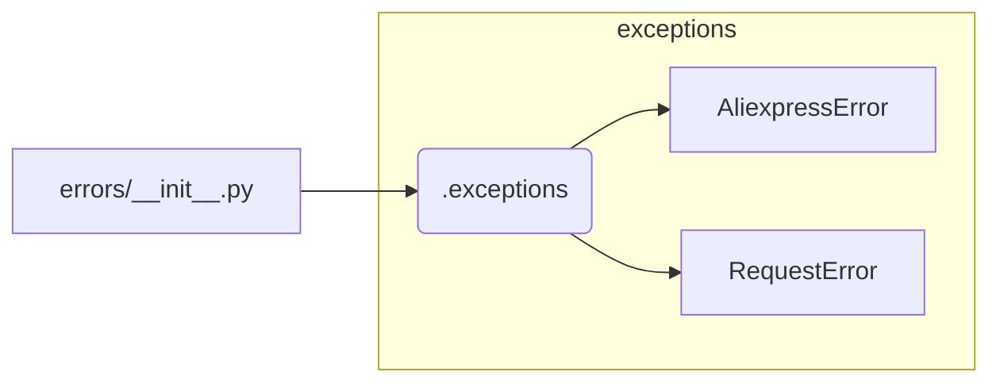

```MD
1. **<input code>**:

```python
## \file hypotez/src/suppliers/aliexpress/api/errors/__init__.py
# -*- coding: utf-8 -*-
#! venv/Scripts/python.exe # <- venv win
## ~~~~~~~~~~~~~
""" module: src.suppliers.aliexpress.api.errors """
from .exceptions import *
```

2. **<algorithm>**:

Этот файл является инициализатором модуля `errors` для API поставщика AliExpress.  Он не содержит собственного алгоритма обработки.  Его основная функция - импортировать все классы исключений, определенные в подпапке `exceptions`.  Пошаговая блок-схема будет очень простой:

* **Шаг 1:**  Импортировать классы исключений из подпапки `exceptions`.

Пример: Этот файл просто импортирует все классы из подпапки `exceptions`.  Если `exceptions` содержит `AliexpressError`, `RequestError`, то они станут доступны в этом модуле.


3. **<mermaid>**:



4. **<explanation>**:

* **Импорты:**  `from .exceptions import *` —  эта строка импортирует *все* классы, определенные в модуле `exceptions`, который находится в той же папке (`./exceptions`).  Это позволяет использовать классы из `exceptions` в файлах, которые импортируют `errors/__init__.py`.

* **Классы:**  Этот файл сам по себе не определяет классы. Он их импортирует.  Классы, такие как `AliexpressError` и `RequestError` (если они присутствуют), вероятно, представляют собой пользовательские исключения, которые специфичны для API AliExpress. Они обрабатывают ошибки, возникающие при взаимодействии с этим API.

* **Функции:** Нет функций, так как это файл импортов.

* **Переменные:** Нет переменных.

* **Возможные ошибки или области для улучшений:**

    * **Явность импортов:**  Вместо `*` предпочтительно импортировать нужные классы явно.  Например, `from .exceptions import AliexpressError, RequestError`. Это делает код более понятным и уменьшает риск конфликтов имён.
    * **Документация:** Добавьте документацию к этому файлу.  В `""" module: src.suppliers.aliexpress.api.errors """` можно расширить описание, чтобы объяснить, что именно он делает и как его использовать.
    * **Использование:** Этот файл служит вспомогательным.  Важно, чтобы классы в `.exceptions` были должным образом определены, что описывает типы ошибок, которые могут произойти в API.


**Цепочка взаимосвязей:**

Этот модуль является частью структуры проекта, ориентированной на работу с API AliExpress.  Связь выглядит так:

```
src
├── suppliers
│   └── aliexpress
│       └── api
│           └── errors
│               └── __init__.py    <- Этот файл
│               └── exceptions.py  <- Файл, содержащий классы исключений
│           └── ... (другие API файлы)
└── ... (другие модули)
```

Взаимосвязь:  Код в других частях проекта (например, клиентском коде для работы с API AliExpress) импортирует этот модуль, чтобы использовать определенные в нём исключения для обработки потенциальных ошибок во взаимодействии с API.