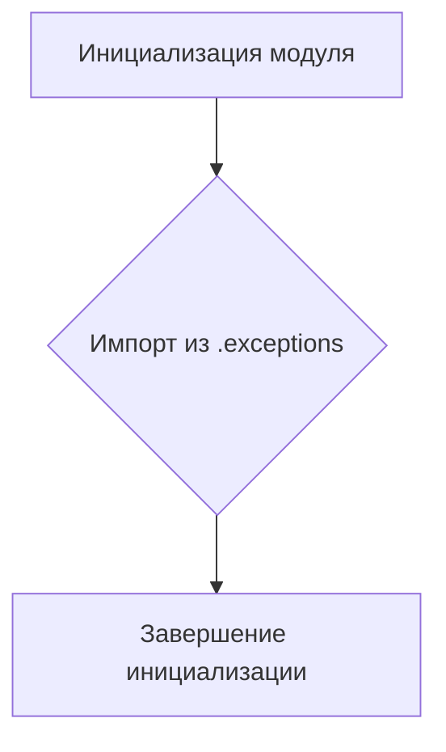

```MD
# Анализ файла hypotez/src/suppliers/aliexpress/api/errors/__init__.py

## <input code>

```python
# -*- coding: utf-8 -*-\
#! venv/Scripts/python.exe # <- venv win
## ~~~~~~~~~~~~~\
""" module: src.suppliers.aliexpress.api.errors """
from .exceptions import *
```

## <algorithm>

Этот файл представляет собой инициализационный модуль для пакета `aliexpress.api.errors`.  Он не содержит логики выполнения, а просто импортирует все классы исключений, определенные в подпапке `exceptions`. Алгоритм работы сводится к импорту.  

**Блок-схема:**



**Примеры:**

* Если в `exceptions.py` определены классы `AliexpressAPIError`, `InvalidCredentialsError`, то этот модуль позволит использовать их в других частях проекта.

**Перемещение данных:**

В этом случае данные не перемещаются, так как модуль не выполняет какие-либо вычисления или операции с данными.

## <mermaid>


## <explanation>

**Импорты:**

Строка `from .exceptions import *` импортирует все определения (классы, функции, переменные) из подмодуля `exceptions`, который находится в той же директории, что и текущий файл. Использование `.` перед именем подмодуля (`exceptions`) означает, что он находится в текущей директории.  Это типичный способ организации импорта в Python, позволяющий организовать модули в иерархии папок и модулей. Важно понимать, что этот импорт **не** импортирует всю подпапку `exceptions`. Он импортирует все определенные в `exceptions.py` классы, функции, и прочие определения, доступные для использования в текущем модуле.

**Классы:**

В этом файле нет собственных классов, но импорт `from .exceptions import *` указывает на существование определенных классов в файле `exceptions.py`.  Эти классы будут представлять типы ошибок, специфичных для взаимодействия с API AliExpress.


**Функции:**

Нет функций.

**Переменные:**

Нет переменных.

**Возможные ошибки или области для улучшений:**

* **Ясность импорта:** Использование `*` в `from .exceptions import *` может привести к проблемам с именованием, если в разных модулях используются похожие имена. Лучше импортировать только те классы и функции, которые необходимы, используя явные импорты, например:
```python
from .exceptions import AliexpressAPIError, InvalidCredentialsError
```
* **Документация:** Добавление docstrings к классам и функциям `exceptions.py` повысит читабельность и понимание кода.

**Взаимосвязи с другими частями проекта:**

Этот модуль является частью подсистемы работы с API AliExpress.  Другие части проекта (например, модули для обработки заказов, поиска товаров и т.д.) могут использовать классы исключений из этого модуля для обработки ошибок, возникающих при взаимодействии с API AliExpress.  Возможно, в другом месте проекта будет код, использующий эти классы исключений для обработки ситуаций, связанных с неудачным запросом или некорректным ответом от API.

**Вывод:**

Файл `__init__.py` выполняет простую, но важную задачу - предоставляя доступ к классам исключений в модуле `exceptions`.  Он играет роль точки входа для других частей проекта, позволяя работать с API AliExpress и обрабатывать возможные ошибки. Важно позаботиться о ясности и структурированности импорта в дальнейшем для избежания проблем с именами.