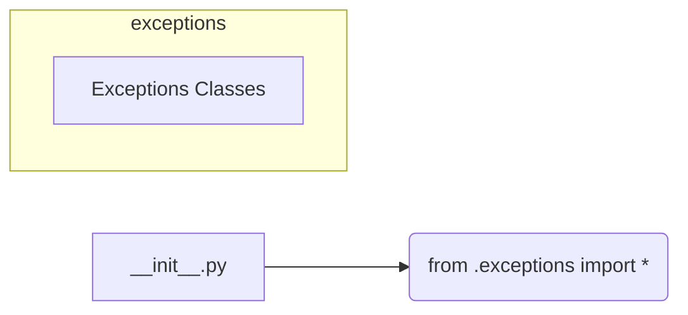

# <input code>

```python
## \file hypotez/src/suppliers/aliexpress/api/errors/__init__.py
# -*- coding: utf-8 -*-
#! venv/Scripts/python.exe # <- venv win
## ~~~~~~~~~~~~~
""" module: src.suppliers.aliexpress.api.errors """
from .exceptions import *
```

# <algorithm>

Этот код представляет собой файл `__init__.py` для пакета `errors` внутри модуля `aliexpress.api` в проекте `hypotez`.  Алгоритм работы прост: он импортирует все классы исключений, определенные в подпапке `exceptions`.

Пошаговая блок-схема:

1. **Импорт:** Файл импортирует все классы исключений из папки `.exceptions`.
   * **Входные данные:** Путь к папке `exceptions`
   * **Выходные данные:**  Никаких прямых выходных данных. Все классы исключений доступны для использования в других частях проекта.


# <mermaid>



**Объяснение диаграммы:**

* `__init__.py` - файл, который импортирует классы.
* `from .exceptions import *` - оператор импорта, который подключает все классы из подпапки `exceptions`

# <explanation>

**Импорты:**

`from .exceptions import *`:  Этот импорт делает все классы исключений, определенные в файле `exceptions.py` (который находится в той же директории, что и `__init__.py`), доступными для использования в текущем модуле `errors`.  Символ `.` означает, что импортируемый файл находится в подпапке `exceptions` текущего модуля (`aliexpress/api/errors`).  Это стандартная практика для организации Python-модулей, позволяющая избежать конфликтов имён и улучшить структуру кода.

**Классы:**

Код не содержит определений классов.  Он только импортирует классы исключений, которые должны быть уже определены в файле `exceptions.py` (например, `AliexpressAPIError`, `IncorrectDataError`, и т.д.).  Без просмотра `exceptions.py` невозможно понять точный функционал и структуру этих классов.

**Функции:**

Код не содержит определений функций.

**Переменные:**

Нет переменных.

**Возможные ошибки или области для улучшений:**

* **Отсутствие документации:** В файле `__init__.py` отсутствует строка документации, описывающая, что он делает.
* **Неявный импорт:** Использование `*` при импорте из `exceptions`  может привести к конфликту имён в случае, если в `exceptions.py` уже есть импорты из других модулей, которые имеют имена, совпадающие с именами классов, которые мы импортируем. 
* **Нет проверки корректности импорта:** Код не проверяет, существует ли файл `.exceptions`.  Если файла нет, произойдёт ошибка во время выполнения.

**Взаимосвязи с другими частями проекта:**

Этот файл играет ключевую роль в обеспечении доступа к классам исключений `aliexpress.api.errors` в других частях проекта, которые могут обрабатывать API-запросы к AliExpress и обрабатывать возможные ошибки.  Например, в модулях, отвечающих за взаимодействие с API (например, `aliexpress_client.py`),  будут использоваться эти исключения для обработки ошибок во время обращений к серверу.

**Пример предполагаемого использования (в другом модуле):**

```python
from suppliers.aliexpress.api.errors import AliexpressAPIError

try:
    # Код, который может вызвать ошибку API
    response = aliexpress_client.get_products()
except AliexpressAPIError as e:
    print(f"Ошибка при запросе к API: {e}")
```

В этом примере используется класс исключения `AliexpressAPIError`, импортированный из `__init__.py`, чтобы обработать потенциальную ошибку при работе с API AliExpress.