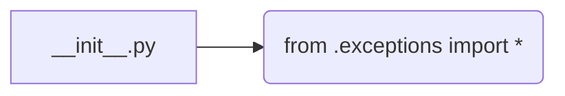
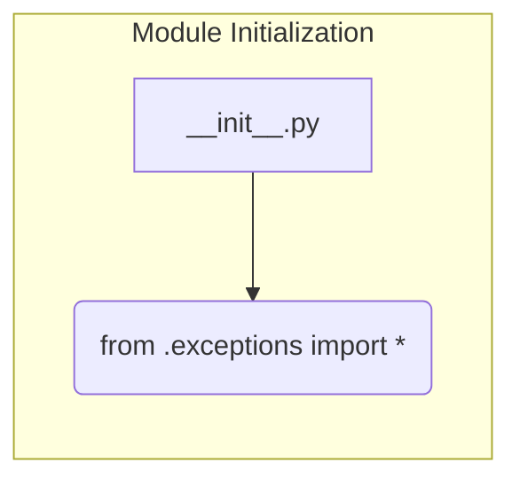

```MD
# <input code>

```python
## \file hypotez/src/suppliers/aliexpress/api/errors/__init__.py
# -*- coding: utf-8 -*-
#! venv/Scripts/python.exe # <- venv win
## ~~~~~~~~~~~~
""" module: src.suppliers.aliexpress.api.errors """
from .exceptions import *
```

# <algorithm>

Этот код представляет собой инициализирующий модуль для пакета обработки ошибок API AliExpress.  По сути, он просто импортирует все классы исключений из подпапки `exceptions`.  Блок-схема проста:



В данном случае, нет сложных вычислений или обработки данных.  Инициализация модуля сводится к импорту.

# <mermaid>



Эта диаграмма изображает единственный шаг: импорт из подмодуля `exceptions`.  Зависимости находятся внутри структуры пакета.


# <explanation>

* **Импорты**:
    * `from .exceptions import *`: Эта строка импортирует все классы и/или функции (используя `*`) из подпапки `exceptions`, которая находится в текущем каталоге (`.`) относительно файла `__init__.py`.  Это типичный способ организации связанных классов в Python.  Это импортирует все классы исключений, определённые в файле(ах) `exceptions`, в модуль `__init__.py`.  Это даёт доступ к этим классам из других модулей в пакете `aliexpress.api.errors`.  Привязка к `src` – важно.  Используя точку, `.` - вы попадаете в структуру пакета, создавая иерархию импорта. 

* **Классы**:
    Этот код не определяет новые классы, он лишь импортирует уже определённые классы исключений. Эти классы, скорее всего, наследуются от базового класса `Exception` в Python и предназначены для обработки специфичных ошибок, возникающих при взаимодействии с API AliExpress.  Их подробное описание находиться в файлах `exceptions.py`.

* **Функции**:
    Нет функций.  Только импорт.

* **Переменные**:
    Нет переменных.

* **Возможные ошибки или области для улучшений**:
    * **Дополнить документацией**: Добавление docstrings к импортируемым классам исключений (в `exceptions.py`) поможет более четко описать их назначение.
    * **Использование `if __name__ == "__main__":`**: Если в этом файле будет  любой код, который должен быть выполнен только при прямом запуске файла (не при импорте),  используйте `if __name__ == "__main__":`.


* **Взаимосвязь с другими частями проекта**:
    Этот файл является частью структуры пакета `hypotez/src/suppliers/aliexpress/api/errors`.  Он будет использоваться кодом, который взаимодействует с API AliExpress, для обработки возможных ошибок во время запросов к API.  Скорее всего, это приведет к инициализации класса, который затем будет использован для обработки исключений.


**Общая картина:**

Модуль `__init__.py` в `aliexpress.api.errors` просто импортирует необходимые классы из подмодуля `exceptions`, делая их доступными для использования в других частях кода. Он действует как точка входа в этот раздел обработки ошибок.  Связанные с этим классы исключений, определённые в `exceptions.py`, обрабатывают ошибки, специфичные для API AliExpress.  Это чётко демонстрирует паттерн организации кода:  разделение обязанностей, где модуль инициализирует доступ к необходимым классам для обработки ошибок, не выполняя другие задачи.