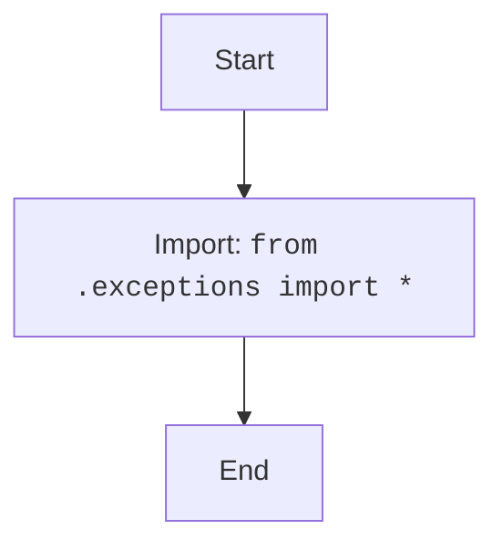

# Анализ кода `hypotez/src/suppliers/aliexpress/api/errors/__init__.py`

## 1. <алгоритм>

1.  **Импорт модуля `exceptions`**:
    *   Импортируются все имена (классы исключений) из модуля `exceptions.py`, расположенного в той же директории.
    *   Пример: Если `exceptions.py` содержит класс `AliExpressAPIError`, то после импорта его можно будет использовать как `AliExpressAPIError`.

## 2. <mermaid>

**Объяснение зависимостей `mermaid`:**

*   `Start`: Начало процесса.
*   `ImportExceptions`: Импортирует все классы исключений из модуля `exceptions.py`, находящегося в той же директории.
*   `End`: Конец процесса.

## 3. <объяснение>

### Импорты
*   `from .exceptions import *`:
    *   **Назначение**: Импортирует все публичные имена (классы исключений) из модуля `exceptions.py`, находящегося в той же директории. Это позволяет использовать классы исключений, определенные в `exceptions.py`, непосредственно в текущем модуле `__init__.py`, и делает их доступными при импорте пакета `src.suppliers.aliexpress.api.errors`.
    *   **Взаимосвязь с `src`**:  Пакет `src.suppliers.aliexpress.api.errors` предназначен для обработки ошибок, возникающих при взаимодействии с AliExpress API. Файл `__init__.py` делает все исключения из `exceptions.py` доступными при импорте этого пакета.  Например,  если проект импортирует `from src.suppliers.aliexpress.api.errors import AliExpressAPIError`, то это будет работать, т.к. в `__init__.py` происходит импорт `from .exceptions import *`.

### Классы
*   В данном файле нет явных классов. Однако он импортирует классы исключений из `exceptions.py`.
    *   **Роль**: Классы исключений используются для обработки и уведомления об ошибках, которые могут возникнуть в процессе выполнения операций API AliExpress.

### Функции
*   В данном файле нет функций.

### Переменные
*   В данном файле нет переменных.

### Потенциальные ошибки и области для улучшения
*   **Импорт `*`**: Использование `from module import *` не является лучшей практикой, так как может привести к конфликтам имен и затрудняет понимание того, какие именно имена импортируются. Рекомендуется явно перечислять импортируемые имена: `from .exceptions import AliExpressAPIError, AnotherError, ...`. Это позволит избежать потенциальных конфликтов имен и сделает код более читаемым и понятным.

### Цепочка взаимосвязей с другими частями проекта
1.  `src.suppliers.aliexpress.api`: Этот пакет, вероятно, содержит другие модули, которые взаимодействуют с AliExpress API. Модуль `errors` предоставляет классы исключений, используемые для обработки ошибок, которые могут возникнуть при этом взаимодействии.
2.  `src.suppliers.aliexpress`: Этот пакет, вероятно, содержит общую логику для работы с AliExpress, включая модули для API, обработки данных и т.д.
3.  `src.suppliers`: Этот пакет, вероятно, содержит модули для работы с другими поставщиками, помимо AliExpress.
4.  `src`: Корень проекта, который объединяет все модули и пакеты.

Таким образом, `src.suppliers.aliexpress.api.errors` является важной частью проекта, обеспечивающей структурированный подход к обработке ошибок при работе с AliExpress API.