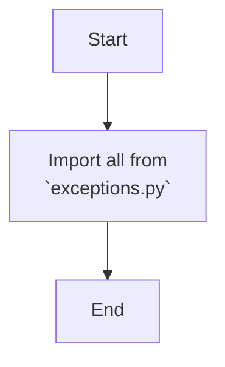

## АНАЛИЗ КОДА: `hypotez/src/suppliers/aliexpress/api/errors/__init__.py`

### <алгоритм>

1. **Импорт модуля `exceptions`:**
   -  Модуль `__init__.py` импортирует все (`*`) имена (классы, функции, переменные) из модуля `exceptions.py`, находящегося в той же директории.
   -  **Пример:** Если `exceptions.py` содержит классы `APIError`, `InvalidParameterError`,  после импорта их можно будет использовать напрямую, например, `raise APIError("Some error")`.

### <mermaid>

### <объяснение>

**Импорты:**

- `from .exceptions import *`:
  - Этот импорт указывает Python импортировать все имена (классы, функции, переменные), определенные в модуле `exceptions.py`, который находится в той же директории, что и `__init__.py`. 
  -  Это делается для того, чтобы все исключения, определенные в `exceptions.py`, были доступны при импорте пакета `src.suppliers.aliexpress.api.errors`. 
  -  Взаимосвязь с другими пакетами: Этот импорт устанавливает, что модуль `errors` зависит от модуля `exceptions`, который предположительно содержит кастомные исключения, специфичные для AliExpress API.

**Классы:**

- В данном файле нет классов. Однако, он неявно предполагает наличие классов (исключений) в модуле `exceptions.py`.  Примеры таких классов могут включать:
  - `APIError`: Базовый класс для всех ошибок API.
  - `InvalidParameterError`: Ошибка, указывающая на неправильные входные параметры.
  - `AuthenticationError`: Ошибка, связанная с аутентификацией.
  - Эти классы (предположительно) будут наследоваться от стандартного класса `Exception` Python или другого кастомного базового класса.

**Функции:**

- В данном файле нет функций. Предполагается, что функции могут быть в `exceptions.py`, например:
   -  Функции для преобразования стандартных ошибок в кастомные.

**Переменные:**

- В данном файле нет явных переменных.  Возможно, `exceptions.py` содержит какие-то константы.

**Потенциальные ошибки или области для улучшения:**

- Использование `from ... import *` не всегда является хорошей практикой, особенно для больших пакетов. Оно может привести к конфликтам имен и затрудняет понимание, откуда импортируется конкретное имя. В будущем было бы лучше явно перечислить импортируемые имена, например, `from .exceptions import APIError, InvalidParameterError`.

**Цепочка взаимосвязей с другими частями проекта:**

- Данный модуль `src.suppliers.aliexpress.api.errors` предназначен для обработки ошибок, которые могут возникнуть при взаимодействии с API AliExpress.
- Он вероятно будет использоваться в других частях проекта, которые делают запросы к API AliExpress, например, `src.suppliers.aliexpress.api.client`.
-  Цепочка может выглядеть так:
    - `src.suppliers.aliexpress.api.client` делает запрос к API AliExpress.
    -  Если запрос заканчивается ошибкой, возникает исключение.
    -  Модуль `src.suppliers.aliexpress.api.errors` предоставляет кастомные исключения (такие как `APIError`), которые можно обработать в `src.suppliers.aliexpress.api.client` или вышестоящих модулях.
    -  Это позволяет единообразно обрабатывать ошибки API AliExpress во всем проекте.