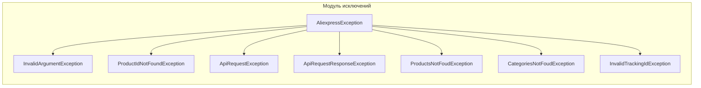

# <input code>

```python
## \file hypotez/src/suppliers/aliexpress/api/errors/exceptions.py
# -*- coding: utf-8 -*-\
#! venv/Scripts/python.exe # <- venv win
## ~~~~~~~~~~~~~\
""" module: src.suppliers.aliexpress.api.errors """
"""Custom exceptions module"""


class AliexpressException(Exception):
    """Common base class for all AliExpress API exceptions."""
    def __init__(self, reason: str):
        super().__init__()
        self.reason = reason

    def __str__(self) -> str:
        return '%s' % self.reason


class InvalidArgumentException(AliexpressException):
    """Raised when arguments are not correct."""
    pass


class ProductIdNotFoundException(AliexpressException):
    """Raised if the product ID is not found."""
    pass


class ApiRequestException(AliexpressException):
    """Raised if the request to AliExpress API fails"""
    pass


class ApiRequestResponseException(AliexpressException):
    """Raised if the request response is not valid"""
    pass


class ProductsNotFoudException(AliexpressException):
    """Raised if no products are found"""
    pass


class CategoriesNotFoudException(AliexpressException):
    """Raised if no categories are found"""
    pass


class InvalidTrackingIdException(AliexpressException):
    """Raised if the tracking ID is not present or invalid"""
    pass
```

# <algorithm>

**Шаг 1:** Определение базового класса `AliexpressException`
  * Принимает строку `reason` для описания причины исключения.
  * Инициализирует атрибут `self.reason`.
  * Переопределяет метод `__str__` для возвращения строки с причиной исключения.
**Примеры:**
```python
e = AliexpressException("Некорректный аргумент")
print(e)  # Output: Некорректный аргумент
```

**Шаг 2:** Наследование от `AliexpressException`
*   Все классы `InvalidArgumentException`, `ProductIdNotFoundException` и т.д. наследованы от `AliexpressException`.
*   Они добавляют специфические типы исключений для API AliExpress.

**Шаг 3:** Определение специфических исключений.
   * Каждый класс представляет собой отдельное исключение, описывающее конкретную проблему, связанную с API AliExpress.

**Шаг 4:**  Использование исключений.
   *  Код, который может вызвать эти исключения, использует соответствующий класс исключения, например:
```python
raise ProductIdNotFoundException("Продукт с ID не найден")
```

# <mermaid>



# <explanation>

**Импорты:**
В данном файле нет импортов. Он содержит только определения собственных исключений. Это означает, что все исключения являются собственными, и не используют какие-либо внешние библиотеки.

**Классы:**
*   **`AliexpressException`**: Базовый класс для всех исключений, связанных с API AliExpress. Он хранит информацию о причине исключения (`reason`) и предоставляет способ ее получения в строковом виде.
*   **`InvalidArgumentException`, `ProductIdNotFoundException`, `ApiRequestException`, `ApiRequestResponseException`, `ProductsNotFoudException`, `CategoriesNotFoudException`, `InvalidTrackingIdException`**: Эти классы представляют собой специфические типы исключений, которые могут быть вызваны в коде, связанном с API AliExpress. Они представляют собой конкретные ошибки, которые могут произойти при взаимодействии с API, например, неверный аргумент или отсутствие продукта.

**Функции:**
В этом файле определены только методы `__init__` и `__str__` внутри класса `AliexpressException`. Метод `__init__` инициализирует атрибут `self.reason` и является конструктором. `__str__` возвращает строковое представление исключения.

**Переменные:**
`reason` — это переменная, которая хранит строковое сообщение об ошибке.

**Возможные ошибки или области для улучшений:**

* **Отсутствие дополнительных данных:**  Классы исключений содержат только сообщение об ошибке.  Для более сложного анализа ошибок полезно было бы хранить дополнительную информацию, такую как код ошибки, стековый след (traceback) или данные запроса, вызвавшие ошибку.

* **Документирование:** Дополнительная документация о классах исключений сделала бы их использование более понятным.  К примеру, добавить описание для `reason`.

**Цепочка взаимосвязей:**

Этот файл `exceptions.py` является частью модуля `aliexpress`, который отвечает за взаимодействие с API AliExpress. Вероятно,  в других частях кода (например, в файлах с функциями для работы с API) будут вызовы к этим исключениям (или попытки обработки этих исключений).  Эти вызовы/обработки исключений будут вызывать эти исключения, таким образом, обеспечивая взаимодействие между разными частями проекта.

В целом, код хорошо структурирован и предназначен для создания и обработки исключений, связанных с API AliExpress.  Однако, добавление дополнительных данных и более подробной документации улучшит его читаемость и поддерживаемость в будущем.