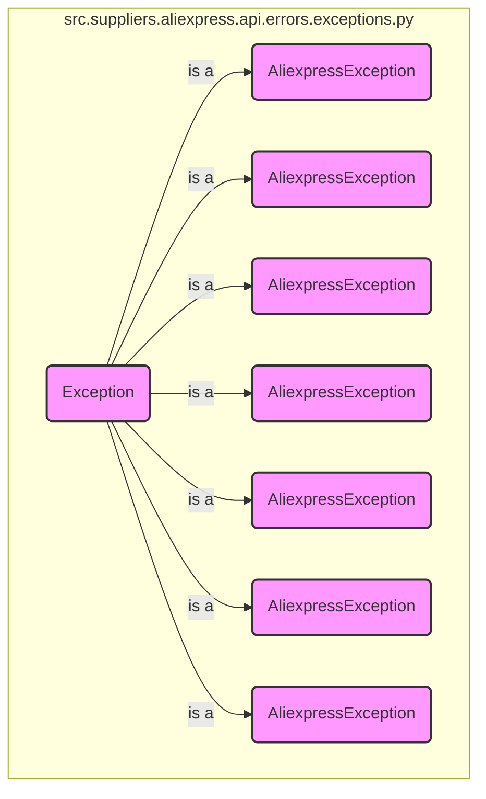

## АНАЛИЗ КОДА: `hypotez/src/suppliers/aliexpress/api/errors/exceptions.py`

### 1. <алгоритм>

1.  **Объявление базового класса `AliexpressException`**:
    *   Создается класс `AliexpressException`, наследуемый от встроенного класса `Exception`.
    *   Конструктор `__init__` принимает строковый аргумент `reason`, который сохраняется в атрибуте экземпляра `self.reason`.
        *   Пример: `exc = AliexpressException("Произошла ошибка")`
    *   Метод `__str__` переопределяется для возвращения строки `reason`, что позволяет использовать исключение для вывода сообщения об ошибке.
        *   Пример: `print(exc)` выведет `Произошла ошибка`
2.  **Объявление производных классов исключений**:
    *   Создаются классы исключений, наследуемые от `AliexpressException`:
        *   `InvalidArgumentException` - для неверных аргументов.
            *   Пример: `raise InvalidArgumentException("Неверный формат id")`
        *   `ProductIdNotFoundException` - если ID продукта не найден.
             *  Пример: `raise ProductIdNotFoundException("Товар не найден")`
        *   `ApiRequestException` - если запрос к API AliExpress не удался.
             *  Пример: `raise ApiRequestException("Ошибка запроса API")`
        *    `ApiRequestResponseException` - если ответ API не валидный.
             *  Пример: `raise ApiRequestResponseException("Невалидный ответ от API")`
        *    `ProductsNotFoudException` - если товары не найдены.
             *  Пример: `raise ProductsNotFoudException("Товары не найдены")`
        *    `CategoriesNotFoudException` - если категории не найдены.
             *  Пример: `raise CategoriesNotFoudException("Категории не найдены")`
        *    `InvalidTrackingIdException` - если ID отслеживания не валидный.
             *  Пример: `raise InvalidTrackingIdException("Неверный ID отслеживания")`
    *   Каждый класс имеет пустой блок `pass`, так как наследует всю логику от `AliexpressException`.

### 2. <mermaid>

**Объяснение:**

*   Диаграмма `flowchart TD` представляет иерархию классов исключений.
*   `AliexpressException` — базовый класс, от которого наследуются все остальные пользовательские исключения.
*   Стрелка с надписью `is a` показывает отношение наследования.
*   Каждый дочерний класс (например, `InvalidArgumentException`) представляет конкретную ситуацию ошибки, специфичную для работы с AliExpress API.
*    `classDef exception fill:#f9f,stroke:#333,stroke-width:2px` - задает стиль для классов исключений.
*   `src.suppliers.aliexpress.api.errors.exceptions.py` - это модуль, в котором определены классы исключений.
*   Имена классов на диаграмме соответствуют именам классов в коде, что обеспечивает понятность и отслеживаемость структуры исключений.

### 3. <объяснение>

**Импорты:**

*   В данном файле нет явных импортов. Он использует встроенный класс `Exception` для создания иерархии пользовательских исключений.

**Классы:**

*   **`AliexpressException`**:
    *   Роль: Базовый класс для всех пользовательских исключений, связанных с AliExpress API.
    *   Атрибуты:
        *   `reason` (str): Строка, содержащая описание причины возникновения исключения.
    *   Методы:
        *   `__init__(self, reason: str)`: Конструктор класса, инициализирует атрибут `reason`.
        *   `__str__(self) -> str`: Переопределенный метод, возвращающий строку, описывающую причину исключения.
    *   Взаимодействие: Является родительским классом для всех остальных исключений в этом модуле, предоставляя общую структуру и функциональность.
*   **`InvalidArgumentException`**:
    *   Роль: Исключение, выбрасываемое, когда аргументы, переданные в функцию или метод, неверны.
    *   Атрибуты: Наследует атрибут `reason` от `AliexpressException`.
    *   Методы: Нет собственных методов, использует методы `AliexpressException`.
    *   Взаимодействие: Выбрасывается в коде, когда происходит ошибка валидации входных аргументов.
*   **`ProductIdNotFoundException`**:
    *   Роль: Исключение, выбрасываемое, когда не удается найти продукт по заданному идентификатору.
    *   Атрибуты: Наследует атрибут `reason` от `AliexpressException`.
    *   Методы: Нет собственных методов, использует методы `AliexpressException`.
    *    Взаимодействие: Выбрасывается, когда поиск товара по ID заканчивается неудачей.
*    **`ApiRequestException`**:
    *    Роль: Исключение, выбрасываемое при ошибке запроса к AliExpress API.
    *   Атрибуты: Наследует атрибут `reason` от `AliexpressException`.
    *   Методы: Нет собственных методов, использует методы `AliexpressException`.
    *    Взаимодействие: Выбрасывается при ошибках на уровне сетевого запроса.
*   **`ApiRequestResponseException`**:
     *   Роль: Исключение, выбрасываемое при получении невалидного ответа от AliExpress API.
     *  Атрибуты: Наследует атрибут `reason` от `AliexpressException`.
     *   Методы: Нет собственных методов, использует методы `AliexpressException`.
     *  Взаимодействие: Выбрасывается, когда ответ от сервера не соответствует ожидаемому формату или содержит ошибки.
*   **`ProductsNotFoudException`**:
    *   Роль: Исключение, выбрасываемое, когда не найдено ни одного продукта по заданным критериям.
    *  Атрибуты: Наследует атрибут `reason` от `AliexpressException`.
    *   Методы: Нет собственных методов, использует методы `AliexpressException`.
    *    Взаимодействие: Выбрасывается, когда поиск товаров по каким-либо условиям (например, категории, ключевые слова) заканчивается неудачей.
*   **`CategoriesNotFoudException`**:
    *   Роль: Исключение, выбрасываемое, когда не найдено ни одной категории по заданным критериям.
    *    Атрибуты: Наследует атрибут `reason` от `AliexpressException`.
    *    Методы: Нет собственных методов, использует методы `AliexpressException`.
    *   Взаимодействие: Выбрасывается, когда не удается найти категорию по ID или другим параметрам.
*   **`InvalidTrackingIdException`**:
    *    Роль: Исключение, выбрасываемое, когда ID отслеживания не найден или невалидный.
    *   Атрибуты: Наследует атрибут `reason` от `AliexpressException`.
    *    Методы: Нет собственных методов, использует методы `AliexpressException`.
    *    Взаимодействие: Выбрасывается, когда ID отслеживания не соответствует формату или не существует.

**Функции:**

*   В данном коде нет явных функций, только методы классов.

**Переменные:**

*   `reason` (str): Атрибут экземпляра класса `AliexpressException`, хранит строку с описанием причины исключения.

**Потенциальные ошибки и области для улучшения:**

*   **Общая обработка исключений:** Все исключения наследуются от `AliexpressException`, что позволяет использовать общий блок `try-except` для их обработки, но в каждой ситуации `except` блока, мы можем использовать каждый класс исключения отдельно.
*   **Детальные сообщения об ошибках:** При создании экземпляров исключений можно передавать более конкретные сообщения, включающие, например, идентификаторы продуктов или параметры запроса, для облегчения отладки.
*   **Логирование:** Можно добавить логирование исключений для более глубокого анализа ошибок и отладки.
*   **Кастомизация:** Можно добавить собственные атрибуты к конкретным классам исключений, если это необходимо для их обработки.
*   **Интернационализация**: Сообщения об ошибках можно вынести в отдельные файлы для поддержки разных языков.

**Взаимосвязи с другими частями проекта:**

*   Этот модуль используется другими частями проекта `src/suppliers/aliexpress/api`, которые взаимодействуют с AliExpress API. Эти исключения обрабатываются там, чтобы сообщить о проблемах, возникающих во время вызова API.
*   Пример: Функции в других файлах этого пакета могут выбрасывать эти исключения в случаях, когда:
    *   аргументы запроса к API невалидны (например, неправильный формат ID);
    *   продукт с указанным ID не найден;
    *   возникают проблемы при запросе к API (например, сбой соединения, неверный формат ответа).
    *   нет товаров или категорий по заданным параметрам;
    *   ID отслеживания имеет неверный формат.

В целом, этот файл предоставляет необходимый набор пользовательских исключений, которые позволяют более структурированно обрабатывать ошибки, возникающие при работе с AliExpress API.