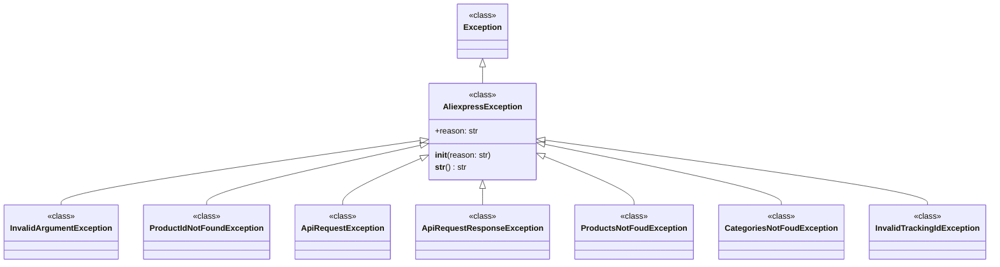

## Анализ кода `hypotez/src/suppliers/aliexpress/api/errors/exceptions.py`

### <алгоритм>

1.  **Определение базового класса `AliexpressException`:**
    *   При вызове `AliexpressException(reason)`:
        *   Вызывается конструктор родительского класса `Exception`.
        *   Атрибуту `reason` экземпляра присваивается переданная строка.
    *   При вызове `str(instance)`:
        *   Возвращается строка, содержащая причину ошибки `reason`.
    *   Пример: `ex = AliexpressException("Произошла ошибка API"); str(ex)` вернет `"Произошла ошибка API"`.

2.  **Определение производных классов ошибок:**
    *   Классы `InvalidArgumentException`, `ProductIdNotFoundException`, `ApiRequestException`, `ApiRequestResponseException`, `ProductsNotFoudException`, `CategoriesNotFoudException`, `InvalidTrackingIdException` наследуются от `AliexpressException`.
    *   Эти классы представляют конкретные типы ошибок, которые могут возникнуть при взаимодействии с AliExpress API.
    *   Примеры:
        *   `InvalidArgumentException("Неверный формат аргумента")` - используется, когда передан некорректный аргумент.
        *   `ProductIdNotFoundException("ID продукта не найден")` - используется, когда не удалось найти продукт по ID.
        *   `ApiRequestException("Ошибка запроса API")` - используется, когда запрос к API завершился ошибкой.
        *   `ApiRequestResponseException("Неверный ответ API")` - используется, когда получен некорректный ответ от API.
        *   `ProductsNotFoudException("Продукты не найдены")` - используется, когда не удалось найти продукты.
        *    `CategoriesNotFoudException("Категории не найдены")` - используется, когда не удалось найти категории.
        *   `InvalidTrackingIdException("Неверный или отсутсвует ID отслеживания")` - используется, когда неверный ID отслеживания.

### <mermaid>

**Описание зависимостей:**

*   `Exception`: Это встроенный базовый класс исключений Python.
*   `AliexpressException`:  Пользовательский класс, наследующийся от `Exception`, является базовым классом для всех исключений, связанных с AliExpress API.
*   `InvalidArgumentException`, `ProductIdNotFoundException`, `ApiRequestException`, `ApiRequestResponseException`, `ProductsNotFoudException`, `CategoriesNotFoudException`, `InvalidTrackingIdException`:  Конкретные классы исключений, наследующиеся от `AliexpressException`,  представляют разные сценарии ошибок при работе с AliExpress API.

### <объяснение>

**Импорты:**

*   В данном файле нет явных импортов. Все необходимые компоненты определены внутри файла.

**Классы:**

*   **`AliexpressException`**:
    *   **Роль:** Базовый класс для всех пользовательских исключений, связанных с API AliExpress.
    *   **Атрибуты:**
        *   `reason` (str): Причина ошибки, которая будет отображаться при преобразовании исключения в строку.
    *   **Методы:**
        *   `__init__(self, reason: str)`: Конструктор класса, принимает строку `reason` в качестве причины ошибки и сохраняет ее.
        *   `__str__(self) -> str`: Возвращает строку, представляющую причину ошибки.
    *   **Взаимодействие:** Этот класс служит основой для всех специализированных исключений в модуле, обеспечивая единый интерфейс для работы с ошибками.
*   **`InvalidArgumentException`**:
    *   **Роль:** Исключение, которое выбрасывается, когда аргументы, переданные в функции или методы, некорректны.
    *   **Атрибуты**: Нет.
    *   **Методы**: Нет.
    *   **Взаимодействие**: Наследуется от `AliexpressException`, перенимая его функционал.
*   **`ProductIdNotFoundException`**:
    *   **Роль:** Исключение, которое выбрасывается, если продукт с указанным ID не найден.
    *   **Атрибуты**: Нет.
    *   **Методы**: Нет.
    *   **Взаимодействие**: Наследуется от `AliexpressException`.
*   **`ApiRequestException`**:
    *   **Роль:** Исключение, которое выбрасывается при неудачном запросе к AliExpress API.
    *    **Атрибуты**: Нет.
    *   **Методы**: Нет.
    *   **Взаимодействие**: Наследуется от `AliexpressException`.
*    **`ApiRequestResponseException`**:
    *   **Роль:** Исключение, которое выбрасывается, если ответ от AliExpress API недействителен.
    *    **Атрибуты**: Нет.
    *   **Методы**: Нет.
    *   **Взаимодействие**: Наследуется от `AliexpressException`.
*   **`ProductsNotFoudException`**:
    *   **Роль:** Исключение, которое выбрасывается, если продукты не найдены.
    *    **Атрибуты**: Нет.
    *   **Методы**: Нет.
    *   **Взаимодействие**: Наследуется от `AliexpressException`.
*    **`CategoriesNotFoudException`**:
    *   **Роль:** Исключение, которое выбрасывается, если категории не найдены.
    *    **Атрибуты**: Нет.
    *   **Методы**: Нет.
    *   **Взаимодействие**: Наследуется от `AliexpressException`.
*    **`InvalidTrackingIdException`**:
    *   **Роль:** Исключение, которое выбрасывается, если  ID отслеживания  недействителен.
    *   **Атрибуты**: Нет.
    *   **Методы**: Нет.
    *    **Взаимодействие**: Наследуется от `AliexpressException`.

**Функции:**

*   В этом файле нет функций, только классы исключений.

**Переменные:**

*   Внутри классов `reason` это атрибут экземпляра, который хранит причину исключения. Он имеет тип `str`.

**Потенциальные ошибки и области для улучшения:**

*   **Отсутствие документации по специфике ошибок:** Хотя есть общее описание каждого исключения, нет информации о конкретных случаях, когда они должны быть выброшены. Добавление комментариев с примерами ситуаций, вызывающих эти ошибки, сделает код более понятным и удобным в использовании.
*   **Логирование ошибок**:  На текущий момент  выброс исключения это единственная реакция на ошибку. В дальнейшем необходимо интегрировать систему логирования для более эффективной отладки и анализа ошибок.
*  **Расширение функционала `AliexpressException`**: Возможно добавление дополнительных атрибутов или методов в `AliexpressException`, которые могут быть полезны для обработки ошибок (например, код ошибки, HTTP-статус и т. д.).

**Цепочка взаимосвязей с другими частями проекта:**

*   Этот модуль `src.suppliers.aliexpress.api.errors` используется для обработки ошибок, возникающих при взаимодействии с API AliExpress.
*   Модуль используется в `src.suppliers.aliexpress.api`, а также в модулях, которые используют этот API. Когда в процессе работы с API возникают ошибки, выбрасываются исключения, определенные в этом файле, позволяя другим частям проекта обрабатывать эти ошибки в соответствии с их логикой.

**Дополнение:**

Данный модуль представляет собой хорошо структурированную систему исключений, которые помогут в дальнейшем при разработке системы.