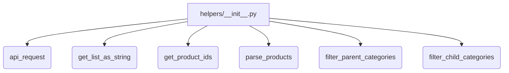
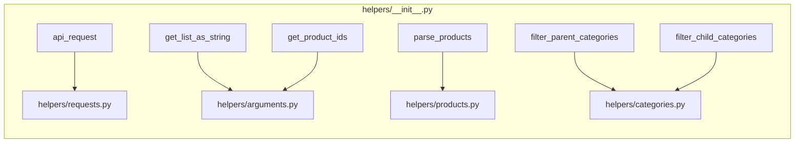

1. **<input code>**

```python
## \file hypotez/src/suppliers/aliexpress/api/helpers/__init__.py
# -*- coding: utf-8 -*-
#! venv/Scripts/python.exe # <- venv win
## ~~~~~~~~~~~~
""" module: src.suppliers.aliexpress.api.helpers """
from .requests import api_request
from .arguments import get_list_as_string, get_product_ids
from .products import parse_products
from .categories import filter_parent_categories, filter_child_categories
```

2. **<algorithm>**

Этот код представляет собой инициализацию модуля `helpers` в пакете `aliexpress.api`. Он импортирует функции и классы из других модулей, находящихся в той же директории (поддиректориях).  Прямой алгоритм выполнения отсутствует, т.к. это всего лишь импорт.  Данные не передаются между функциями, а импортируются для последующего использования.

**Блок-схема (формально не применима, но демонстрирует концепцию):**



3. **<mermaid>**



4. **<explanation>**

* **Импорты:**
    * `from .requests import api_request`: Импортирует функцию `api_request` из модуля `requests` в текущем пакете (`helpers`).  Скорее всего, эта функция делает запросы к API AliExpress.
    * `from .arguments import get_list_as_string, get_product_ids`: Импортирует функции `get_list_as_string` и `get_product_ids` из модуля `arguments`, отвечающего, вероятно, за обработку входных данных (списков и идентификаторов продуктов).
    * `from .products import parse_products`: Импортирует функцию `parse_products`, которая, скорее всего, обрабатывает и парсит данные о продуктах, полученные с API AliExpress.
    * `from .categories import filter_parent_categories, filter_child_categories`: Импортирует функции `filter_parent_categories` и `filter_child_categories`, предназначенные для фильтрации категорий продуктов.


* **Классы:** Нет классов в данном файле.


* **Функции:**
    * Все импортированные функции (`api_request`, `get_list_as_string`, `get_product_ids`, `parse_products`, `filter_parent_categories`, `filter_child_categories`) являются потенциально важными компонентами, но без их реализации сложно дать полное описание их функциональности.


* **Переменные:** Нет переменных в данном файле.


* **Возможные ошибки/улучшения:**
    * Отсутствие документации к импортированным функциям (docstrings) затрудняет понимание их назначения.
    * Не указана платформа кодирования (Python версия), что может быть важно для интерпретации кода.
    * Нет примеров использования импортированных функций.


**Цепочка взаимосвязей:**

Файл `hypotez/src/suppliers/aliexpress/api/helpers/__init__.py` импортирует функции из подмодулей. Эти подмодули (`requests`, `arguments`, `products`, `categories`) скорее всего выполняют специфические задачи, связанные с взаимодействием с API AliExpress, обработкой данных о товарах и категориях, и находятся в зависимости от других частей проекта (`hypotez`).  Без доступа к другим файлам проекта сложно сделать более точный анализ.