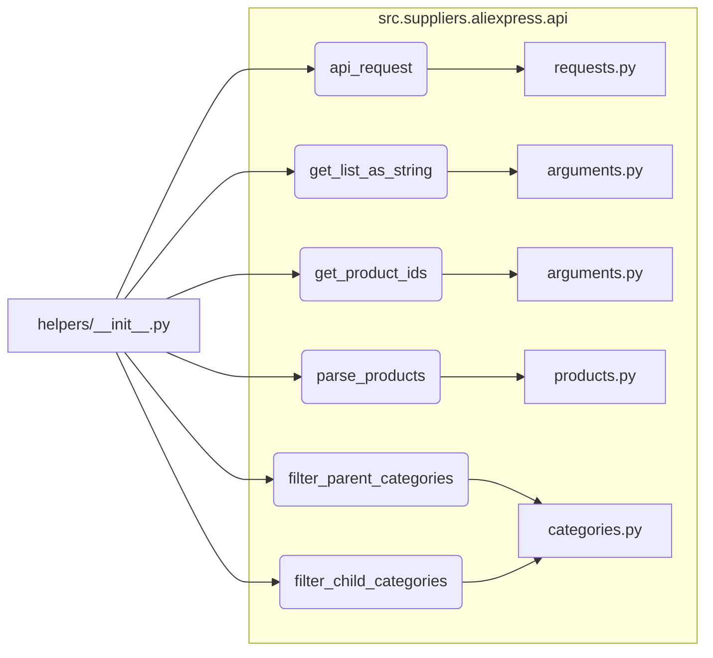

```MD
# <input code>

```python
## \file hypotez/src/suppliers/aliexpress/api/helpers/__init__.py
# -*- coding: utf-8 -*-
#! venv/Scripts/python.exe # <- venv win
## ~~~~~~~~~~~~~
""" module: src.suppliers.aliexpress.api.helpers """
from .requests import api_request
from .arguments import get_list_as_string, get_product_ids
from .products import parse_products
from .categories import filter_parent_categories, filter_child_categories
```

# <algorithm>

Этот код представляет собой файл `__init__.py` для пакета `helpers` в модуле `aliexpress` внутри `suppliers` проекта. Он импортирует функции и классы из других модулей внутри этого пакета, обеспечивая доступ к ним как к общедоступным в текущем модуле.

Пошаговая блок-схема отсутствует, так как код просто импортирует модули.


# <mermaid>



Диаграмма показывает, как модуль `helpers/__init__.py` импортирует функции и классы из других файлов в подпапках `requests.py`, `arguments.py`, `products.py` и `categories.py`.


# <explanation>

**Импорты**:

Файл `__init__.py` отвечает за инициализацию пакета `helpers`. Импортированные модули (`api_request`, `get_list_as_string`, `get_product_ids`, `parse_products`, `filter_parent_categories`, `filter_child_categories`) находятся в подпапках `requests`, `arguments`, `products`, `categories` текущего пакета `helpers`. Эти импорты позволяют использовать функции и классы из этих модулей в любом другом файле внутри пакета `helpers`. Например, `api_request` скорее всего содержит функции для отправки запросов на API AliExpress, а `parse_products` - для обработки полученных данных.


**Классы**:

Код не содержит объявлений классов, только импортирует функции.  Поскольку файл `__init__.py`, то предполагается, что в подпапках (`requests`, `arguments`, `products`, `categories`) определены классы, которые эти функции используют. 

**Функции**:

Каждая импортируемая функция, вероятно, имеет определенную функциональность, связанную с обработкой данных, связанных с AliExpress (запросы к API, получение и фильтрация данных). Например:

* `api_request`: Функция, вероятно, выполняет HTTP запросы к API AliExpress, получая данные.
* `get_list_as_string`: Получение списков данных в определенном формате (строки).
* `get_product_ids`: Извлечение идентификаторов продуктов.
* `parse_products`: Парсинг данных продуктов.
* `filter_parent_categories`, `filter_child_categories`: Фильтрация категорий.

**Переменные**:

Код не определяет переменных.  Переменные существуют внутри функций, импортированных функций и классов.


**Возможные ошибки или области для улучшений**:

* **Документация**: Нет документации (docstrings) внутри функции, что затрудняет понимание их работы. Добавление docstrings крайне полезно.
* **Взаимодействия**: Неясно, как эти функции взаимодействуют друг с другом. Нужно понимать входные и выходные данные каждой функции, чтобы увидеть полную картину процесса.
* **Обработка ошибок**: Отсутствует обработка ошибок. Функции могут возвращать некорректные значения при сбоях. Добавление проверок и обработки ошибок существенно повысит надежность.


**Цепочка взаимосвязей**:

Этот файл `__init__.py` служит как интерфейс для других частей проекта, которые нуждаются в функциях для работы с API AliExpress.  Далее, эти функции используются для обработки данных, что может влиять на последующие этапы обработки (например, хранение данных в базе данных или представление данных пользователю). Без контекста других частей проекта, трудно определить полную цепочку.