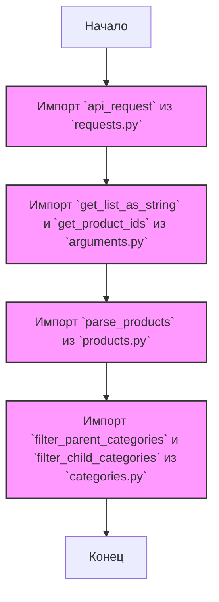

## АНАЛИЗ КОДА: `src/suppliers/aliexpress/api/helpers/__init__.py`

### 1. <алгоритм>

**Общая цель:**  Файл `__init__.py` в директории `src/suppliers/aliexpress/api/helpers` выступает в роли точки входа для модуля `helpers`, который предоставляет вспомогательные функции для работы с API AliExpress. Он импортирует необходимые функции из других модулей внутри директории `helpers` и делает их доступными для использования в других частях проекта.

**Блок-схема:**

```
flowchart TD
    Start[Начало] --> ImportRequests[Импорт api_request из requests.py];
    ImportRequests --> ImportArguments[Импорт get_list_as_string, get_product_ids из arguments.py];
    ImportArguments --> ImportProducts[Импорт parse_products из products.py];
    ImportProducts --> ImportCategories[Импорт filter_parent_categories, filter_child_categories из categories.py];
    ImportCategories --> End[Конец];
```

**Примеры:**

- **`api_request`**: Функция, предположительно, выполняет запросы к API AliExpress. Например, `response = api_request(url, params)`.
- **`get_list_as_string`**: Функция, которая преобразует список в строку, пригодную для передачи в URL. Например, `string_of_ids = get_list_as_string([123, 456, 789])`
- **`get_product_ids`**: Функция, которая извлекает ID продуктов из каких-либо данных. Например, `ids = get_product_ids(data)`
- **`parse_products`**: Функция, которая разбирает (парсит) ответ API, содержащий данные о продуктах. Например, `products = parse_products(api_response)`
- **`filter_parent_categories`**: Функция, которая фильтрует список категорий по родительским категориям. Например, `filtered_categories = filter_parent_categories(categories, parent_ids)`
- **`filter_child_categories`**: Функция, которая фильтрует список категорий по дочерним категориям. Например, `filtered_categories = filter_child_categories(categories, child_ids)`

### 2. <mermaid>



**Объяснение зависимостей `mermaid`:**

- Диаграмма `mermaid` показывает, что файл `__init__.py` импортирует функции из четырех других модулей:
    - `requests.py`  содержит функцию `api_request`, предназначенную для выполнения HTTP-запросов к API.
    - `arguments.py` содержит функции `get_list_as_string` и `get_product_ids` для обработки аргументов.
    - `products.py` содержит функцию `parse_products` для разбора данных о продуктах.
    - `categories.py` содержит функции `filter_parent_categories` и `filter_child_categories` для фильтрации категорий.
- Диаграмма демонстрирует поток импорта от одного модуля к другому, начиная с `requests.py` и заканчивая `categories.py`.
- `classDef importClass` и `class` добавлены для стилизации блоков импорта на диаграмме.

### 3. <объяснение>

**Импорты:**

-   `from .requests import api_request`: Импортирует функцию `api_request` из модуля `requests.py`, который расположен в той же директории. Эта функция, вероятно, используется для отправки запросов к API AliExpress. Она является основной функцией для взаимодействия с API, предоставляя абстракцию над процессом отправки HTTP-запросов.
-   `from .arguments import get_list_as_string, get_product_ids`: Импортирует две функции:
    -   `get_list_as_string` из модуля `arguments.py`, вероятно, используется для преобразования списка (например, ID товаров) в строку, пригодную для передачи в URL запросе.
    -   `get_product_ids` из модуля `arguments.py`, предположительно, извлекает ID товаров из каких-либо данных (например, из ответа API).
-   `from .products import parse_products`: Импортирует функцию `parse_products` из модуля `products.py`. Она предназначена для разбора данных о продуктах, полученных от API, в более удобный формат (например, словарь или список объектов).
-   `from .categories import filter_parent_categories, filter_child_categories`: Импортирует две функции:
    -   `filter_parent_categories` из модуля `categories.py` - для фильтрации списка категорий на основе их принадлежности к родительским категориям.
    -   `filter_child_categories` из модуля `categories.py` - для фильтрации списка категорий на основе их принадлежности к дочерним категориям.

**Роль и назначение:**
Файл `__init__.py` играет роль централизованной точки доступа к функциям, расположенным в директории `helpers`. Это позволяет другим частям проекта использовать эти функции, импортируя только директорию `helpers`, вместо того чтобы импортировать каждую функцию из каждого файла отдельно. Это способствует более организованному и структурированному коду.

**Взаимосвязь с другими частями проекта:**
Этот файл является частью модуля `src.suppliers.aliexpress.api.helpers` и предназначен для использования в других модулях, взаимодействующих с API AliExpress. Например,  модуль, отвечающий за загрузку данных о товарах с AliExpress, будет импортировать функции из этого `__init__.py`, чтобы отправлять запросы, обрабатывать ответы и фильтровать данные.

**Возможные улучшения:**

-   **Документация:** Добавление docstrings для всех функций, импортируемых из этого файла, сделало бы код более понятным и удобным для использования.
-   **Обработка ошибок:** Улучшить обработку ошибок в функциях, которые вызываются из этого файла.
-   **Тестирование:** Добавить юнит-тесты для функций, импортируемых из этого файла, чтобы убедиться в их корректной работе.
- **Разделение обязанностей:** Если функции в `arguments.py`, `products.py` и `categories.py` разрослись, может иметь смысл разбить их на более мелкие, сфокусированные модули.

**Цепочка взаимосвязей:**

`src/suppliers/aliexpress/api/__init__.py` -> `src/suppliers/aliexpress/api/helpers/__init__.py` -> `src/suppliers/aliexpress/api/helpers/requests.py`, `src/suppliers/aliexpress/api/helpers/arguments.py`, `src/suppliers/aliexpress/api/helpers/products.py`, `src/suppliers/aliexpress/api/helpers/categories.py`

Этот `__init__.py` файл служит связующим звеном между основными модулями API и их вспомогательными функциями, определенными в других файлах.