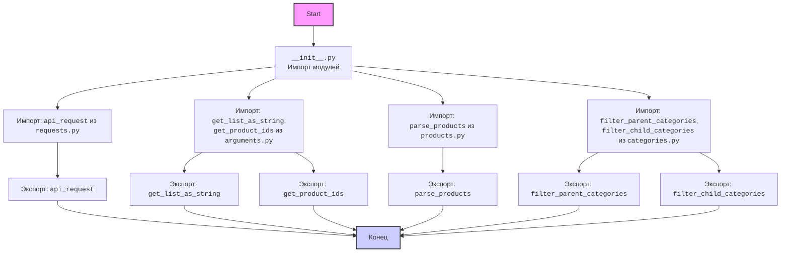

## АНАЛИЗ КОДА: `hypotez/src/suppliers/aliexpress/api/helpers/__init__.py`

### 1. <алгоритм>

**Цель:** Этот файл `__init__.py` в каталоге `hypotez/src/suppliers/aliexpress/api/helpers` определяет, какие модули и функции из этого каталога будут доступны при импорте пакета `src.suppliers.aliexpress.api.helpers`. Он действует как точка входа для этого подпакета, позволяя импортировать функции и классы из его модулей напрямую.

**Блок-схема:**

```
flowchart TD
    Start[Начало] --> ImportModules[Импорт модулей]
    ImportModules --> ExportFunctions[Экспорт функций]
    ExportFunctions --> End[Конец]

    subgraph Import Modules
      ImportModules --> RequestModule[Импорт: api_request из requests.py]
      ImportModules --> ArgumentsModule[Импорт: get_list_as_string, get_product_ids из arguments.py]
      ImportModules --> ProductsModule[Импорт: parse_products из products.py]
      ImportModules --> CategoriesModule[Импорт: filter_parent_categories, filter_child_categories из categories.py]
    end

    subgraph Export Functions
      ExportFunctions --> ExportApiRequest[Экспорт: api_request]
      ExportFunctions --> ExportGetListAsString[Экспорт: get_list_as_string]
      ExportFunctions --> ExportGetProductIds[Экспорт: get_product_ids]
      ExportFunctions --> ExportParseProducts[Экспорт: parse_products]
      ExportFunctions --> ExportFilterParentCategories[Экспорт: filter_parent_categories]
      ExportFunctions --> ExportFilterChildCategories[Экспорт: filter_child_categories]
    end
```

**Примеры:**

1.  **Импорт модулей:** При импорте `from src.suppliers.aliexpress.api.helpers import api_request`, импортируется функция `api_request` из модуля `requests.py`.
2.  **Экспорт функций:** После импорта модулей,  например, `from src.suppliers.aliexpress.api.helpers import get_product_ids`, функция `get_product_ids` становится доступной для использования в других частях программы.

### 2. <mermaid>



**Описание зависимостей `mermaid`:**

*   **`Start`**: Начало процесса импорта и экспорта.
*   **`ImportModules`**:  Указывает на начало импорта модулей из текущей директории (`.`).
*   **`RequestModule`**: Импортирует функцию `api_request` из файла `requests.py`.
*    **`ArgumentsModule`**: Импортирует функции `get_list_as_string` и `get_product_ids` из файла `arguments.py`.
*   **`ProductsModule`**: Импортирует функцию `parse_products` из файла `products.py`.
*   **`CategoriesModule`**: Импортирует функции `filter_parent_categories` и `filter_child_categories` из файла `categories.py`.
*   **`ExportApiRequest`**: Экспортирует функцию `api_request`, делая её доступной для импорта.
*   **`ExportGetListAsString`**: Экспортирует функцию `get_list_as_string`, делая её доступной для импорта.
*   **`ExportGetProductIds`**: Экспортирует функцию `get_product_ids`, делая её доступной для импорта.
*    **`ExportParseProducts`**: Экспортирует функцию `parse_products`, делая её доступной для импорта.
*    **`ExportFilterParentCategories`**: Экспортирует функцию `filter_parent_categories`, делая её доступной для импорта.
*    **`ExportFilterChildCategories`**: Экспортирует функцию `filter_child_categories`, делая её доступной для импорта.
*    **`End`**: Конец процесса, все импортированные и экспортированные элементы готовы к использованию.

### 3. <объяснение>

**Импорты:**

*   `from .requests import api_request`:
    *   Импортирует функцию `api_request` из файла `requests.py`, который находится в том же каталоге `hypotez/src/suppliers/aliexpress/api/helpers/`.
    *   Назначение:  Функция вероятно используется для отправки HTTP запросов к API AliExpress.
*   `from .arguments import get_list_as_string, get_product_ids`:
    *   Импортирует функции `get_list_as_string` и `get_product_ids` из файла `arguments.py`, также находящегося в том же каталоге.
    *   Назначение: Вероятно, `get_list_as_string` преобразует список в строку, а `get_product_ids` обрабатывает идентификаторы продуктов.
*   `from .products import parse_products`:
    *   Импортирует функцию `parse_products` из файла `products.py`.
    *   Назначение: Скорее всего,  эта функция занимается разбором данных о продуктах.
*   `from .categories import filter_parent_categories, filter_child_categories`:
    *   Импортирует функции `filter_parent_categories` и `filter_child_categories` из файла `categories.py`.
    *   Назначение: Эти функции, вероятно, отвечают за фильтрацию категорий товаров.

**Функции:**
- `api_request`: функция для отправки запросов к API AliExpress.
- `get_list_as_string`: функция для преобразования списка в строку.
- `get_product_ids`: функция для обработки идентификаторов продуктов.
- `parse_products`: функция для разбора данных о продуктах.
- `filter_parent_categories`: функция для фильтрации родительских категорий товаров.
- `filter_child_categories`: функция для фильтрации дочерних категорий товаров.

**Взаимосвязь с другими частями проекта:**

*   Этот `__init__.py` выступает в качестве интерфейса для пакета `src.suppliers.aliexpress.api.helpers`, позволяя другим частям проекта легко импортировать необходимые функции. Например, другие модули в `src.suppliers.aliexpress.api` могут использовать импортированные функции для выполнения API-запросов, обработки данных и фильтрации результатов.

**Потенциальные ошибки и области для улучшения:**

1.  **Явное указание кодировки:**  Строка `# -*- coding: utf-8 -*-`  может быть излишней, если PEP8 кодировка UTF-8.  Удалить эту строку и заменить на `# -*- coding: utf-8 -*`
2.  **Документирование**: Отсутствие документации (docstrings) для модулей и функций. Добавление docstrings улучшит понимание кода.
3.  **Обработка ошибок**: Код не содержит обработки ошибок. В реальных условиях, API-запросы могут вызывать ошибки, поэтому обработка исключений необходима.
4.  **Имена переменных**: Имена переменных, такие как `get_list_as_string`,  достаточно ясны, но стоит всегда придерживаться стандарта `PEP8`.
5. **Отсутствие try-except:** Отсутствует конструкция `try-except`, что может привести к неожиданным ошибкам в работе.

**Дополнительная информация:**

Файл `__init__.py` в Python используется для обозначения директории как пакета. Он может быть пустым или содержать импорты для предоставления доступа к модулям и функциям из этого пакета.  В данном случае, он используется для удобного импорта функций, связанных с API AliExpress, в другие части проекта.