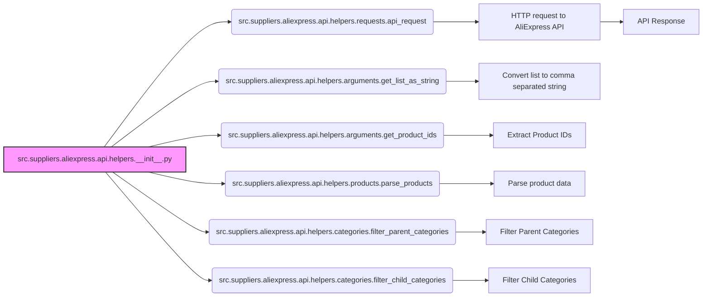

## Анализ кода `hypotez/src/suppliers/aliexpress/api/helpers/__init__.py`

### <алгоритм>

1. **Импорт модулей:**
   - Импортируются функции `api_request` из `src.suppliers.aliexpress.api.helpers.requests`.
   - Импортируются функции `get_list_as_string` и `get_product_ids` из `src.suppliers.aliexpress.api.helpers.arguments`.
   - Импортируется функция `parse_products` из `src.suppliers.aliexpress.api.helpers.products`.
   - Импортируются функции `filter_parent_categories` и `filter_child_categories` из `src.suppliers.aliexpress.api.helpers.categories`.

2. **Функциональность:**
    - `api_request`: Выполняет HTTP-запросы к API AliExpress. Например, `api_request(url="https://example.com", method="GET", params={"key": "value"})` вернет ответ от API.
    - `get_list_as_string`: Преобразует список в строку, разделенную запятыми, что может быть использовано для передачи параметров в запросах. Пример: `get_list_as_string(["item1", "item2", "item3"])` вернет `"item1,item2,item3"`.
    - `get_product_ids`: Извлекает ID продуктов из разных структур данных. Например, `get_product_ids([{"productId": 123}, {"productId": 456}])` вернет `[123, 456]`.
    - `parse_products`: Парсит данные о продуктах, полученные из API, в более структурированный формат. Например,  `parse_products(raw_data)` вернет список словарей с информацией о продуктах.
    - `filter_parent_categories`: Фильтрует категории товаров на верхнем уровне иерархии. Например, `filter_parent_categories([{"id": 1, "level": 1}, {"id": 2, "level": 2}])` вернет `[{"id": 1, "level": 1}]`.
    - `filter_child_categories`: Фильтрует категории товаров на нижних уровнях иерархии. Например, `filter_child_categories([{"id": 1, "level": 1}, {"id": 2, "level": 2}])` вернет `[{"id": 2, "level": 2}]`.
   
   

### <mermaid>

**Анализ зависимостей:**

- `src.suppliers.aliexpress.api.helpers.__init__.py` импортирует функции из других модулей для организации функциональности хелперов.
- `api_request` отвечает за отправку запросов к API AliExpress.
- `get_list_as_string` преобразует списки в строки, что часто требуется для передачи параметров в API-запросах.
- `get_product_ids` извлекает идентификаторы продуктов, которые нужны для запросов к API.
- `parse_products` обрабатывает полученные от API данные, приводя их к более удобному для работы виду.
- `filter_parent_categories` и `filter_child_categories` используются для фильтрации категорий товаров.

### <объяснение>

**Импорты:**

- `from .requests import api_request`: Импортирует функцию `api_request` из модуля `requests`, расположенного в том же пакете `src.suppliers.aliexpress.api.helpers`. `api_request` отвечает за отправку HTTP-запросов к API AliExpress.
- `from .arguments import get_list_as_string, get_product_ids`: Импортирует функции `get_list_as_string` и `get_product_ids` из модуля `arguments`. `get_list_as_string` используется для преобразования списка в строку, разделенную запятыми, а `get_product_ids` используется для извлечения ID продуктов из различных структур данных.
- `from .products import parse_products`: Импортирует функцию `parse_products` из модуля `products`. Она предназначена для разбора (парсинга) данных о продуктах, полученных из API AliExpress.
- `from .categories import filter_parent_categories, filter_child_categories`: Импортирует функции `filter_parent_categories` и `filter_child_categories` из модуля `categories`. Они отвечают за фильтрацию категорий товаров на верхнем и нижнем уровнях соответственно.

**Классы:**

В этом файле классов нет. Он предназначен для импорта и предоставления доступа к вспомогательным функциям.

**Функции:**

-   `api_request`:  
    -   **Аргументы:**  Принимает параметры запроса, такие как URL, метод, заголовки и данные.
    -   **Возвращаемое значение:**  Возвращает ответ от API AliExpress в формате JSON.
    -   **Назначение:**  Отвечает за отправку запросов к API.
    -   **Пример:** `api_request(url="https://example.com/api/products", method="GET", params={"ids": "123,456"})`
-   `get_list_as_string`:
    -   **Аргументы:** Принимает список.
    -   **Возвращаемое значение:**  Возвращает строку, где элементы списка разделены запятыми.
    -   **Назначение:**  Преобразует список в строку, удобную для использования в API-запросах.
    -   **Пример:** `get_list_as_string(["item1", "item2", "item3"])` вернет `"item1,item2,item3"`.
-   `get_product_ids`:
    -   **Аргументы:** Принимает список или другую структуру данных, содержащую информацию о продуктах.
    -   **Возвращаемое значение:** Возвращает список ID продуктов.
    -   **Назначение:** Извлекает идентификаторы продуктов из различных источников данных.
    -   **Пример:** `get_product_ids([{"productId": 123}, {"productId": 456}])` вернет `[123, 456]`.
-   `parse_products`:
    -   **Аргументы:** Принимает сырые данные о продуктах, полученные из API.
    -   **Возвращаемое значение:** Возвращает список словарей, где каждый словарь представляет информацию о продукте в удобном для использования виде.
    -   **Назначение:** Парсит и структурирует данные о продуктах, делая их более удобными для дальнейшей обработки.
    -   **Пример:** `parse_products(raw_api_data)`
-   `filter_parent_categories`:
    -   **Аргументы:** Принимает список категорий.
    -   **Возвращаемое значение:** Возвращает список категорий верхнего уровня.
    -   **Назначение:**  Фильтрует родительские категории товаров.
    -   **Пример:** `filter_parent_categories([{"id": 1, "level": 1}, {"id": 2, "level": 2}])` вернет `[{"id": 1, "level": 1}]`.
-   `filter_child_categories`:
    -   **Аргументы:** Принимает список категорий.
    -   **Возвращаемое значение:** Возвращает список категорий нижнего уровня.
    -   **Назначение:** Фильтрует дочерние категории товаров.
    -   **Пример:** `filter_child_categories([{"id": 1, "level": 1}, {"id": 2, "level": 2}])` вернет `[{"id": 2, "level": 2}]`.

**Переменные:**

В данном файле переменных как таковых нет, он служит для импорта и группировки функций.

**Потенциальные ошибки и области для улучшения:**

-   **Обработка ошибок:** Код не содержит явной обработки ошибок. Следует добавить блоки try-except для обработки возможных исключений при выполнении API-запросов, преобразований данных и т.д.
-   **Логирование:**  Добавление логирования поможет отслеживать работу функций и диагностировать проблемы.
-   **Конфигурация:**  Следует вынести конфигурационные параметры (например, URL API) в отдельные переменные или конфигурационный файл.
-   **Тестирование:** Необходимы модульные тесты для каждой функции, чтобы гарантировать их правильную работу.

**Взаимосвязи с другими частями проекта:**

-   Этот файл является частью пакета `src.suppliers.aliexpress.api.helpers` и предоставляет набор вспомогательных функций для взаимодействия с API AliExpress.
-   Функции из этого файла могут использоваться в других частях проекта, например, в модулях, которые выполняют поиск товаров, получение информации о категориях и т.д.
-   Например, в модуле, который обрабатывает запросы от пользователей, могут использоваться функции `api_request`, `get_list_as_string`, `get_product_ids`, `parse_products` для получения и обработки данных о товарах.
-   Модули для получения категорий могут использовать `filter_parent_categories` и `filter_child_categories` для получения нужной иерархии.

Таким образом, файл `__init__.py` служит центральной точкой для импорта и использования хелпер-функций в пакете `src.suppliers.aliexpress.api.helpers`, способствуя модульности и повторному использованию кода в проекте.