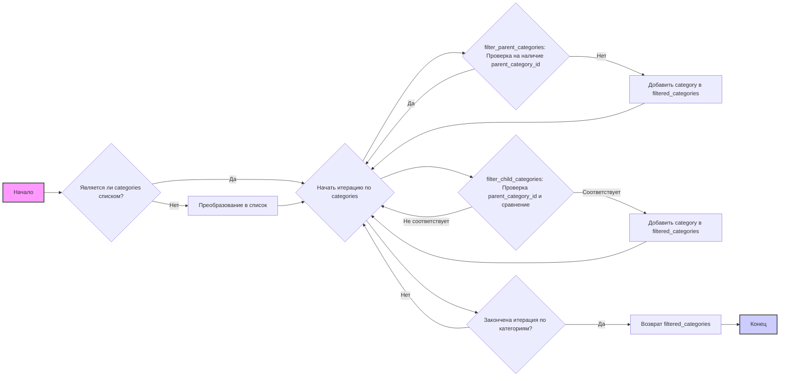

## Анализ кода `hypotez/src/suppliers/aliexpress/api/helpers/categories.py`

### 1. <алгоритм>

**Функция `filter_parent_categories`:**

1.  **Начало:** Функция принимает список `categories`, который может содержать объекты типов `models.Category` или `models.ChildCategory`.
    *   _Пример ввода:_ `[Category(id=1, name="Electronics"), ChildCategory(id=2, name="Laptops", parent_category_id=1)]`
2.  **Инициализация:** Создается пустой список `filtered_categories` для хранения отфильтрованных категорий.
    *   _Пример:_ `filtered_categories = []`
3.  **Проверка типа ввода:** Проверяется, является ли ввод списком. Если вводится единичное значение не списка (`str`, `int`, `float`), оно преобразуется в список для единообразной обработки.
    *   _Пример ввода_: `categories = "test"` -> `categories = ["test"]`
    *   _Пример ввода_: `categories = 123` -> `categories = [123]`
4.  **Итерация по категориям:** Цикл `for` проходит по каждой `category` в списке `categories`.
5.  **Фильтрация:** Проверяется, имеет ли текущий объект `category` атрибут `parent_category_id`. Если нет, то это родительская категория, и она добавляется в `filtered_categories`.
    *   _Пример:_ `category = Category(id=1, name="Electronics")` -> `filtered_categories = [Category(id=1, name="Electronics")]`
    *   _Пример:_ `category = ChildCategory(id=2, name="Laptops", parent_category_id=1)` -> `filtered_categories` остается без изменений.
6.  **Возврат:** Функция возвращает список `filtered_categories`, содержащий только объекты `Category` без `parent_category_id`.
    *   _Пример вывода:_ `[Category(id=1, name="Electronics")]`

**Функция `filter_child_categories`:**

1.  **Начало:** Функция принимает список `categories` и идентификатор родительской категории `parent_category_id`.
    *   _Пример ввода:_ `categories = [Category(id=1, name="Electronics"), ChildCategory(id=2, name="Laptops", parent_category_id=1), ChildCategory(id=3, name="Tablets", parent_category_id=1)]`, `parent_category_id=1`
2.  **Инициализация:** Создается пустой список `filtered_categories` для хранения отфильтрованных дочерних категорий.
    *   _Пример:_ `filtered_categories = []`
3.  **Проверка типа ввода:** Проверяется, является ли ввод списком. Если вводится единичное значение не списка (`str`, `int`, `float`), оно преобразуется в список для единообразной обработки.
    *   _Пример ввода_: `categories = "test"` -> `categories = ["test"]`
    *   _Пример ввода_: `categories = 123` -> `categories = [123]`
4.  **Итерация по категориям:** Цикл `for` проходит по каждой `category` в списке `categories`.
5.  **Фильтрация:** Проверяется наличие атрибута `parent_category_id` и соответствие значения `parent_category_id` текущего объекта с переданным в функцию значением. Если оба условия выполнены, то категория добавляется в `filtered_categories`.
    *   _Пример:_ `category = ChildCategory(id=2, name="Laptops", parent_category_id=1)` -> `filtered_categories = [ChildCategory(id=2, name="Laptops", parent_category_id=1)]`
    *   _Пример:_ `category = Category(id=1, name="Electronics")` -> `filtered_categories` остается без изменений.
    *   _Пример:_ `category = ChildCategory(id=3, name="Tablets", parent_category_id=2)` -> `filtered_categories` остается без изменений.
6.  **Возврат:** Функция возвращает список `filtered_categories`, содержащий только объекты `ChildCategory`, принадлежащие к указанной `parent_category_id`.
    *   _Пример вывода:_ `[ChildCategory(id=2, name="Laptops", parent_category_id=1), ChildCategory(id=3, name="Tablets", parent_category_id=1)]`

### 2. <mermaid>



**Описание диаграммы:**

Диаграмма `mermaid` представляет поток управления выполнения функций `filter_parent_categories` и `filter_child_categories`.

*   `A` (Начало): Начало выполнения функций.
*   `B` (Является ли `categories` списком?): Проверка типа входных данных.
*   `C` (Преобразование в список): Преобразование входных данных в список, если это не список.
*   `D` (Начать итерацию по `categories`): Начало цикла для обработки каждой категории.
*   `E` (`filter_parent_categories`: Проверка на наличие `parent_category_id`): Проверка наличия атрибута `parent_category_id`.
*    `F` (Добавить `category` в `filtered_categories`): Добавление родительской категории в список.
*   `G` (`filter_child_categories`: Проверка `parent_category_id` и сравнение): Проверка наличия `parent_category_id` и его соответствия с входным значением.
*   `H` (Добавить `category` в `filtered_categories`): Добавление дочерней категории в список.
*   `I` (Закончена итерация по категориям?): Проверка окончания цикла.
*   `J` (Возврат `filtered_categories`): Возврат результата - списка отфильтрованных категорий.
*   `K` (Конец): Завершение выполнения функций.

### 3. <объяснение>

**Импорты:**

*   `from typing import List, Union`: Импортирует типы `List` и `Union` из модуля `typing` для аннотации типов. `List` используется для определения типа данных списка, а `Union` используется для указания, что переменная может иметь один из нескольких типов (в данном случае - `models.Category` или `models.ChildCategory`). Это улучшает читаемость и помогает в отладке.
*   `from .. import models`: Импортирует модуль `models` из родительского каталога (`..`). Это означает, что в том же каталоге, где расположен файл `categories.py`, есть модуль `models.py`, содержащий определения классов `Category` и `ChildCategory`.
    *   **Взаимосвязь с другими пакетами `src`**: Этот импорт указывает на связь с `src.suppliers.aliexpress.api.models`, где определены структуры данных для категорий. Модуль `models` внутри пакета `src` используется для представления данных, полученных из API AliExpress.

**Функции:**

*   **`filter_parent_categories(categories: List[models.Category | models.ChildCategory]) -> List[models.Category]`**:
    *   **Аргументы**:
        *   `categories` (`List[models.Category | models.ChildCategory]`): Список объектов категорий, которые могут быть как родительскими (`models.Category`), так и дочерними (`models.ChildCategory`).
    *   **Возвращаемое значение**:
        *   `List[models.Category]`: Список объектов `Category`, которые являются родительскими (не имеют `parent_category_id`).
    *   **Назначение**: Фильтрует список категорий, оставляя только те, у которых нет `parent_category_id`, т.е. родительские категории.
    *   **Пример**:
        ```python
        categories = [
            models.Category(id=1, name="Electronics"),
            models.ChildCategory(id=2, name="Laptops", parent_category_id=1),
            models.Category(id=3, name="Home"),
        ]
        parent_categories = filter_parent_categories(categories)
        # parent_categories будет:
        # [models.Category(id=1, name="Electronics"), models.Category(id=3, name="Home")]
        ```
*   **`filter_child_categories(categories: List[models.Category | models.ChildCategory], parent_category_id: int) -> List[models.ChildCategory]`**:
    *   **Аргументы**:
        *   `categories` (`List[models.Category | models.ChildCategory]`): Список объектов категорий.
        *   `parent_category_id` (`int`): Идентификатор родительской категории, по которой нужно фильтровать.
    *   **Возвращаемое значение**:
        *   `List[models.ChildCategory]`: Список объектов `ChildCategory`, которые имеют указанный `parent_category_id`.
    *   **Назначение**: Фильтрует список категорий, оставляя только дочерние категории, у которых `parent_category_id` совпадает с переданным значением.
    *   **Пример**:
        ```python
        categories = [
            models.Category(id=1, name="Electronics"),
            models.ChildCategory(id=2, name="Laptops", parent_category_id=1),
            models.ChildCategory(id=3, name="Tablets", parent_category_id=1),
            models.ChildCategory(id=4, name="Smartphones", parent_category_id=2),
        ]
        child_categories = filter_child_categories(categories, 1)
        # child_categories будет:
        # [models.ChildCategory(id=2, name="Laptops", parent_category_id=1), models.ChildCategory(id=3, name="Tablets", parent_category_id=1)]
        ```

**Переменные:**

*   `filtered_categories` (в обеих функциях):
    *   Тип: `List`
    *   Использование: Временный список для хранения отфильтрованных категорий перед возвратом.

**Потенциальные ошибки и области для улучшения:**

*   **Обработка неверного ввода**: Обе функции проверяют является ли ввод списком, и в случае если это не так, преобразуют ввод в список. Это может быть полезно, если функция должна быть устойчива к ошибкам. Однако, если на вход поступает объект, который не является ни списком ни примитивным типом, это может привести к нежелательным результатам. Возможно стоит добавить проверки на допустимые типы `categories` на этапе ввода.
*   **Дублирование кода**: Код для проверки ввода и преобразования в список повторяется в обеих функциях. Можно вынести эту логику в отдельную вспомогательную функцию.
*   **Модуль `models`**: Зависимость от импорта `from .. import models` может быть улучшена, если будут использоваться явные относительные или абсолютные импорты с указанием полных путей пакета `src`.

**Цепочка взаимосвязей с другими частями проекта:**

1.  **API AliExpress**: Этот модуль работает в связке с API AliExpress, данные из которого должны быть представлены в виде моделей, определенных в `src.suppliers.aliexpress.api.models`.
2.  **`src.suppliers.aliexpress.api.api`**:  Этот модуль `categories.py` является частью более крупного API-клиента AliExpress. Функции для фильтрации категорий предполагают, что данные были получены через API и преобразованы в объекты `models.Category` или `models.ChildCategory`.
3.  **Использование в бизнес-логике**: Отфильтрованные категории могут использоваться в других частях проекта для формирования запросов к API, отображения списка категорий пользователю и т.д.

Этот анализ демонстрирует, как код в `categories.py` используется для обработки данных, полученных из API AliExpress, и предоставляет базовые инструменты для работы с категориями и их иерархией.