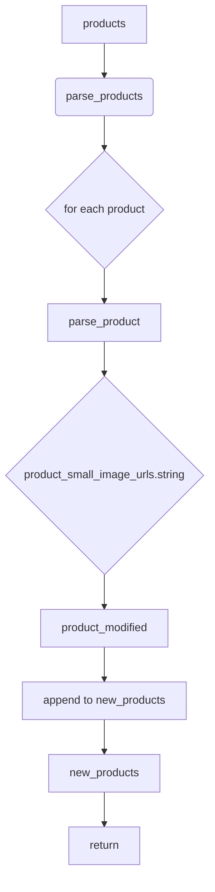

```MD
# Анализ кода hypotez/src/suppliers/aliexpress/api/helpers/products.py

## <input code>

```python
## \file hypotez/src/suppliers/aliexpress/api/helpers/products.py
# -*- coding: utf-8 -*-
#! venv/Scripts/python.exe # <- venv win
## ~~~~~~~~~~~~~
""" module: src.suppliers.aliexpress.api.helpers """
def parse_product(product):
    product.product_small_image_urls = product.product_small_image_urls.string
    return product

def parse_products(products):
    new_products = []

    for product in products:
        new_products.append(parse_product(product))

    return new_products
```

## <algorithm>

**Алгоритм parse_product:**

1. Принимает объект `product` в качестве входных данных.
2. Извлекает значение атрибута `product_small_image_urls` объекта `product`.
3. Присваивает значение `string` (предполагается, что `product.product_small_image_urls` является объектом, имеющим атрибут `string`, который содержит строковое представление URL-адресов изображений)  экземпляру `product_small_image_urls`.
4. Возвращает измененный объект `product`.

**Пример parse_product:**

```
Вход: product = { 'product_small_image_urls': 'string_object' }
Выход: product = { 'product_small_image_urls': 'строковое значение' }
```


**Алгоритм parse_products:**

1. Принимает список объектов `products` в качестве входных данных.
2. Создает пустой список `new_products`.
3. Проходит по каждому элементу списка `products`.
4. Для каждого элемента вызывает функцию `parse_product`.
5. Добавляет возвращенный из функции `parse_product` объект в список `new_products`.
6. Возвращает список `new_products`.

**Пример parse_products:**

```
Вход: products = [product1, product2, product3]
Выход: new_products = [product1_modified, product2_modified, product3_modified]
```


## <mermaid>



## <explanation>

**Импорты:**

Файл не содержит импортов, все необходимые классы и функции, вероятно, импортируются из других модулей.  `#! venv/Scripts/python.exe` – указывает на интерпретатор Python, который используется в виртуальном окружении. Важно для запуска.

**Классы:**

Код не определяет классы.  Предполагается, что `product` - это объект из другого модуля, содержащий атрибут `product_small_image_urls`.

**Функции:**

* **`parse_product(product)`:** Эта функция принимает объект `product` в качестве аргумента. Она изменяет значение атрибута `product_small_image_urls` объекта `product` на строковое значение, которое содержится в `product.product_small_image_urls.string`. Возвращает измененный объект `product`.
* **`parse_products(products)`:** Функция принимает список `products`, состоящий из объектов (предположительно, аналогичных `product`), и преобразует каждый объект в списке, используя функцию `parse_product`.  Она возвращает новый список `new_products` с модифицированными объектами.

**Переменные:**

* `product`:  Объект, содержащий данные о продукте.
* `products`: Список объектов `product`.
* `new_products`: Список измененных объектов.

**Возможные ошибки и улучшения:**

* **Обработка исключений:**  Код не обрабатывает ситуации, когда `product.product_small_image_urls` не существует или не имеет атрибута `string`.  Рекомендуется добавить обработку исключений `AttributeError` или проверку на существование и тип `product.product_small_image_urls`.  Например:

```python
def parse_product(product):
    try:
        product.product_small_image_urls = product.product_small_image_urls.string
        return product
    except AttributeError as e:
        print(f"Ошибка при обработке product: {e}")
        return product  # Или возвратить None, или другой обработанный результат
```

* **Изменение исходного списка:** Функция `parse_product` изменяет переданный ей объект `product`. Это может быть проблематично, если `product` используется в других частях кода.  Рассмотреть создание копий объектов, чтобы избежать побочных эффектов.

* **Типы данных:** Неясно, какой тип данных представляет собой `product`.  Для более надежного кода полезно задавать типы данных,  или использовать аннотации типов Python.

**Цепочка взаимосвязей:**

Функции `parse_product` и `parse_products` находятся в модуле `hypotez/src/suppliers/aliexpress/api/helpers/products.py`, который, вероятно, используется в других частях приложения `hypotez` для обработки данных с AliExpress.  Функции, предположительно, получают данные о продуктах (например, из API AliExpress) и готовят их для последующей обработки (например, сохранения в базу данных, отображения на сайте).