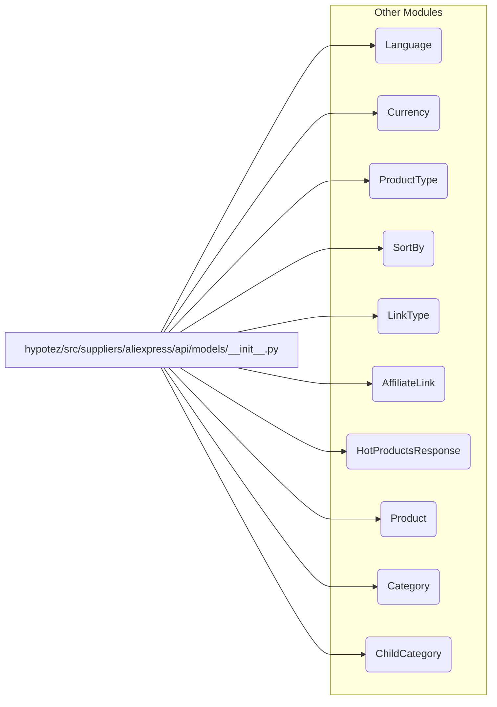

# <input code>

```python
## \file hypotez/src/suppliers/aliexpress/api/models/__init__.py
# -*- coding: utf-8 -*-
#! venv/Scripts/python.exe # <- venv win
## ~~~~~~~~~~~~~\
""" module: src.suppliers.aliexpress.api.models """
from .languages import Language
from .currencies import Currency
from .request_parameters import ProductType, SortBy, LinkType
from .affiliate_link import AffiliateLink
from .hotproducts import HotProductsResponse
from .product import Product
from .category import Category, ChildCategory
```

# <algorithm>

Этот код является модулем `__init__.py` для пакета `models` внутри API `aliexpress` в проекте `hypotez`.  Он выполняет импорт различных классов и типов из других файлов внутри того же пакета.  Блок-схема очень простая:  он просто импортирует нужные классы и объекты.  Нет операций с данными или вычислений в этом файле.  Взаимодействие с другими частями проекта происходит через эти импортированные классы, которые, предположительно, содержат логику, связанную с моделями данных, используемыми в API AliExpress.

Пример: если другая часть проекта использует класс `Product`, она может получить его из этого файла, используя `from hypotez.src.suppliers.aliexpress.api.models import Product`.

# <mermaid>



**Объяснение диаграммы:**

Диаграмма отображает импорты из `__init__.py` и указывает на файлы, из которых происходят импортируемые классы (Language, Currency и т. д.).  В `Other Modules` обозначены импортируемые модули, в которых предполагается содержаться реализация перечисленных классов.

# <explanation>

**Импорты:**

Этот файл содержит только импорты.  Каждая строка `from .[filename] import [class/variable]` импортирует классы или переменные из соответствующих файлов внутри текущего пакета. Например, `from .languages import Language` импортирует класс `Language` из файла `languages.py` в подпапке `aliexpress/api/models`.  Это типичная структура для организации моделей данных в Python проектах.  Используемый префикс `.` указывает, что импортируемые модули находятся в том же пакете.

**Классы (предполагаемые):**

Файл `__init__.py` не содержит определения классов, но он указывает, что импортированные из других файлов классы (например, `Language`, `Currency`, `Product`, `Category`) существуют.  Эти классы, вероятно, представляют собой различные сущности данных, относящиеся к AliExpress API, такие как типы продуктов, валюты, языки и т. д.  Их подробное описание содержится в других файлах.

**Функции (отсутствуют):**

В этом файле нет функций.

**Переменные (отсутствуют):**

В данном файле нет определения переменных.


**Возможные улучшения:**

* Документирование: Добавить подробные строковые комментарии (docstrings) для каждого импортированного класса, чтобы объяснить его назначение.  Это сделает код более читаемым и понятным.
* Валидация импорта:  Можно добавить проверку, что импортируемые файлы существуют, чтобы избежать ошибок.
* Структура пакета:  В идеале, каждая группа связанных моделей должна быть в отдельном модуле (.py файле), чтобы избежать чрезмерного числа импортов в одном `__init__.py`.

**Взаимосвязи с другими частями проекта:**

Этот файл является частью проекта, ориентированного на обработку данных и API AliExpress. Другие части проекта (например, клиентский код, контроллеры, сервисы) будут использовать импортированные классы из `aliexpress/api/models` для доступа к информации об AliExpress.  Эти классы будут предоставлять интерфейс для работы с данными AliExpress, такие как получение и обработка данных об продуктах, категориях и т. д.