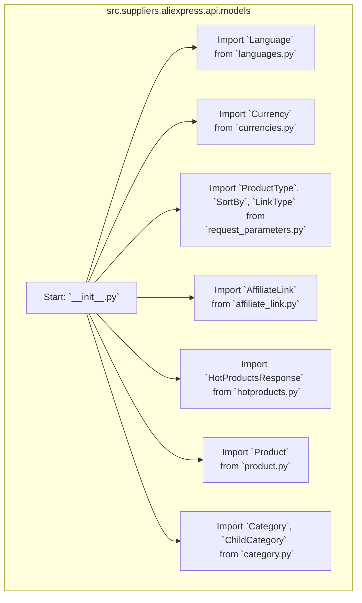

## АНАЛИЗ КОДА: `src/suppliers/aliexpress/api/models/__init__.py`

### 1. <алгоритм>

1.  **Начало:** Инициализация модуля `src.suppliers.aliexpress.api.models`.
2.  **Импорт `Language`:** Импорт класса `Language` из модуля `languages.py`. Этот класс, вероятно, используется для представления языковых параметров, например, `Language.EN` для английского языка.
    *   Пример: `language = Language.EN`
3.  **Импорт `Currency`:** Импорт класса `Currency` из модуля `currencies.py`. Этот класс, вероятно, используется для представления валютных параметров, например, `Currency.USD` для долларов США.
    *   Пример: `currency = Currency.USD`
4.  **Импорт `ProductType`, `SortBy`, `LinkType`:** Импорт классов `ProductType`, `SortBy` и `LinkType` из модуля `request_parameters.py`. Эти классы, вероятно, используются для определения параметров запроса, таких как тип продукта (например, `ProductType.PHYSICAL`), способ сортировки (`SortBy.PRICE_ASC`), и тип ссылки (`LinkType.AFFILIATE`).
    *   Пример: `product_type = ProductType.PHYSICAL`, `sort_by = SortBy.PRICE_DESC`, `link_type = LinkType.AFFILIATE`
5.  **Импорт `AffiliateLink`:** Импорт класса `AffiliateLink` из модуля `affiliate_link.py`. Этот класс, вероятно, представляет структуру данных для аффилиатных ссылок.
    *   Пример: `affiliate_link = AffiliateLink(url="https://example.com/product?affid=123", tracking_id="456")`
6.  **Импорт `HotProductsResponse`:** Импорт класса `HotProductsResponse` из модуля `hotproducts.py`. Этот класс, вероятно, представляет структуру данных для ответов на запросы горячих товаров.
    *   Пример: `hot_products = HotProductsResponse(items=[product1, product2], total_count=100)`
7.  **Импорт `Product`:** Импорт класса `Product` из модуля `product.py`. Этот класс, вероятно, представляет структуру данных для товаров.
    *   Пример: `product = Product(id="123", name="Product Name", price=10.99)`
8.   **Импорт `Category`, `ChildCategory`:** Импорт классов `Category` и `ChildCategory` из модуля `category.py`. Эти классы, вероятно, представляют структуру данных для категорий товаров.
    *   Пример: `category = Category(id="456", name="Electronics", children=[child_category1, child_category2])`, `child_category = ChildCategory(id="789", name="Phones")`
9.  **Конец:** Завершение импорта всех необходимых классов.

### 2. <mermaid>

**Объяснение зависимостей `mermaid`:**

-   Диаграмма начинается с подграфа `src.suppliers.aliexpress.api.models`, который представляет собой модуль, в котором находится данный файл `__init__.py`.
-   `Start` обозначает точку входа - начало выполнения кода `__init__.py`.
-   Каждый последующий узел представляет собой импорт конкретного класса из соответствующего модуля. Например, `languages_import` обозначает импорт класса `Language` из модуля `languages.py`.
-   Стрелки (`-->`) показывают поток импорта, т.е. все классы импортируются в `__init__.py`, делая их доступными для использования в других частях проекта.

### 3. <объяснение>

**Импорты:**

-   `from .languages import Language`: Импортирует класс `Language` из модуля `languages.py`, расположенного в той же директории. `Language` вероятно используется для представления языка интерфейса или товара.
-   `from .currencies import Currency`: Импортирует класс `Currency` из модуля `currencies.py`, расположенного в той же директории. `Currency` вероятно используется для представления валюты.
-   `from .request_parameters import ProductType, SortBy, LinkType`: Импортирует классы `ProductType`, `SortBy` и `LinkType` из модуля `request_parameters.py`, расположенного в той же директории. Эти классы вероятно используются для определения параметров запросов к API. `ProductType` определяет тип продукта, `SortBy` - критерий сортировки, `LinkType` - тип формируемой ссылки (например, аффилиатная).
-   `from .affiliate_link import AffiliateLink`: Импортирует класс `AffiliateLink` из модуля `affiliate_link.py`, расположенного в той же директории. `AffiliateLink` вероятно используется для создания и представления аффилиатных ссылок.
-   `from .hotproducts import HotProductsResponse`: Импортирует класс `HotProductsResponse` из модуля `hotproducts.py`, расположенного в той же директории. `HotProductsResponse` вероятно используется для обработки ответов на запросы о популярных товарах.
-   `from .product import Product`: Импортирует класс `Product` из модуля `product.py`, расположенного в той же директории. `Product` вероятно используется для представления информации о продукте.
-   `from .category import Category, ChildCategory`: Импортирует классы `Category` и `ChildCategory` из модуля `category.py`, расположенного в той же директории. `Category` и `ChildCategory` вероятно используются для представления структуры категорий товаров.

Все эти импорты предназначены для того, чтобы сделать доступными классы, представляющие различные аспекты работы с API AliExpress. Эти классы обеспечивают структуру данных для представления ответов API, параметры запросов, и другие связанные сущности.

**Взаимосвязь с другими частями проекта:**

Данный файл `__init__.py` является точкой входа для модуля `src.suppliers.aliexpress.api.models`. Другие модули проекта, которые взаимодействуют с API AliExpress, будут использовать эти классы, импортируя их из данного модуля. Например:

-   `src/suppliers/aliexpress/api/client.py` может использовать `ProductType`, `SortBy`, `LinkType`, `AffiliateLink`, `Product`, `Category`, и `ChildCategory` для формирования запросов к API и обработки ответов.
-   `src/suppliers/aliexpress/tasks.py` (или подобные) могут использовать `HotProductsResponse` для обработки данных о популярных товарах.
-   `src/suppliers/aliexpress/utils.py` может использовать `Currency`, `Language` для форматирования данных или настройки параметров запроса.

**Потенциальные улучшения и ошибки:**

-   **Отсутствие Docstrings**: В файле отсутствуют docstrings для модуля или для классов, это затрудняет понимание предназначения данного модуля и его содержимого. Рекомендуется добавить docstrings для каждого класса и модуля.
-   **Статическая типизация**: Можно рассмотреть возможность добавления статической типизации с помощью `typing` для улучшения читаемости и предотвращения ошибок.
-   **Управление версиями API**:  Следует добавить в проект механизм управления версиями API, который позволит легко адаптироваться к изменениям в API AliExpress.  Это можно сделать с помощью переменных окружения или файла конфигурации.
-  **Обработка ошибок:** В классах нет механизмов для обработки ошибок. Это можно реализовать путём добавления обработки исключений или создания специальных классов для ошибок.

В целом, код представляет собой базовую структуру для работы с данными API AliExpress, предоставляя классы для представления различных сущностей. Улучшения могут быть направлены на повышение читаемости, надежности и масштабируемости.