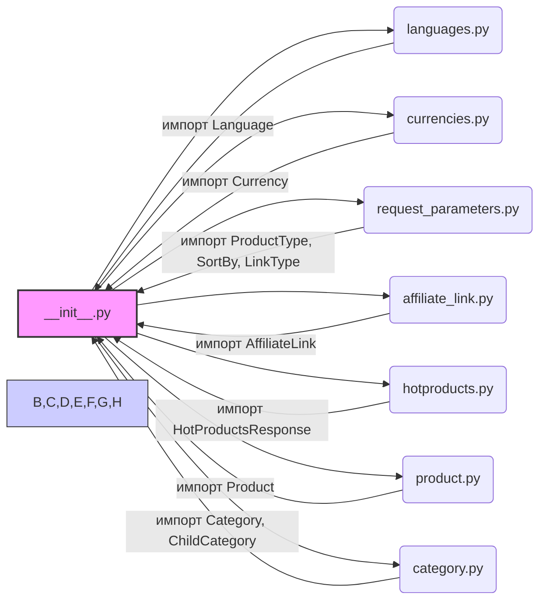

## Анализ кода `hypotez/src/suppliers/aliexpress/api/models/__init__.py`

### <алгоритм>

1. **Импорт модулей:**
   - Импортируются классы и типы данных из различных подмодулей внутри `src.suppliers.aliexpress.api.models`.
   - Например, `Language` и `Currency` импортируются из `languages` и `currencies` соответственно.
   - `ProductType`, `SortBy`, `LinkType` импортируются из `request_parameters`, определяя параметры запроса к API.
   - `AffiliateLink`, `HotProductsResponse`, `Product`, `Category` и `ChildCategory` импортируются из соответствующих файлов, определяя модели данных ответов API.
   - **Пример:** `from .languages import Language` импортирует класс `Language`, который может быть использован для представления языка в запросе к API.

2. **Сборка в единый модуль:**
   -  Файл `__init__.py` играет роль точки входа для пакета `models`, делая импортированные классы и типы данных доступными для использования в других частях проекта через `from src.suppliers.aliexpress.api import models`.
   - **Пример:** После импорта, можно использовать `models.Product` для создания или работы с объектами типа Product.

### <mermaid>

**Объяснение диаграммы:**

- **__init__.py**:  Центральный модуль (`A`), представляющий пакет `models`, откуда импортируются и экспортируются другие модули.
- **languages.py**: Модуль `B`, содержащий класс `Language`, который импортируется в `__init__.py` как `Language`
- **currencies.py**: Модуль `C`, содержащий класс `Currency`, который импортируется в `__init__.py` как `Currency`
- **request_parameters.py**: Модуль `D`, содержащий перечисления `ProductType`, `SortBy`, `LinkType`, которые импортируются в `__init__.py`.
- **affiliate_link.py**: Модуль `E`, содержащий класс `AffiliateLink`, который импортируется в `__init__.py` как `AffiliateLink`.
- **hotproducts.py**: Модуль `F`, содержащий класс `HotProductsResponse`, который импортируется в `__init__.py` как `HotProductsResponse`.
- **product.py**: Модуль `G`, содержащий класс `Product`, который импортируется в `__init__.py` как `Product`.
- **category.py**: Модуль `H`, содержащий классы `Category`, и `ChildCategory`, которые импортируются в `__init__.py` как `Category` и `ChildCategory` соответственно.

Стрелки указывают направление импорта. Например, `languages.py` импортируется в `__init__.py` как `Language`.

### <объяснение>

**Импорты:**

-   `from .languages import Language`: Импортирует класс `Language` из модуля `languages.py` внутри текущего пакета `src.suppliers.aliexpress.api.models`. Этот класс, вероятно, используется для представления языковых настроек при работе с API AliExpress.
-   `from .currencies import Currency`: Аналогично, импортирует класс `Currency` из `currencies.py`, представляющий валютные единицы.
-   `from .request_parameters import ProductType, SortBy, LinkType`: Импортирует перечисления (или классы, которые ведут себя как перечисления) `ProductType`, `SortBy` и `LinkType` из модуля `request_parameters.py`. Эти типы данных, вероятно, используются для формирования параметров запроса к API, определяя тип продукта, способ сортировки и тип ссылки.
-   `from .affiliate_link import AffiliateLink`: Импортирует класс `AffiliateLink` из `affiliate_link.py`, предназначенный для представления партнерских ссылок.
-   `from .hotproducts import HotProductsResponse`: Импортирует класс `HotProductsResponse` из `hotproducts.py`, который, вероятно, является моделью данных для ответа API при запросе горячих товаров.
-   `from .product import Product`: Импортирует класс `Product` из `product.py`, представляющий модель данных товара.
-   `from .category import Category, ChildCategory`: Импортирует классы `Category` и `ChildCategory` из `category.py`, представляющие категории товаров и их подкатегории.

**Классы:**

-   `Language`: Класс, представляющий языковые настройки. Возможно, имеет атрибуты, такие как код языка, название и т.д.
-   `Currency`: Класс, представляющий валюту. Возможно, имеет атрибуты, такие как код валюты, символ и т.д.
-   `ProductType`: Перечисление типов продуктов.
-   `SortBy`: Перечисление способов сортировки товаров.
-   `LinkType`: Перечисление типов ссылок.
-   `AffiliateLink`: Класс, представляющий партнерскую ссылку. Возможно, содержит атрибуты, такие как URL, партнерский ID и т.д.
-   `HotProductsResponse`: Класс, представляющий ответ API с горячими товарами. Может содержать список продуктов, метаданные и т.д.
-   `Product`: Класс, представляющий товар. Может содержать такие атрибуты, как ID, название, цена, описание и т.д.
-   `Category`: Класс, представляющий категорию товаров. Может содержать ID, название, и т.д.
-   `ChildCategory`: Класс, представляющий подкатегорию товаров. Может содержать ID, название, и т.д.

**Функции:**

В данном файле нет определения функций, поскольку это файл `__init__.py`, основная функция которого - импорт и экспорт классов и типов данных из других модулей.

**Переменные:**

В этом файле нет переменных, которые инициализируются напрямую.

**Взаимосвязи с другими частями проекта:**

Этот файл является точкой входа для пакета `models` внутри `src.suppliers.aliexpress.api`. Это означает, что другие части проекта, такие как компоненты, взаимодействующие с API AliExpress, могут импортировать модели данных из этого файла, используя `from src.suppliers.aliexpress.api import models` и получая доступ ко всем классам, например, `models.Product`, `models.Category`.

**Потенциальные ошибки или области для улучшения:**

-   Используется абсолютный путь к python интерпретатору в файле. Это может быть проблемой при переносе проекта в другую систему.
-   Все импорты в одном файле могут привести к усложнению структуры проекта при его росте.
-   Отсутствует документация классов и типов данных в самих модулях (languages.py, currencies.py и т.д), что затрудняет понимание назначения и использования.
-   Необходимо добавить `__all__`, чтобы явно указать какие имена должны быть доступны при импорте из пакета `models`

**Цепочка взаимосвязей:**

`__init__.py` -> `languages.py`, `currencies.py`, `request_parameters.py`, `affiliate_link.py`, `hotproducts.py`, `product.py`, `category.py` -> Используется другими частями проекта для работы с API AliExpress.