## Анализ кода `hypotez/src/suppliers/aliexpress/api/models/__init__.py`

### <алгоритм>

1. **Импорт модулей:**
   -  Импортируются различные классы из других модулей, расположенных в той же директории `src.suppliers.aliexpress.api.models`.
     -  Пример: `from .languages import Language` импортирует класс `Language` из модуля `languages.py`.
     -  Пример: `from .currencies import Currency` импортирует класс `Currency` из модуля `currencies.py`.
2. **Экспорт классов:**
   -  Все импортированные классы автоматически становятся доступны для использования при импорте пакета `src.suppliers.aliexpress.api.models`. Это позволяет внешним модулям легко обращаться к моделям данных, определенным внутри этого пакета.

```mermaid
flowchart TD
    subgraph src.suppliers.aliexpress.api.models
        Start[Start: __init__.py] --> ImportLanguages[Import: from .languages import Language]
        ImportLanguages --> ImportCurrencies[Import: from .currencies import Currency]
        ImportCurrencies --> ImportRequestParameters[Import: from .request_parameters import ProductType, SortBy, LinkType]
        ImportRequestParameters --> ImportAffiliateLink[Import: from .affiliate_link import AffiliateLink]
        ImportAffiliateLink --> ImportHotProductsResponse[Import: from .hotproducts import HotProductsResponse]
        ImportHotProductsResponse --> ImportProduct[Import: from .product import Product]
        ImportProduct --> ImportCategory[Import: from .category import Category, ChildCategory]
        ImportCategory --> End[End: Export all imported classes]
    end
```

### <mermaid>

### <объяснение>

#### Импорты:

-   `from .languages import Language`: Импортирует класс `Language` из модуля `languages.py`, расположенного в той же директории. Этот класс, вероятно, используется для представления языков.
-   `from .currencies import Currency`: Импортирует класс `Currency` из `currencies.py`. Используется для представления валют.
-   `from .request_parameters import ProductType, SortBy, LinkType`: Импортирует классы `ProductType`, `SortBy` и `LinkType` из `request_parameters.py`.  Они представляют параметры запроса, такие как тип продукта, метод сортировки и тип ссылки.
-   `from .affiliate_link import AffiliateLink`: Импортирует класс `AffiliateLink` из `affiliate_link.py`.  Представляет модель партнерской ссылки.
-   `from .hotproducts import HotProductsResponse`: Импортирует класс `HotProductsResponse` из `hotproducts.py`.  Представляет ответ на запрос горячих товаров.
-   `from .product import Product`: Импортирует класс `Product` из `product.py`. Используется для представления продукта.
-   `from .category import Category, ChildCategory`: Импортирует классы `Category` и `ChildCategory` из `category.py`.  Используются для представления категорий товаров и их подкатегорий.

#### Общее:

-   Файл `__init__.py` в Python используется для обозначения директории как пакета. Этот файл, фактически, делает папку `models` модулем, что позволяет импортировать классы из него.
-   Импортируя классы из различных модулей и экспортируя их, `__init__.py` создает удобную точку входа для доступа к моделям данных, необходимым для взаимодействия с API AliExpress.
-   **Цепочка взаимосвязей**: Этот файл является частью пакета `src.suppliers.aliexpress.api.models`, который, в свою очередь, является частью более крупного проекта, предназначенного для взаимодействия с API AliExpress. Пакет `src.suppliers.aliexpress` может включать другие модули, например, `api.client`, которые используют данные модели.
-   **Улучшения:** Для улучшения читаемости и поддержки можно добавить docstrings для каждого импортированного класса.

**Потенциальные ошибки**: Отсутствуют проверки на корректность данных, которые могут быть получены из API, что может привести к ошибкам на более высоких уровнях приложения.