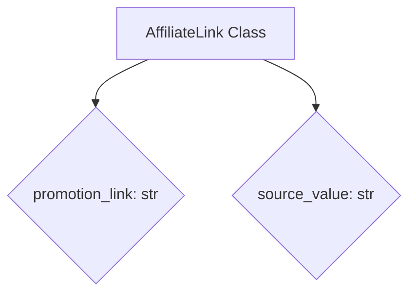
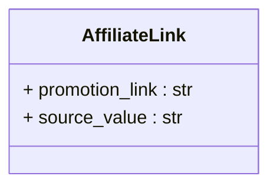

# <input code>

```python
## \file hypotez/src/suppliers/aliexpress/api/models/affiliate_link.py
# -*- coding: utf-8 -*-
#! venv/Scripts/python.exe # <- venv win
## ~~~~~~~~~~~~~
""" module: src.suppliers.aliexpress.api.models """
class AffiliateLink:
    promotion_link: str
    source_value: str
```

# <algorithm>

Этот код определяет базовый класс `AffiliateLink` с двумя атрибутами: `promotion_link` (строка) и `source_value` (строка).  Алгоритм работы сводится к описанию структуры данных, а не к какому-либо процессу обработки.  Данные не перемещаются между функциями или методами.


**Блок-схема:**



**Примеры:**

```
affiliate_link = AffiliateLink()
affiliate_link.promotion_link = "https://example.com/product"
affiliate_link.source_value = "aliexpress_search"
```

# <mermaid>



Эта диаграмма представляет класс `AffiliateLink` с двумя атрибутами: `promotion_link` (строка) и `source_value` (строка). Подключаемые зависимости отсутствуют, так как это всего лишь определение класса, без каких-либо вызовов функций или использования других модулей.


# <explanation>

* **Импорты:** Нет импортируемых модулей.  Этот файл определяет собственный класс.

* **Классы:**
    * **`AffiliateLink`**:  Этот класс представляет собой модель данных для ссылки на товар с сайта AliExpress. Он хранит данные о рекламной ссылке (`promotion_link`) и источнике, откуда была получена ссылка (`source_value`). Атрибуты `promotion_link` и `source_value` определены как `str`, что указывает на строковый тип данных.

* **Функции:** Нет функций.  Код определяет только класс.

* **Переменные:**  Нет переменных в данном коде (в классическом понимании переменных). Есть только атрибуты класса (promotion_link, source_value).

* **Возможные ошибки или области для улучшений:**

    * **Отсутствие логики:** Класс `AffiliateLink` лишь определяет структуру данных.  Для обработки этой информации или взаимодействия с другими частями проекта необходимы дополнительные методы, функции, и другие части кода (например, методы для инициализации, получения данных или вычисления чего-либо).
    * **Отсутствие валидации:**  Не описано как обеспечивается корректность данных.  Например,  `promotion_link` должен быть действительным URL, а `source_value` — подходящей строкой.
    * **Отсутствие методов:**  Добавление методов (например, `__init__`) позволит инициализировать объекты класса и проверять корректность данных при создании экземпляра.


**Цепочка взаимосвязей:**

Этот файл `affiliate_link.py` вероятно будет использоваться в других частях проекта, таких как скрипты сбора данных, парсинга и обработки информации с AliExpress.  Например, в файлах, где происходит запрос данных с сайта AliExpress, эти данные могут быть обработаны и сохранены в базе данных. В дальнейшем они могут использоваться для формирования отчетов, рекомендаций и других бизнес-целей.