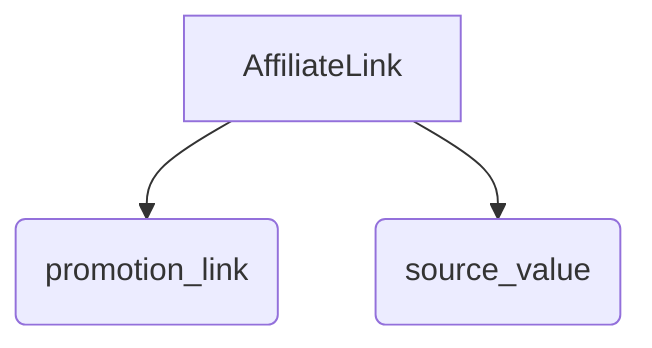
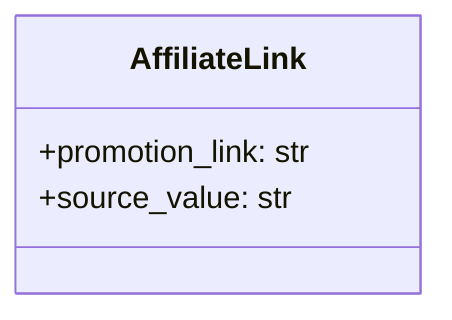

# <input code>

```python
## \file hypotez/src/suppliers/aliexpress/api/models/affiliate_link.py
# -*- coding: utf-8 -*-\
#! venv/Scripts/python.exe # <- venv win
## ~~~~~~~~~~~~~\
""" module: src.suppliers.aliexpress.api.models """
class AffiliateLink:
    promotion_link: str
    source_value: str
```

# <algorithm>

Этот код определяет класс `AffiliateLink`.  Блок-схема проста, так как код не содержит логики выполнения. Класс только описывает структуру данных, представляющую информацию об аффилиатной ссылке.



Пример данных:

```
affiliate_link = AffiliateLink()
affiliate_link.promotion_link = "https://example.com/product?id=123"
affiliate_link.source_value = "some_source_value"
```

# <mermaid>



Описание диаграммы:

Диаграмма `classDiagram` показывает структуру класса `AffiliateLink`.  Она состоит из одного класса `AffiliateLink` и двух атрибутов (promotion_link и source_value), каждый из которых имеет тип `str`.


# <explanation>

**Импорты:**

В данном фрагменте кода нет импортируемых модулей. Код описывает только структуру данных.


**Классы:**

`AffiliateLink`:  Этот класс определяет структуру данных для хранения информации об аффилиатной ссылке.  Он имеет два атрибута:

* `promotion_link`: Строка, представляющая промо-ссылку.
* `source_value`: Строка, содержащая значение источника ссылки.

**Функции:**

Нет функций.

**Переменные:**

Нет переменных, определенных вне методов.


**Возможные ошибки или области для улучшений:**

* Отсутствие проверки типов или валидации данных:  Сейчас у нас нет ограничений на то, какие значения могут быть сохранены в атрибутах `promotion_link` и `source_value`. Если в `promotion_link` сохранится невалидная ссылка, это может повлиять на дальнейшую обработку.  Добавление проверок поможет избежать таких проблем.
* Нет методов:  Отсутствуют методы для обработки данных. Класс лишь определяет структуру. Для обработки данных нужны методы для извлечения информации и манипуляции ей.
* Комментарий `# -*- coding: utf-8 -*-`: Обычно используется для объявления кодировки файла. Но здесь он, вероятно, лишний, если файл, использующий этот код, явно объявляет кодировку.

**Взаимосвязи с другими частями проекта:**

Этот файл `affiliate_link.py` находится в пакете `src.suppliers.aliexpress.api.models`.  Это указывает на то, что он используется в рамках работы с API алиэкспресс.  Следующие шаги могут включать создание моделей, обрабатывающих данные из `promotion_link`, `source_value` и связанной информацией, или использование этих данных для получения дальнейших данных от алиэкспресс.

**Пример возможного использования:**


```python
from hypotez.src.suppliers.aliexpress.api.models.affiliate_link import AffiliateLink

affiliate_link = AffiliateLink()
affiliate_link.promotion_link = "https://www.aliexpress.com/item/1234567890.html?spm=a2g0o.store_pc_all.0.0.6b995034O1l0hF"
affiliate_link.source_value = "ReferralCode_XYZ"

print(affiliate_link.promotion_link)