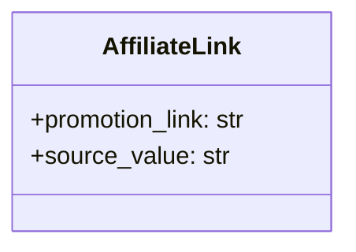

## <алгоритм>

1.  **Инициализация класса `AffiliateLink`:**
    *   Создается класс `AffiliateLink`, который представляет собой модель для хранения данных о партнерской ссылке.
    *   При создании экземпляра `AffiliateLink` необходимо задать значения для атрибутов `promotion_link` (строка, представляющая партнерскую ссылку) и `source_value` (строка, представляющая источник ссылки).
    *   _Пример:_
        ```python
        affiliate_link_instance = AffiliateLink()
        affiliate_link_instance.promotion_link = "https://s.click.aliexpress.com/e/_DB8s2g"
        affiliate_link_instance.source_value = "aliexpress_product_page"
        ```

2.  **Использование экземпляра `AffiliateLink`:**
    *   Экземпляры класса `AffiliateLink` могут использоваться для передачи данных о партнерской ссылке между различными частями системы, например, для хранения в базе данных или для отправки в API.
    *   _Пример:_
        ```python
        def process_link(link: AffiliateLink):
            print(f"Ссылка: {link.promotion_link}, Источник: {link.source_value}")

        process_link(affiliate_link_instance) #выведет "Ссылка: https://s.click.aliexpress.com/e/_DB8s2g, Источник: aliexpress_product_page"
        ```

## <mermaid>



**Разбор `mermaid` диаграммы:**

*   `class AffiliateLink`:  Объявляет класс с именем `AffiliateLink`.
*   `+promotion_link: str`:  Атрибут `promotion_link` типа `str`, представляющий партнерскую ссылку. Символ `+` указывает, что это публичный атрибут.
*   `+source_value: str`:  Атрибут `source_value` типа `str`, представляющий источник партнерской ссылки. Символ `+` указывает, что это публичный атрибут.

**Импорты:** В данном коде нет импортов, что говорит о том, что `AffiliateLink` — это самостоятельная модель, не зависящая от каких-либо внешних модулей в рамках текущего файла.

## <объяснение>

**Импорты:**

*   В данном коде импорты отсутствуют, так как класс `AffiliateLink` не зависит от внешних модулей. Это указывает на то, что модель является достаточно простой и самодостаточной.

**Классы:**

*   `class AffiliateLink:`:
    *   **Роль:**  Класс `AffiliateLink` представляет собой модель данных для хранения информации о партнерской ссылке. Он обеспечивает структурированное хранение данных, связанных с партнерской ссылкой.
    *   **Атрибуты:**
        *   `promotion_link: str`:  Хранит саму партнерскую ссылку как строку.
        *   `source_value: str`: Хранит информацию об источнике, откуда была получена партнерская ссылка (например, "aliexpress_product_page", "search_result").
    *   **Методы:** В текущей версии класса отсутствуют методы. Он служит только для хранения данных.
    *   **Взаимодействие:**
        *   Класс `AffiliateLink` может использоваться в других частях проекта для передачи и обработки данных партнерских ссылок. Например, он может использоваться в функциях, которые обрабатывают API ответы от AliExpress, сохраняют данные в базу данных или отправляют в другие системы.

**Функции:**

*   В данном коде функции отсутствуют, поскольку класс является простой моделью данных.

**Переменные:**

*   `promotion_link`: Переменная типа `str`, предназначенная для хранения партнерской ссылки.
*   `source_value`: Переменная типа `str`, предназначенная для хранения источника партнерской ссылки.

**Потенциальные ошибки и области для улучшения:**

*   **Отсутствие валидации:** В текущем виде код не проводит валидацию данных, присваиваемых атрибутам `promotion_link` и `source_value`. Следует добавить проверки, например, чтобы `promotion_link` соответствовала формату URL, а `source_value` была одним из предопределенных значений.
*   **Отсутствие методов:** В текущем виде класс `AffiliateLink` предназначен только для хранения данных. Можно добавить методы для работы с данными, например, методы для преобразования данных или сравнения.

**Цепочка взаимосвязей с другими частями проекта:**

*   Класс `AffiliateLink`, вероятно, будет использоваться в модулях, которые отвечают за работу с API AliExpress (`src/suppliers/aliexpress/api/`) и/или обработки ответов API.
*   Экземпляры `AffiliateLink` могут передаваться в модули, отвечающие за сохранение данных в базе данных (`src/db/`) или в другие модули обработки данных.
*   Также экземпляры `AffiliateLink` могут использоваться при генерации отчетов и аналитике, связанной с партнерскими ссылками.

В целом, класс `AffiliateLink` является базовой моделью для представления партнерских ссылок, но в дальнейшем может быть расширен и улучшен для обеспечения более надежной обработки данных.