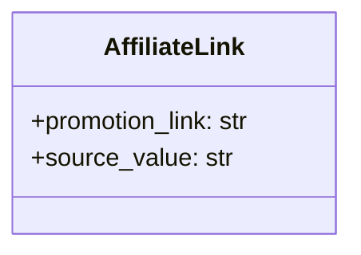

## АНАЛИЗ КОДА `hypotez/src/suppliers/aliexpress/api/models/affiliate_link.py`

### 1. <алгоритм>

1.  **Определение класса `AffiliateLink`**:
    *   Создается класс `AffiliateLink` для представления партнерской ссылки AliExpress.
    *   Этот класс имеет два атрибута:
        *   `promotion_link`: Строка, представляющая URL партнерской ссылки.
        *   `source_value`: Строка, представляющая источник партнерской ссылки (например, ID конкретной страницы или товара).
    *   Пример:
        ```python
        link1 = AffiliateLink()
        link1.promotion_link = "https://aliexpress.ru/item/12345.html?aff_short_key=abcdef"
        link1.source_value = "product_page_12345"
        ```

2.  **Использование `AffiliateLink`**:
    *   Экземпляры класса `AffiliateLink` могут использоваться для хранения и передачи данных, связанных с партнерскими ссылками AliExpress.
    *   Данные могут быть получены из API AliExpress, базы данных или других источников и затем могут быть переданы другим частям приложения.

### 2. <mermaid>



**Объяснение диаграммы:**

*   Диаграмма представляет класс `AffiliateLink` с двумя атрибутами: `promotion_link` (строка, содержащая URL партнерской ссылки) и `source_value` (строка, определяющая источник этой ссылки).
*   Класс `AffiliateLink` используется как модель для представления данных, связанных с партнерскими ссылками.

### 3. <объяснение>

**Импорты:**

В данном коде нет явных импортов. Это означает, что класс `AffiliateLink` не зависит от каких-либо других модулей, и является автономным в рамках проекта.

**Классы:**

*   **`AffiliateLink`**:
    *   **Роль**: Представляет модель данных для партнерской ссылки AliExpress. Он хранит URL партнерской ссылки и источник, откуда она была получена.
    *   **Атрибуты**:
        *   `promotion_link` (str): URL партнерской ссылки.
        *   `source_value` (str): Идентификатор источника партнерской ссылки.
    *   **Методы**:
        *   В данном коде нет методов, кроме конструктора по умолчанию, который не определен явно.

**Функции:**

*   В данном коде нет явных функций.

**Переменные:**

*   `promotion_link`: Строковая переменная, представляющая партнерскую ссылку.
*   `source_value`: Строковая переменная, представляющая источник ссылки.

**Потенциальные ошибки и области для улучшения:**

*   **Отсутствие валидации**: Нет никакой проверки на корректность форматов `promotion_link` или `source_value`. Желательно добавить проверки, например, является ли `promotion_link` допустимым URL.
*   **Отсутствие методов**: Класс не имеет методов для работы с данными (например, метода для проверки действительности ссылки, или форматирования).
*   **Инициализация атрибутов**: Атрибуты класса должны инициализироваться в методе `__init__`  для более корректного и гибкого создания объектов класса, как показано в следующем примере:

```python
class AffiliateLink:
    def __init__(self, promotion_link: str, source_value: str):
        self.promotion_link = promotion_link
        self.source_value = source_value
```

**Взаимосвязи с другими частями проекта:**

*   Этот класс, вероятно, используется в других частях проекта, где нужно обрабатывать и хранить партнерские ссылки AliExpress, например, в модулях, связанных с API AliExpress, отслеживанием статистики или генерацией ссылок.
*   Вероятная цепочка взаимосвязей:
    1.  API AliExpress возвращает данные, включающие партнерские ссылки.
    2.  Эти данные используются для создания объектов класса `AffiliateLink`.
    3.  Объекты `AffiliateLink` используются в других частях проекта, например, для вывода или анализа данных.
*   В дальнейшем этот класс может быть расширен для поддержки других полей, связанных с партнерскими ссылками, таких как идентификатор партнерской программы, данные о комиссии и прочее.