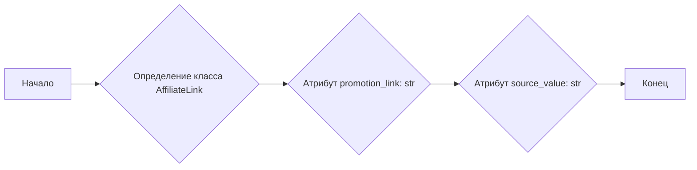

## АНАЛИЗ КОДА: `src/suppliers/aliexpress/api/models/affiliate_link.py`

### 1. <алгоритм>

**Описание:**

Модуль `affiliate_link.py` содержит определение класса `AffiliateLink`. Этот класс используется для представления партнерской ссылки, полученной от AliExpress, которая включает в себя ссылку для продвижения (`promotion_link`) и значение-источник (`source_value`).

**Блок-схема:**



**Примеры:**

1. **Создание объекта `AffiliateLink`:**

   ```python
   link = AffiliateLink()
   link.promotion_link = "https://s.click.aliexpress.com/e/_d345678"
   link.source_value = "1234567890"
   print(f"Ссылка для продвижения: {link.promotion_link}")
   print(f"Значение-источник: {link.source_value}")
   ```

2. **Использование объекта `AffiliateLink` (пример):**
   ```python
    def process_link(affiliate_link):
        print(f"Обработка ссылки: {affiliate_link.promotion_link}")
        # какая-либо логика обработки
    
    link = AffiliateLink()
    link.promotion_link = "https://s.click.aliexpress.com/e/_d345678"
    link.source_value = "1234567890"
    process_link(link)
    ```

### 2. <mermaid>


**Объяснение зависимостей:**

В данном коде нет импортов, поэтому диаграмма `mermaid` отображает только структуру класса `AffiliateLink` с его атрибутами. Класс не зависит от других модулей или классов в проекте.

### 3. <объяснение>

**Импорты:**

В данном файле отсутствуют импорты.

**Классы:**

*   **`AffiliateLink`**:
    *   **Роль:** Представляет структуру данных для хранения информации о партнерской ссылке AliExpress.
    *   **Атрибуты:**
        *   `promotion_link` (str): URL-адрес партнерской ссылки для продвижения.
        *   `source_value` (str): Идентификатор источника ссылки.
    *   **Методы:**  Класс не содержит методов, это простой класс-контейнер для хранения данных.
    *   **Взаимодействие:** Этот класс предназначен для использования в других частях проекта, где необходимо обрабатывать и передавать данные партнерских ссылок. Например, в модулях, отвечающих за парсинг данных с AliExpress API или в модулях, отвечающих за сохранение данных в базу данных.

**Функции:**

В данном файле отсутствуют функции.

**Переменные:**

*   `promotion_link`:  Строка (str), представляющая URL-адрес партнерской ссылки.
*   `source_value`:  Строка (str), представляющая значение-источник для ссылки.

**Потенциальные ошибки и области для улучшения:**

*   **Валидация:** Отсутствует валидация типов данных или форматов для `promotion_link` и `source_value`.  Желательно добавить проверку на то, что `promotion_link` является валидным URL, а `source_value` соответствует ожидаемому формату.
*   **Расширение функциональности:**  В будущем можно добавить методы для обработки ссылок, например, для анализа параметров URL.
*   **Документация:**  Добавить docstring для класса.

**Взаимосвязь с другими частями проекта:**

`AffiliateLink` используется как модель данных для представления партнерских ссылок, полученных от AliExpress. Данные, представленные в этом классе, могут использоваться в следующих частях проекта:

*   Модули для работы с AliExpress API: Эти модули используют класс `AffiliateLink` для обработки ответов API, содержащих партнерские ссылки.
*   Модули для хранения и обработки данных: Эти модули могут использовать класс `AffiliateLink` для сохранения ссылок в базе данных или в файле.
*   Модули для генерации контента: Этот класс может использоваться в модулях, создающих контент для продвижения товаров AliExpress.

**Пример:**

```python
# Пример использования в модуле, обрабатывающем API
from src.suppliers.aliexpress.api.models.affiliate_link import AffiliateLink

def process_api_response(api_response):
  promotion_link = api_response.get("promotion_link")
  source_value = api_response.get("source_value")
  
  if promotion_link and source_value:
    affiliate_link = AffiliateLink()
    affiliate_link.promotion_link = promotion_link
    affiliate_link.source_value = source_value
    return affiliate_link
  
  return None

# пример api_response
api_response = {"promotion_link":"https://s.click.aliexpress.com/e/_d345678", "source_value":"1234567890"}
link = process_api_response(api_response)
if link:
   print(f"Ссылка для продвижения: {link.promotion_link}")
   print(f"Значение-источник: {link.source_value}")
```