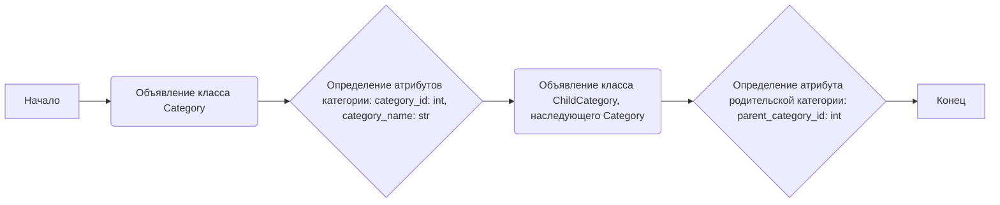
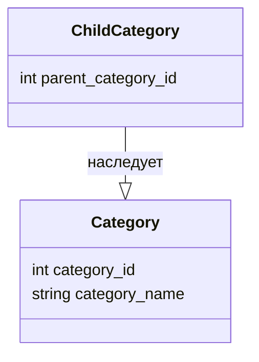

## Анализ кода `hypotez/src/suppliers/aliexpress/api/models/category.py`

### 1. <алгоритм>

**Блок-схема:**



**Примеры:**

1.  **`Category`**:
    *   Создание экземпляра:
        ```python
        category = Category()
        category.category_id = 123
        category.category_name = "Electronics"
        print(f"Category ID: {category.category_id}, Category Name: {category.category_name}")
        # Вывод: Category ID: 123, Category Name: Electronics
        ```

2.  **`ChildCategory`**:
    *   Создание экземпляра:
        ```python
        child_category = ChildCategory()
        child_category.category_id = 456
        child_category.category_name = "Smartphones"
        child_category.parent_category_id = 123
        print(f"Child Category ID: {child_category.category_id}, Child Category Name: {child_category.category_name}, Parent Category ID: {child_category.parent_category_id}")
        # Вывод: Child Category ID: 456, Child Category Name: Smartphones, Parent Category ID: 123
        ```

**Поток данных:**

*   Классы `Category` и `ChildCategory` представляют собой модели данных. Данные, такие как идентификаторы и названия категорий, хранятся в атрибутах этих классов.
*   Класс `ChildCategory` наследует атрибуты от класса `Category`, расширяя его функциональность добавлением атрибута `parent_category_id`.
*   Поток данных заключается в создании экземпляров этих классов и присваивании им значений атрибутов.

### 2. <mermaid>



**Анализ зависимостей:**

*   **`Category`**: Определяет базовую структуру для категорий, содержащую `category_id` (идентификатор категории) и `category_name` (название категории).
*   **`ChildCategory`**: Наследует от `Category`, добавляя атрибут `parent_category_id` (идентификатор родительской категории), указывающий на родительскую категорию.
*   **`ChildCategory --|> Category`**: Указывает на отношение наследования, где `ChildCategory` является подклассом (наследником) `Category`.

### 3. <объяснение>

#### Импорты:

*   В данном коде нет явных импортов. Код использует встроенные типы данных Python. Отсутствие импортов означает, что файл не зависит от внешних пакетов или модулей, что делает его более самодостаточным. Однако, при использовании этого кода в рамках большего проекта `hypotez`, могут быть зависимости от других частей этого проекта, например, для использования этих моделей в функциях API или для сохранения в базе данных.

#### Классы:

*   **`Category`**:
    *   **Роль**: Представляет общую модель для категории товаров.
    *   **Атрибуты**:
        *   `category_id` (`int`): Идентификатор категории.
        *   `category_name` (`str`): Название категории.
    *   **Методы**: Отсутствуют. Класс используется как контейнер данных.
    *   **Взаимодействие**: Может использоваться как базовый класс для других моделей категорий.
*   **`ChildCategory`**:
    *   **Роль**: Представляет дочернюю категорию, которая является подкатегорией другой категории.
    *   **Атрибуты**:
        *   `parent_category_id` (`int`): Идентификатор родительской категории.
        *   Наследует `category_id` и `category_name` от класса `Category`.
    *   **Методы**: Отсутствуют. Класс используется как контейнер данных.
    *   **Взаимодействие**: Наследует от класса `Category`, расширяя его функциональность.

#### Функции:

*   В данном коде нет функций.

#### Переменные:

*   Переменные используются как атрибуты классов `Category` и `ChildCategory`.
*   `category_id` и `parent_category_id` имеют тип `int`, представляя собой числовые идентификаторы.
*   `category_name` имеет тип `str`, представляя собой текстовое название.

#### Потенциальные ошибки и области для улучшения:

*   **Отсутствие методов**: Классы `Category` и `ChildCategory` являются контейнерами данных и не содержат методов. Это может ограничивать их использование в более сложных сценариях. Можно было бы добавить методы для валидации данных, представления в виде словаря или строкового представления.
*   **Отсутствие валидации типов**: Не реализована валидация типов атрибутов. Можно было бы использовать `dataclasses` или `pydantic`, чтобы обеспечить проверку типов во время создания экземпляров классов.
*   **Отсутствие docstrings**: Классы и их атрибуты не имеют docstrings. Добавление описаний сделает код более понятным и поддерживаемым.

#### Цепочка взаимосвязей:

*   Эти модели могут использоваться в API для получения списка категорий с AliExpress.
*   Модели могут использоваться для маппинга данных, полученных из API AliExpress, в структуры данных Python.
*   Модели могут использоваться для сохранения и извлечения данных из базы данных.
*   В более широком контексте, эти модели могут быть частью слоя данных в системе обработки данных о товарах.
*   Модели могут быть использованы в связке с другими модулями `src/suppliers/aliexpress/api/`, например, `src.suppliers.aliexpress.api.api`.